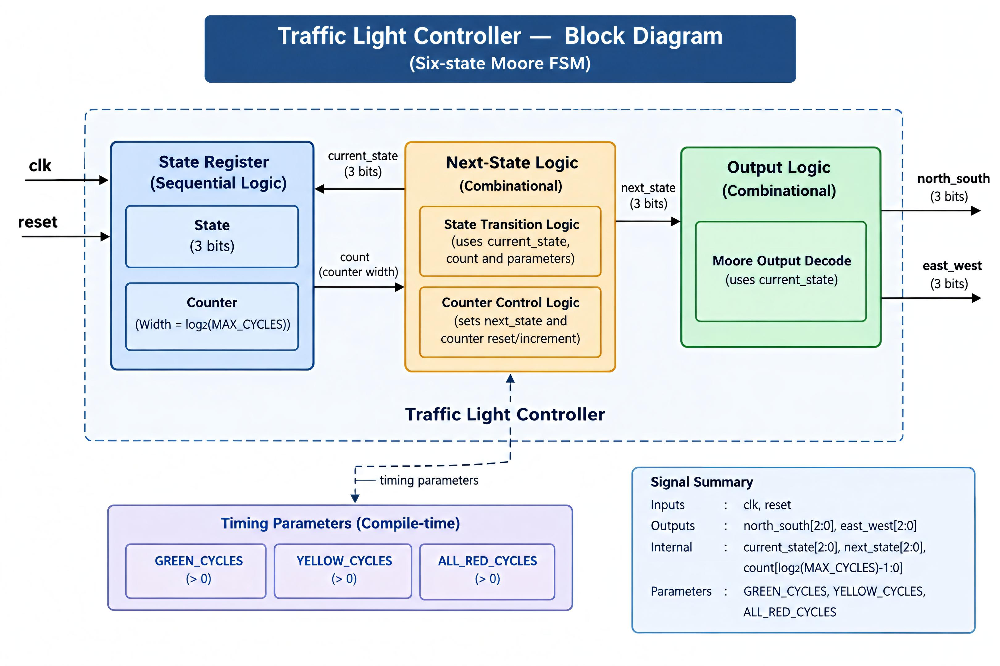
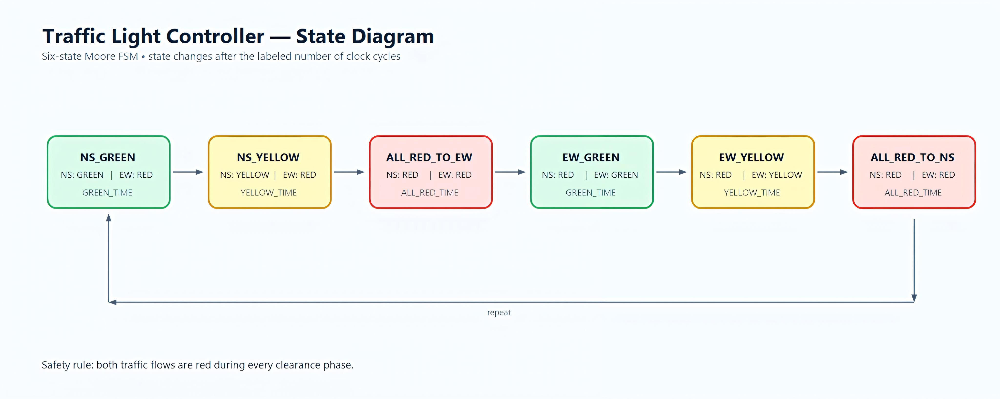
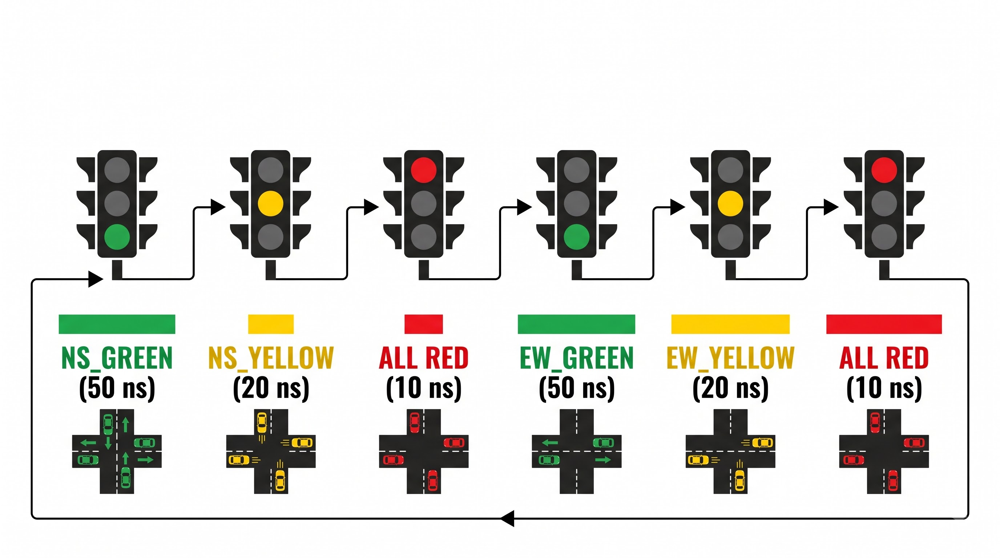
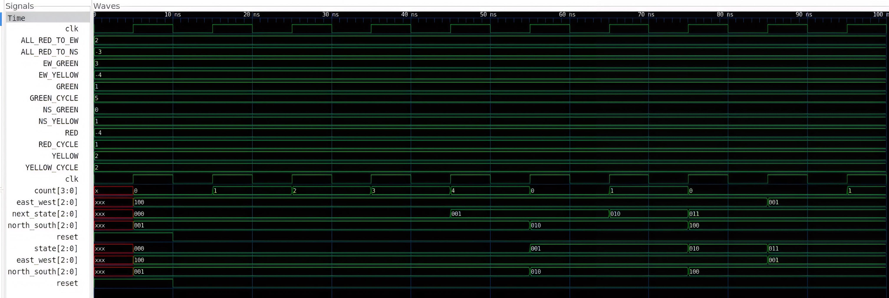
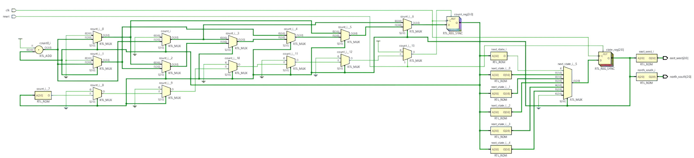

# ⚡ TRAFFIC LIGHT CONTROLLER

### Moore FSM • Timed State Transitions • Synthesizable RTL

<p>
  
  
  
  
</p>

---

## 📋 Introduction

Modern embedded systems and digital controllers rely heavily on robust sequential logic to manage timed operations reliably. A prime example of this is a traffic-light controller, which governs the safe flow of intersection traffic by transitioning systematically through a pre-determined sequence of signal states. 

This project implements a fully synthesizable **Traffic-Light Controller in Verilog HDL** utilizing a **3-state Moore Finite State Machine (FSM)** architecture. In a Moore machine, outputs are strictly a function of the current state, ensuring deterministic behavior and glitch-free signal transitions. Designed for industrial synthesis and FPGA/ASIC deployment, the architecture features a clean separation of state memory, next-state logic, and output decoding.

---

## 📌 Project Summary

* **Architecture:** 3-state Moore Finite State Machine (FSM)
* **Design Language:** Verilog RTL (IEEE 1364-2005 compatible)
* **Control Features:** Synchronous active reset, edge-triggered clocking, and timed state progression
* **Verification Scope:** Self-checking testbench, functional simulation, and waveform timing analysis

## 🔌 Interface Specifications

Quick interface overview. Full details are available in
[Requirements & Design](./01-docs/01-requirements-and-design.md).

| Port | Direction | Width | Description |
| :--- | :--- | :--- | :--- |
| `clk` | Input | 1 | Master system clock |
| `reset` | Input | 1 | Synchronous active-high reset |
| `light` | Output | 3 | One-hot encoded traffic lights `{Red, Yellow, Green}` |


## 🏗️ Architecture

The controller consists of a state register, next-state logic, and output
logic. The FSM changes state on the active clock edge and generates the
corresponding traffic-light output based on the current state.



### FSM State Diagram



### Timing Flow



Detailed FSM behavior is documented in
[FSM Specification](./01-docs/02-fsm-specification.md).


## 💻 RTL Implementation

The RTL implementation follows strict synthesizable coding standards:

- Separated 2-process FSM modeling (Sequential state/timer registers + Combinational next-state/output logic)
- One-hot state encoding (`S_RED=3'b001`, `S_GREEN=3'b010`, `S_YELLOW=3'b100`) for minimal combinational decode logic and maximum $F_{max}$
- Full case coverage with defensive `default` branches to guarantee zero inferred latches
- Fully synchronous active-high reset aligned with the system clock tree
- Parameterized state dwell times (`RED_CYCLES`, `GREEN_CYCLES`, `YELLOW_CYCLES`)

The Verilog RTL and testbench are available in
[rtl-tb/](./03-rtl-tb).

<br>

<table align="center" width="100%" cellpadding="0" cellspacing="0" border="0">
  <tr>

    <!-- RTL DESIGN CARD -->
    <td align="center" width="50%" style="padding: 12px;">
      <a href="./03-rtl-tb/traffic_light/traffic_light_controller.v">
        <table width="100%" cellpadding="0" cellspacing="0" border="0">
          <tr>
            <td align="center" style="padding: 22px; border: 1px solid #30363d; border-radius: 10px; background-color: #0d1117;">

              <div style="font-size: 30px;">⚙️</div>

              <br>

              <div>
                <strong style="font-size: 18px;">RTL Design Source</strong>
              </div>

              <br>

              <div>
                <code>traffic_light_controller.v</code>
              </div>

              <br>

              <div style="font-size: 13px;">
                Synthesizable RTL implementation
              </div>

            </td>
          </tr>
        </table>
      </a>
    </td>

    <!-- TESTBENCH CARD -->
    <td align="center" width="50%" style="padding: 12px;">
      <a href="./03-rtl-tb/traffic_light/traffic_light_controller_tb.v">
        <table width="100%" cellpadding="0" cellspacing="0" border="0">
          <tr>
            <td align="center" style="padding: 22px; border: 1px solid #30363d; border-radius: 10px; background-color: #0d1117;">

              <div style="font-size: 30px;">🧪</div>

              <br>

              <div>
                <strong style="font-size: 18px;">RTL Testbench</strong>
              </div>

              <br>

              <div>
                <code>traffic_light_controller_tb.v</code>
              </div>

              <br>

              <div style="font-size: 13px;">
                Simulation and functional verification
              </div>

            </td>
          </tr>
        </table>
      </a>
    </td>

  </tr>
</table>

<br>

## 🧪 Verification Strategy

The dedicated testbench is used to verify:

- Synchronous reset assertion and de-assertion latency
- Cycle-accurate timing verification across all state intervals
- State transition sequence ordering without intermediate invalid states
- Output vector integrity (`light` bus exclusivity: never multiple lights ON simultaneously)
- Extended endurance testing (50+ continuous cycles) verifying terminal recovery and zero deadlock
- Self-checking assertion checks with automated `$error` tracking and summary reporting

Detailed verification planning and results are documented in
[Verification Summary](./01-docs/03-verification-summary.md).

## 📈 Simulation Evidence

### Waveform



The waveform is analyzed to compare the expected FSM behavior with the actual
simulation output.

### RTL Schematic



The RTL schematic provides a hardware-oriented view of the structures inferred
from the Verilog RTL.

## 📚 Documentation

- [Requirements & Design](./01-docs/01-requirements-and-design.md)
- [FSM Specification](./01-docs/02-fsm-specification.md)
- [Verification Summary](./01-docs/03-verification-summary.md)
- [Design Decisions & Trade-offs](./01-docs/04-design-decisions.md)

## 🧪 Verification & Simulation Results

| Test Case | Scenario Description | Expected Behavior | Actual Behavior | Status |
| :--- | :--- | :--- | :--- | :--- |
| **TC_01** | Reset Assertion during active run | Immediate return to `S_RED` (`light=3'b100`) | Forced to `S_RED` within 1 cycle | ✅ PASS |
| **TC_02** | Red State Timing Hold | Light remains Red for exactly 6 clock cycles | Counter holds state for 6 cycles | ✅ PASS |
| **TC_03** | Sequential Transition Integrity | Sequenced through `RED -> GREEN -> YELLOW -> RED` | Deterministic cycle sequence verified | ✅ PASS |
| **TC_04** | Terminal Recovery Verification | Continuous execution across 50 full cycles | Zero state lockup or illegal states | ✅ PASS |

## Repository Structure

```text
└── 01-traffic-light-controller/
    │
    ├── README.md
    │
    ├── 01-docs/
    │   ├── 01-requirements-and-design.md
    │   ├── 02-fsm-specification.md
    │   ├── 03-verification-summary.md
    │   └── 04-design-decisions.md
    │
    ├── 02-architecture/
    │   ├── 01-block-diagram.png
    │   ├── 02-state-diagram.png
    │   └── 03timing-flow.png
    │
    └── 03-rtl-tb/
        ├── README.md
        ├── traffic_light_controller.v
        ├── traffic_light_controller_tb.v
        ├── rtl-schematic.png
        └── waveform.png
```

## 🛠️ Tools & Technologies

- **HDL:** Verilog HDL 
- **Simulation Engine:** Icarus Verilog 
- **Waveform Debugger:** GTKWave 
- **Synthesis & Linting:** Xilinx Vivado / Verilator
- **Version Control:** Git & GitHub

## 📚 Key RTL Concepts Applied

- **Moore FSM Topology:** Decoupled input-to-output combinational paths for hazard-free outputs.
- **One-Hot State Encoding:** Minimized next-state decode logic depth to reduce critical path delay.
- **Deterministic Reset Recovery:** Synchronous reset architecture eliminating removal/recovery metastability issues.
- **Latch Prevention Disciplines:** Full default assignments and comprehensive case item branching.
- **Self-Checking Verification:** Automated testbenches using tasks, loop assertions, and status counters.
- **Static Timing Awareness:** Registering boundaries to maintain clean setup and hold slack margins.

## 💬 Interview Questions

**Q: Why is a Moore FSM used for this design?**  
A: The traffic-light output depends only on the current FSM state, providing
predictable and state-based output behavior.

**Q: Why use synchronous reset?**  
A: The reset is sampled with the clock, allowing the FSM to return to its
initial state synchronously.

**Q: Why are default assignments important in combinational logic?**  
A: Default assignments ensure signals receive defined values and help prevent
unintended latch inference.

**Q: What happens during a state transition?**  
A: The next-state logic determines the upcoming state, and the state register
updates on the active clock edge.

**Q: How can this controller be extended?**  
A: Additional inputs and states can be introduced for features such as
pedestrian crossing, emergency priority, or multi-intersection control.

## ⚖️ Design Decisions & Trade-offs

- **Moore FSM:** Provides predictable state-dependent outputs.
- **Synchronous reset:** Keeps reset behavior aligned with the system clock.
- **Separated FSM logic:** Improves readability, simulation, and debugging.
- **Fixed state sequence:** Keeps the initial design focused on fundamental
  FSM-based RTL implementation.

See [Design Decisions & Trade-offs](./01-docs/04-design-decisions.md) for details.

## 🚀 Future Improvements

- Fully parameterized cycle registers accessible via an AMBA APB slave bus interface.
- Dual-axis intersection support (North-South / East-West) with conflicting-green hardware interlocks.
- Pedestrian crossing request synchronizer with debounce filtering.
- Emergency vehicle preemption logic with priority interrupt override.

## 🔗 Related

Part of the [RTL Mini-Projects](../README.md) collection.

This project strengthens practical FSM and RTL design skills and provides a
foundation for larger control-oriented digital hardware projects.


