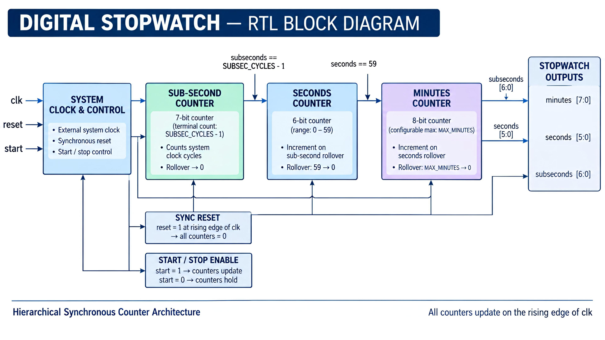
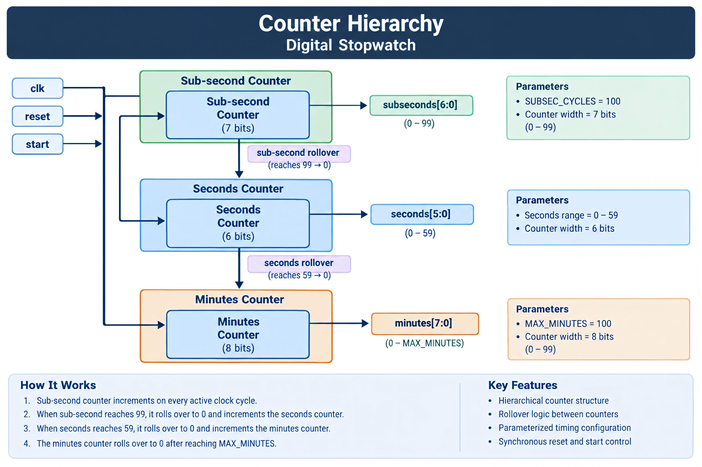
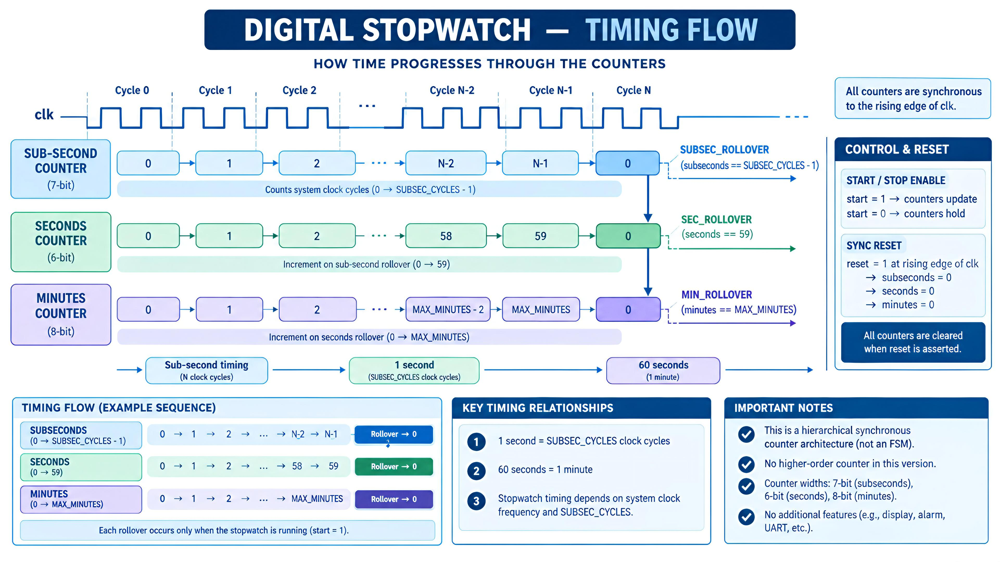

# Digital Stopwatch — Architecture

The architecture of the Digital Stopwatch is represented using three complementary views: the RTL block architecture, the counter hierarchy, and the timing flow. Together, these diagrams describe how the stopwatch is structured, how the counters interact through rollover conditions, and how the elapsed-time outputs evolve with clock cycles.

---

## 1. RTL Block Architecture

The block diagram shows the main functional components of the stopwatch and the flow of information between them. The design uses three hierarchical counters for sub-seconds, seconds, and minutes. The `start` signal controls counter operation, while the synchronous `reset` initializes all counters to zero. Timing parameters control the sub-second and minute limits.



---

## 2. Counter Hierarchy

The Digital Stopwatch uses a hierarchical counter structure. The sub-second counter increments on every active clock cycle and rolls over after reaching `SUBSEC_CYCLES - 1`. Its rollover increments the seconds counter. When the seconds counter reaches `59`, it rolls over to `0` and increments the minutes counter. The minutes counter rolls over to `0` after reaching `MAX_MINUTES`.

The counter sequence is:

`Subseconds → Seconds → Minutes`



---

## 3. Timing Flow

The timing-flow diagram illustrates how the stopwatch counters change with respect to the clock. When `start` is active, the sub-second counter increments on each rising clock edge. When the configured sub-second terminal count is reached, it resets to zero and increments the seconds counter. The same rollover relationship continues from seconds to minutes.

For the current configuration:

- `SUBSEC_CYCLES = 100`
- `MAX_MINUTES = 100`
- Clock period = `10 ns`
- One second = `100` clock cycles = `1000 ns`



---

## Architecture Summary
```text
        Clock + Reset + Start
                 ↓
        Sub-second Counter
                 ↓
       Sub-second Rollover
                 ↓
          Seconds Counter
                 ↓
         Seconds Rollover
                 ↓
          Minutes Counter
                 ↓
       Stopwatch Time Outputs
```
