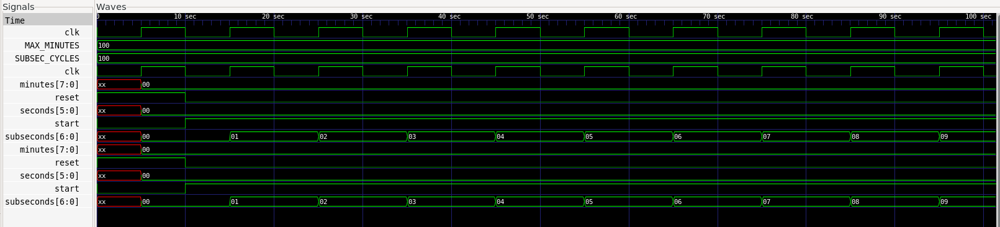
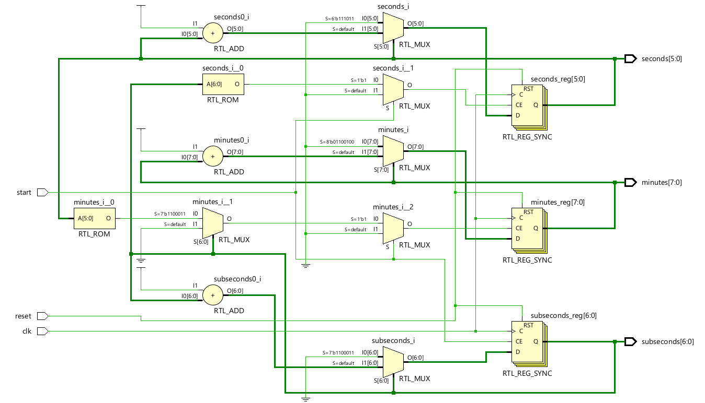

<div align="center">


<br>

### Parameterized Synchronous Counter • Hierarchical Timing • Synthesizable RTL

<p>
  
  
  
  
</p>

</div>

---

## 📋 Introduction

Digital timing systems require reliable sequential logic to measure and represent elapsed time accurately. A digital stopwatch is a practical example of hierarchical counter design, where lower-order timing events generate carry conditions for higher-order counters.

This project implements a fully synthesizable **Digital Stopwatch in Verilog HDL** using a parameterized synchronous counter architecture. The design maintains separate counters for sub-seconds, seconds, and minutes, with start/stop control and synchronous reset. The architecture demonstrates hierarchical counter operation, rollover handling, parameterized timing, and clock-synchronous RTL design.

---

## 📌 Project Summary

* **Architecture:** Hierarchical Synchronous Counter
* **Design Language:** Verilog RTL (IEEE 1364-2005 compatible)
* **Control Features:** Synchronous active-high reset, start/stop control, edge-triggered counting, and configurable timing parameters
* **Verification Scope:** Functional simulation, counter timing verification, and waveform analysis

## 🔌 Interface Specifications

> [!NOTE]
> **Quick Interface Overview**
> Full timing requirements, counter hierarchy, and design assumptions are available in the [Requirements & Design](./01-docs/01-requirements-and-design.md) document.

| Port | Direction | Width | Description |
| :--- | :--- | :--- | :--- |
| `clk` | Input | 1 | Master system clock |
| `reset` | Input | 1 | Synchronous active-high reset |
| `start` | Input | 1 | Enables stopwatch counting |
| `minutes` | Output | 8 | Elapsed minutes |
| `seconds` | Output | 6 | Elapsed seconds |
| `subseconds` | Output | 7 | Elapsed sub-second count |

---

## 🏗️ Architecture

The stopwatch consists of three hierarchical timing counters: a sub-second counter, a seconds counter, and a minutes counter. The sub-second counter generates a rollover event that increments the seconds counter, while the seconds counter generates a rollover event that increments the minutes counter. The minutes counter rolls back to zero after reaching the configured maximum value.


### Counter Hierarchy


### Timing Flow


> [!NOTE]
> **Detailed Timing Behavior**
> Complete counter operation, rollover conditions, timing assumptions, and parameter definitions are documented in the [Timing Specification](./01-docs/02-timing-specification.md).

## 💻 RTL Implementation

The RTL implementation follows strict synthesizable coding standards:

- Hierarchical counter structure for sub-seconds, seconds, and minutes
- Single synchronous clock domain with positive-edge triggered operation
- Fully synchronous active-high reset
- Start control to enable or hold elapsed-time counting
- Parameterized sub-second cycle count and maximum minute value
- Explicit rollover logic between consecutive counter levels
- Non-blocking assignments for sequential state updates
- Counter widths selected according to the required timing ranges

The Verilog RTL and testbench are available in
[rtl-tb/](./03-rtl-tb).

<br>

<table align="center">
<tr>

<td align="center" width="50%">

<a href="./03-rtl-tb/digital_stopwatch.v">


<br><br>


<br>

### Digital Stopwatch RTL

**Synthesizable Verilog RTL**

`digital_stopwatch.v`

<br>

<a href="./03-rtl-tb/digital_stopwatch.v">

</a>

</td>

<td align="center" width="50%">

<a href="./03-rtl-tb/digital_stopwatch_tb.v">


<br><br>


<br>

### Digital Stopwatch Testbench

**Simulation & Verification**

`digital_stopwatch_tb.v`

<br>

<a href="./03-rtl-tb/digital_stopwatch_tb.v">

</a>

</td>

</tr>
</table>

<br>

## 🧪 Verification Strategy

The dedicated testbench is used to verify:

- Synchronous reset initialization of all timing counters
- Stopwatch start operation and counter progression
- Sub-second counting on every active clock cycle
- Correct separation of minutes, seconds, and sub-second timing fields
- Parameterized timing behavior using configurable counter limits
- Waveform-based verification of clock-synchronous counter operation
- Correct counter values during the demonstrated simulation interval

> [!NOTE]
> **Detailed Verification Plan**
> Verification details and simulation observations are documented in the [Verification Summary](./01-docs/03-verification-summary.md).

## 📈 Simulation Evidence

### Waveform



The waveform is analyzed to compare the expected stopwatch counting behavior with the actual simulation output. The simulation demonstrates synchronous reset operation followed by start-controlled sub-second counting.

### RTL Schematic



The RTL schematic provides a hardware-oriented view of the sequential counter structures inferred from the Verilog RTL.

---

## 📚 Documentation

- [Requirements & Design](./01-docs/01-requirements-and-design.md)
- [Timing Specification](./01-docs/02-timing-specification.md)
- [Verification Summary](./01-docs/03-verification-summary.md)
- [Design Decisions & Trade-offs](./01-docs/04-design-decisions.md)

## 🧪 Verification & Simulation Results

| Test Case | Scenario Description | Expected Behavior | Actual Behavior | Status |
| :--- | :--- | :--- | :--- | :--- |
| **TC_01** | Synchronous Reset | All counters return to zero on the active clock edge | `minutes=0`, `seconds=0`, `subseconds=0` | ✅ PASS |
| **TC_02** | Stopwatch Start | Counters begin progressing when `start=1` | Sub-second counter begins incrementing on clock edges | ✅ PASS |
| **TC_03** | Sub-Second Counting | Sub-second counter increments sequentially while running | Counter progresses correctly with each active clock cycle | ✅ PASS |

## Repository Structure

```text
└── 02-digital-stopwatch/
    │
    ├── README.md
    │
    ├── 01-docs/
    │   ├── 01-requirements-and-design.md
    │   ├── 02-timing-specification.md
    │   ├── 03-verification-summary.md
    │   └── 04-design-decisions.md
    │
    ├── 02-architecture/
    │   ├── 01-block-diagram.png
    │   ├── 02-counter-hierarchy.png
    │   └── 03-timing-flow.png
    │
    └── 03-rtl-tb/
        ├── README.md
        ├── digital_stopwatch.v
        ├── digital_stopwatch_tb.v
        ├── rtl-schematic.png
        └── waveform.png
```

## 🛠️ Tools & Technologies

- **HDL:** Verilog HDL
- **Simulation Engine:** Icarus Verilog
- **Waveform Debugger:** GTKWave
- **Synthesis & RTL Analysis:** Xilinx Vivado / Verilator
- **Version Control:** Git & GitHub

## 📚 Key RTL Concepts Applied

- **Hierarchical Counter Design:** Lower-order counters generate rollover events for higher-order counters.
- **Synchronous Sequential Logic:** Counter updates occur only on the rising edge of the system clock.
- **Parameterized RTL:** Timing limits are configurable through Verilog parameters.
- **Synchronous Reset:** All timing counters return to a known zero state synchronously.
- **Start/Stop Control:** The `start` input controls whether elapsed time advances or holds.
- **Rollover Logic:** Sub-second, second, and minute counters transition correctly at their configured terminal values.
- **Non-Blocking Sequential Assignments:** Ensures correct clocked RTL behavior and synthesizable sequential logic.

## 💬 Interview Questions

**Q: Why are three separate counters used in this design?**  
A: Separate counters make the timing hierarchy clear. The sub-second counter handles the smallest time unit, the seconds counter handles seconds, and the minutes counter handles minutes.

**Q: What happens when the sub-second counter reaches its terminal value?**  
A: The sub-second counter returns to zero and increments the seconds counter by one.

**Q: What happens when the seconds counter reaches 59?**  
A: The seconds counter returns to zero and the minutes counter increments by one.

**Q: Why is the reset synchronous?**  
A: The reset is sampled on the active clock edge, keeping the counter updates synchronized with the system clock.

**Q: Why are Verilog parameters used?**  
A: Parameters allow the timing configuration to be changed without modifying the main RTL structure.

**Q: What happens when the stopwatch is stopped?**  
A: When `start` is inactive, the sequential counters retain their current values and elapsed time does not advance.

**Q: Why is the sub-second counter 7 bits wide?**  
A: The project uses `SUBSEC_CYCLES=100`, so the counter represents values from 0 to 99. Seven bits can represent values from 0 to 127.

## ⚖️ Design Decisions & Trade-offs

- **Hierarchical counter architecture:** Separates timing functions into clear counter levels.
- **Synchronous reset:** Keeps counter initialization aligned with the system clock.
- **Parameterized timing:** Provides flexibility for different clock frequencies and timing requirements.
- **Single clock domain:** Simplifies the design and avoids unnecessary clock-domain crossing logic.
- **Separate time fields:** Makes the elapsed-time representation easy to observe, verify, and extend.
- **Verilog-2001 synthesizable subset:** Keeps the implementation portable across common RTL simulation and synthesis tools.

> [!NOTE]
> **Design Decisions & Trade-offs**
> Comprehensive architectural choices, rationale, and trade-offs are detailed in the [Design Decisions & Trade-offs](./01-docs/04-design-decisions.md) document.

## 🚀 Future Improvements

- Seven-segment display driver for physical time visualization.
- Lap and split-time functionality.
- Programmable maximum timing configuration.
- Countdown timer mode.
- Alarm and buzzer control.
- Push-button debounce and control interface.
- AMBA APB register interface for software-controlled configuration.

## 🔗 Related

Part of the [RTL Mini-Projects](../README.md) collection.

This project strengthens practical synchronous RTL, hierarchical counter, parameterization, and timing-control skills and provides a foundation for larger digital hardware systems.
