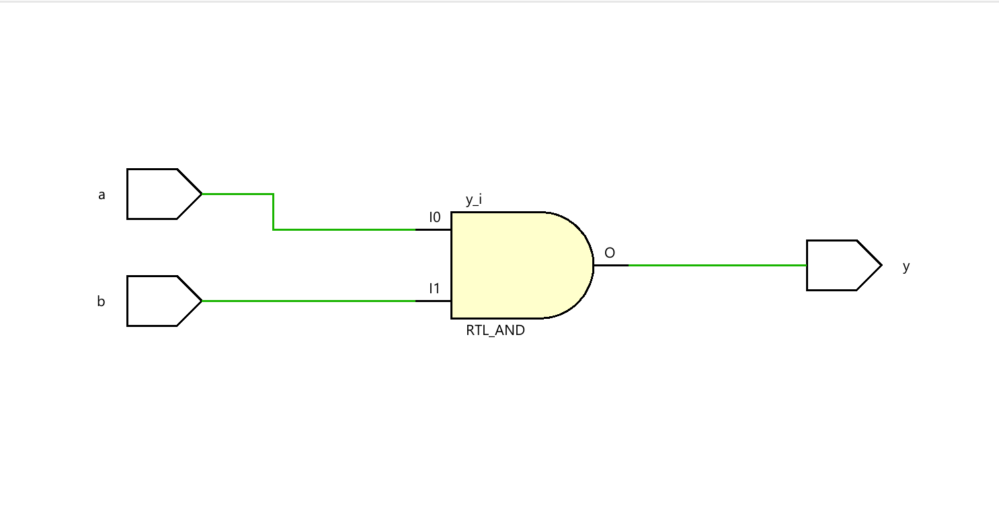
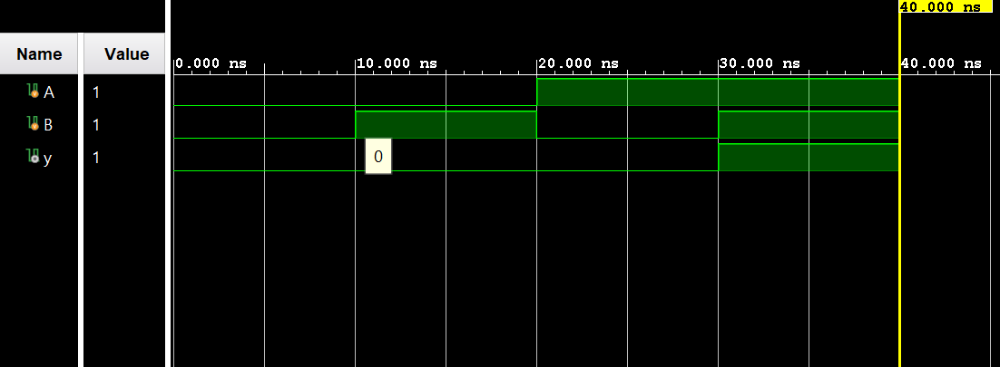

# ◈ **Verilog RTL code** 

```verilog
`timescale 1ns / 1ps

module and_gate (
    input a,
    input b,
    output y

);

assign y = a & b;

endmodule

```

# 📊 **Truth table**

| **Inputs** |  | **Output** |
|:---:|:---:|:---:|
| **A** | **B** | **Y** |
| 0 | 0 | 0 |
| 0 | 1 | 0 |
| 1 | 0 | 0 |
| 1 | 1 | **1** |

# 🧪 **Testbench**

```verilog
module and_gate_tb;

    reg A;
    reg B;
    wire y;

    and_gate DUT (
        .A(A),
        .B(B),
        .y(y)
    );

    initial begin

        $dumpfile("and_gate.vcd");
        $dumpvars(0, and_gate_tb);

        A = 0;
        B = 0;

        #10;

        A = 0;
        B = 1;

        #10;

        A = 1;
        B = 0;

        #10;

        A = 1;
        B = 1;

        #10;

        $finish;

    end

endmodule

```

# 🔷 **RTL Schematics**



# 📈 **Simulation Result**


# ◈ **Verification Summary**

| **Test Case** | **Expected Output** | **Status** |
|:---|:---:|:---:|
| `A=0, B=0` | `Y=0` | **PASS** |
| `A=0, B=1` | `Y=0` | **PASS** |
| `A=1, B=0` | `Y=0` | **PASS** |
| `A=1, B=1` | `Y=1` | **PASS** |

**Verification Result:** `4/4 TEST CASES PASSED`
