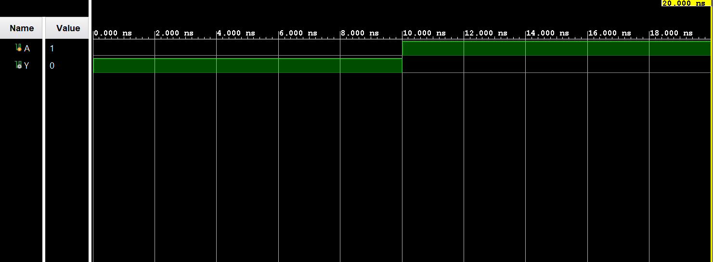

# ◈ **Verilog RTL code** 

```verilog

module not_gate(
    
    input A,
    output Y

);

assign Y = ~A;

endmodule

```

# 📊 **Truth table**

| **Inputs** |  | **Output** |
|:---:||:---:|
| **A** | **Y** | 
| 1     | 0     |
| 0     | 1     |

# 🧪 **Testbench**

```verilog

module not_gate_tb;
     
     reg A;
     wire Y;

     not_gate DUT(
        .A(A),
        .Y(Y)
     );

     initial begin
        $dumpfile("not_gate.vcd");
        $dumpvars(0, not_gate_tb);

        A = 0;

        #10;

        A = 1;

        #10;

        $finish;

    end
endmodule         

```

# 🔷 **RTL Schematics**


# 📈 **Simulation Result**


# ◈ **Verification Summary**

| **Test Case** | **Expected Output** | **Status** |
|:---:|:---:|:---:|
| `A=0, B=0` | `y=0` | **PASS** |
| `A=0, B=1` | `y=0` | **PASS** |
| `A=1, B=0` | `y=0` | **PASS** |
| `A=1, B=1` | `y=1` | **PASS** |

**Verification Result:** `4/4 TEST CASES PASSED`
