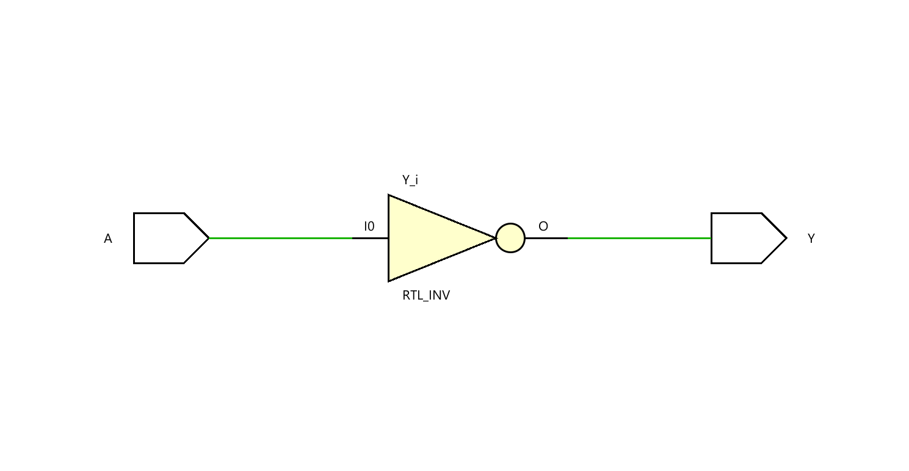

# ◈ NOT Gate (`not_gate`)

### Fundamental Logic Gate • Combinational RTL • Dataflow Modeling

---

## 📌 Module Description

The **NOT Gate** is a basic combinational circuit where the output `Y` is the **logical inverse** of the input `A`, producing **HIGH (`1`)** when `A` is LOW (`0`) and **LOW (`0`)** when `A` is HIGH (`1`). Implemented using continuous assignment (`assign`) in dataflow abstraction.

---

# ◈ **Verilog RTL code** 

```verilog

module not_gate(
    
    input A,
    output Y

);

assign Y = ~A;

endmodule

```

# 📊 **Truth table**

| **Inputs** | **Output** |
|:---:|:---:|
| **A** | **Y** |
| 0 | **1** |
| 1 | **0** |

# 🧪 **Testbench**

```verilog

module not_gate_tb;
     
     reg A;
     wire Y;

     not_gate DUT(
        .A(A),
        .Y(Y)
     );

     initial begin
        $dumpfile("not_gate.vcd");
        $dumpvars(0, not_gate_tb);

        A = 0;

        #10;

        A = 1;

        #10;

        $finish;

    end
endmodule         

```

# 🔷 **RTL Schematics**



# 📈 **Simulation Result**


# ◈ **Verification Summary**

| **Test Case** | **Expected Output** | **Status** |
|:---:|:---:|:---:|
| `A=1,` | `y=0` | **PASS** |
| `A=0,` | `y=1` | **PASS** |

**Verification Result:** `2/2 TEST CASES PASSED`
