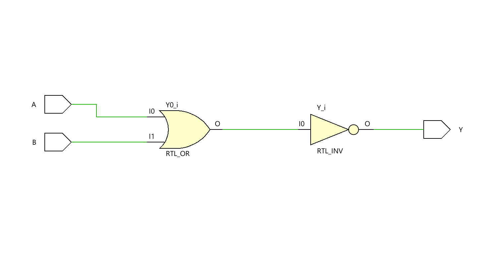
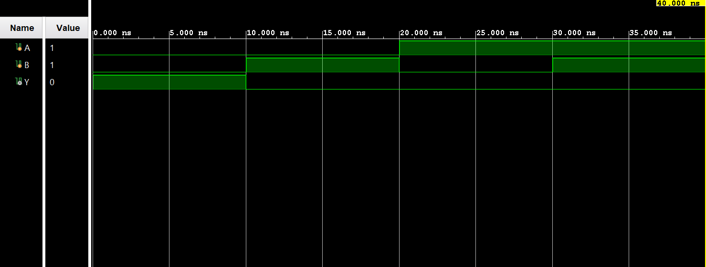

# ◈ NOR Gate (`nor_gate`)

### Fundamental Logic Gate • Combinational RTL • Dataflow Modeling

---

## 📌 Module Description

The **2-Input NOR Gate** is a basic combinational circuit where the output `Y` goes **HIGH (`1`)** only when both inputs `A` and `B` are **LOW (`0`)**; otherwise, the output remains **LOW (`0`)**. Implemented using continuous assignment (`assign`) in dataflow abstraction.

---

# ◈ **Verilog RTL code** 

```verilog

module nor_gate(
    
    input A,
    input B,
    output Y

);

assign Y = ~(A | B);

endmodule
```

# 📊 **Truth table**
| **Inputs** |  | **Output** |
|:---:|:---:|:---:|
| **A** | **B** | **Y** |
| 0 | 0 | **1** |
| 0 | 1 | **0** |
| 1 | 0 | **0** |
| 1 | 1 | **0** |

# 🧪 **Testbench**

```verilog

module nor_gate_tb;
     
     reg A;
     reg B;
     wire Y;

     nor_gate DUT(
        .A(A),
        .B(B),
        .Y(Y)
     );

     initial begin

        $dumpfile("nor_gate.vcd");
        $dumpvars(0, nor_gate_tb);

        A = 0;
        B = 0;

        #10;

        A = 0;
        B = 1;

        #10;

        A = 1;
        B = 0;

        #10;

        A = 1;
        B = 1;

        #10;

        $finish;

    end    

endmodule       

```

# 🔷 **RTL Schematics**



# 📈 **Simulation Result**


# ◈ **Verification Summary**

| **Test Case** | **Expected Output** | **Status** |
|:---:|:---:|:---:|
| `A=0, B=0` | `y=1` | **PASS** |
| `A=0, B=1` | `y=0` | **PASS** |
| `A=1, B=0` | `y=0` | **PASS** |
| `A=1, B=1` | `y=0` | **PASS** |

**Verification Result:** `4/4 TEST CASES PASSED`
