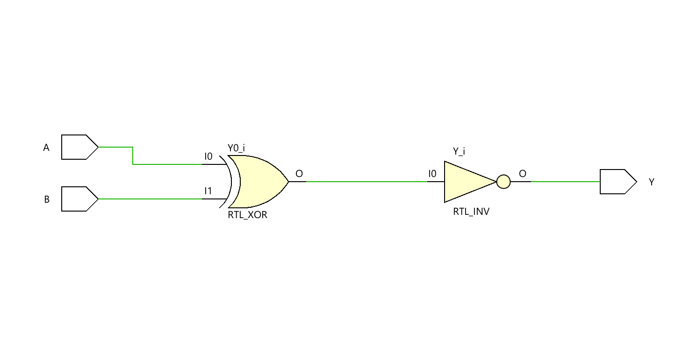
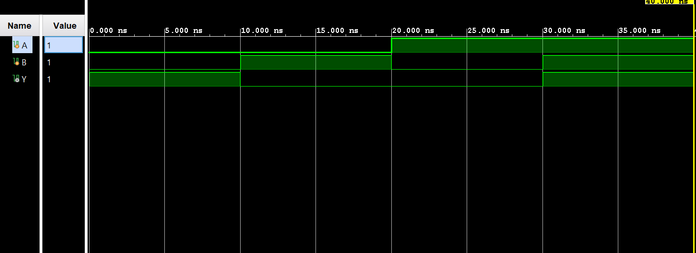

# ◈ XNOR Gate (`xnor_gate`)

### Fundamental Logic Gate • Combinational RTL • Dataflow Modeling

---

## 📌 Module Description

The **2-Input XNOR Gate** is a basic combinational circuit where the output `Y` goes **HIGH (`1`)** when the inputs `A` and `B` are **the same** and goes **LOW (`0`)** when the inputs are different. Implemented using continuous assignment (`assign`) in dataflow abstraction.

---

# ◈ **Verilog RTL code** 

```verilog

module xnor_gate(

    input A,
    input B,
    output Y

);

assign Y = ~(A ^ B);

endmodule 

```

# 📊 **Truth table**

| **Inputs** |  | **Output** |
|:---:|:---:|:---:|
| **A** | **B** | **Y** |
| 0 | 0 | 1 |
| 0 | 1 | 0 |
| 1 | 0 | 0 |
| 1 | 1 | **1** |

# 🧪 **Testbench**

```verilog

module xnor_gate_tb;

    reg A;
    reg B;
    wire Y;

    xnor_gate DUT(
        .A(A),
        .B(B),
        .Y(Y)

    );

    initial begin
        $dumpfile("xnor_gate.vcd");
        $dumpvars(0, xnor_gate_tb);

        A = 0;
        B = 0;

        #10;

        A = 0;
        B = 1;

        #10;

        A = 1;
        B = 0;

        # 10;

        A = 1;
        B = 1;

        #10;
        
        $finish;
        
    end    

endmodule            

```

# 🔷 **RTL Schematics**



# 📈 **Simulation Result**


# ◈ **Verification Summary**

| **Test Case** | **Expected Output** | **Status** |
|:---|:---:|:---:|
| `A=0, B=0` | `y=1` | **PASS** |
| `A=0, B=1` | `y=0` | **PASS** |
| `A=1, B=0` | `y=0` | **PASS** |
| `A=1, B=1` | `y=1` | **PASS** |

**Verification Result:** `4/4 TEST CASES PASSED`

