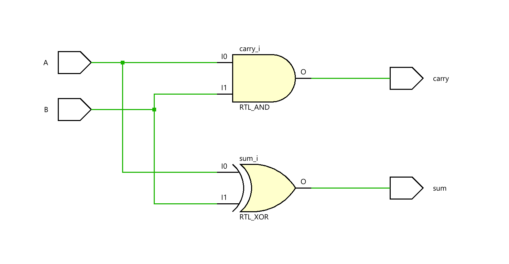
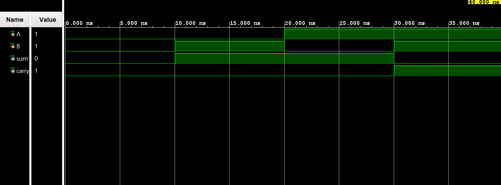

# ◈ **Verilog RTL code** 

```verilog

module half_adder(

    input A,
    input B,
    output sum,
    output carry

);

assign sum = A ^ B;
assign carry = A & B;

endmodule

```

# 📊 **Truth table**

| **Inputs** |  | **Output** |
|:---:|:---:|:---:|
| **A** | **B** | **Sum** | **Carry** |
| 0 | 0 | 0 | 0 |
| 0 | 1 | 1 | 0 |
| 1 | 0 | 1 | 0 |
| 1 | 1 | 0 | **1** |

# 🧪 **Testbench**

```verilog

module half_adder_tb.v;

    reg A;
    reg B;
    wire sum;
    wire carry;

    half_adder DUT(
        .A(A),
        .B(B),
        .sum(sum),
        .carry(carry)

    );

    initial begin
        $dumpfile("half_adder.vcd")
        $dumpvars(0, half_adder_tb);

        A = 0;
        B = 0;

        #10;

        A = 0;
        B = 1;

        #10;

        A = 1;
        B = 0;

        #10;

        A = 1;
        B = 1;

        #10;

        $finish;

    end

endmodule               

```

# 🔷 **RTL Schematics**



# 📈 **Simulation Result**


# ◈ **Verification Summary**

| **Test Case** | **Expected Output** | **Status** |
|:---|:---:|:---:|
| `A=0, B=0` | `Sum=0, Carry=0` | **PASS** |
| `A=0, B=1` | `Sum=1, Carry=0` | **PASS** |
| `A=1, B=0` | `Sum=1, Carry=0` | **PASS** |
| `A=1, B=1` | `Sum=0, Carry=1` | **PASS** |

**Verification Result:** `4/4 TEST CASES PASSED`

