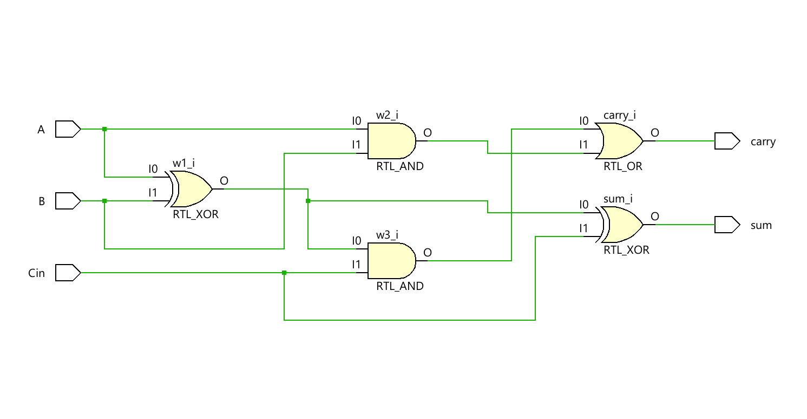
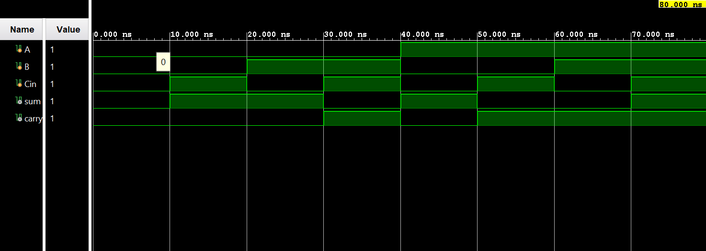

# ◈ Full Adder Using Two Half Adders 

### Combinational Circuit • Hierarchical Design • Structural Modeling

---

## 📌 Module Description

The **Full Adder Using Two Half Adders** is a combinational arithmetic circuit that performs the addition of **three 1-bit inputs**—`A`, `B`, and `Cin`—by cascading **two Half Adders** and an OR gate to produce the **Sum (`S`)** and **Carry-Out (`Cout`)** outputs. Implemented using module instantiation in structural abstraction.

---

# ◈ **Verilog RTL code** 

```verilog

module full_adder_using_half_adder(

    input A,
    input B,
    input Cin,
    output sum,
    output carry

);

wire w1, w2, w3;

assign w1 = A ^ B;
assign w2 = A & B;

assign sum = w1 ^ Cin;

assign w3 = w1 & Cin;
assign carry = w3 | w2;

endmodule

```

# 📊 **Truth table**

| **Inputs** | **Inputs** | **Inputs** | **Output** | **Output** |
|:---:|:---:|:---:|:---:|:---:|
| **A** | **B** | **Cin** | **Sum** | **Cout** |
| 0 | 0 | 0 | 0 | 0 |
| 0 | 0 | 1 | 1 | 0 |
| 0 | 1 | 0 | 1 | 0 |
| 0 | 1 | 1 | 0 | 1 |
| 1 | 0 | 0 | 1 | 0 |
| 1 | 0 | 1 | 0 | 1 |
| 1 | 1 | 0 | 0 | 1 |
| 1 | 1 | 1 | 1 | **1** |

# 🧪 **Testbench**

```verilog

module full_adder_using_half_adder_tb;
     reg A;
     reg B;
     reg Cin;

     wire sum;
     wire carry;

     full_adder_using_half_adder DUT(
        .A(A),
        .B(B),
        .Cin(Cin),
        .sum(sum),
        .carry(carry)

     );

     initial begin
        $dumpfile("full_adder_using_half_adder.vcd");
        $dumpvars(0, full_adder_using_half_adder_tb);

        A = 0;
        B = 0;
        Cin = 0;

        #10;

        A = 0;
        B = 0;
        Cin = 1;

        #10;

        A = 0;
        B = 1;
        Cin = 0;

        #10;

        A = 0;
        B = 1;
        Cin = 1;

        #10;

        A = 1;
        B = 0;
        Cin = 0;
         
        #10;

        A = 1;
        B = 0;
        Cin = 1;
         
        #10;

        A = 1;
        B = 1;
        Cin = 0;
         
        #10;

        A = 1;
        B = 1;
        Cin = 1;
         
        #10;

        $finish;

    end

endmodule               

```

# 🔷 **RTL Schematics**



# 📈 **Simulation Result**


# ◈ **Verification Summary**

| **Test Case** | **Expected Output** | **Status** |
|:---|:---:|:---:|
| `A=0, B=0, Cin=0` | `Sum=0, Cout=0` | **PASS** |
| `A=0, B=0, Cin=1` | `Sum=1, Cout=0` | **PASS** |
| `A=0, B=1, Cin=0` | `Sum=1, Cout=0` | **PASS** |
| `A=0, B=1, Cin=1` | `Sum=0, Cout=1` | **PASS** |
| `A=1, B=0, Cin=0` | `Sum=1, Cout=0` | **PASS** |
| `A=1, B=0, Cin=1` | `Sum=0, Cout=1` | **PASS** |
| `A=1, B=1, Cin=0` | `Sum=0, Cout=1` | **PASS** |
| `A=1, B=1, Cin=1` | `Sum=1, Cout=1` | **PASS** |

**Verification Result:** `8/8 TEST CASES PASSED`
