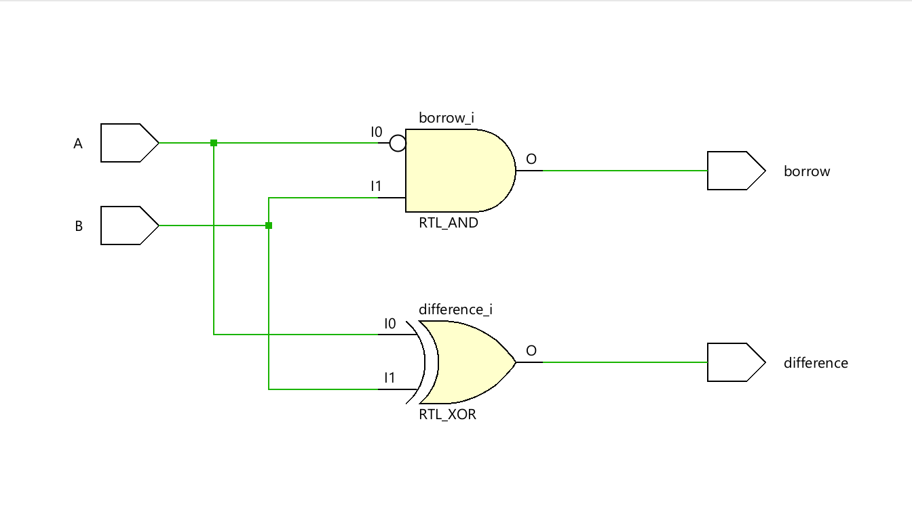
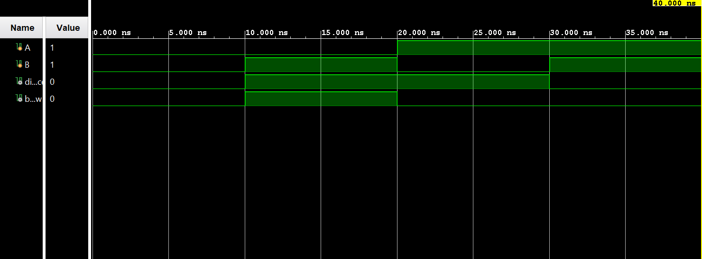

# ◈ **Verilog RTL code** 

```verilog

module half_subtractor(

    input A,
    input B,
    output difference,
    output borrow

);

wire w1;

assign difference = A ^ B;
assign w1 = ~A;
assign borrow = w1 & B;

endmodule

```

# 📊 **Truth table**

| **Inputs** | **Inputs** | **Output** | **Output** |
|:---:|:---:|:---:|:---:|
| **A** | **B** | **Difference** | **Borrow** |
| 0 | 0 | 0 | 0 |
| 0 | 1 | 1 | 1 |
| 1 | 0 | 1 | 0 |
| 1 | 1 | 0 | **0** |

# 🧪 **Testbench**

```verilog

module half_subtractor_tb;

    reg A;
    reg B;
    wire difference;
    wire borrow;

    half_subtractor DUT(
        .A(A),
        .B(B),
        .difference(difference),
        .borrow(borrow)

    );

    initial begin
        $dumpfile("half_subtractor.vcd");
        $dumpvars(0, half_subtractor_tb);

        A = 0;
        B = 0;

        #10;

        A = 0;
        B = 1;

        #10;

        A = 1;
        B = 0;

        #10;

        A = 1;
        B = 1;

        #10;

        $finish;

    end

endmodule                       

```

# 🔷 **RTL Schematics**



# 📈 **Simulation Result**


# ◈ **Verification Summary**

| **Test Case** | **Expected Output** | **Status** |
|:---|:---:|:---:|
| `A=0, B=0` | `Difference=0, Borrow=0` | **PASS** |
| `A=0, B=1` | `Difference=1, Borrow=1` | **PASS** |
| `A=1, B=0` | `Difference=1, Borrow=0` | **PASS** |
| `A=1, B=1` | `Difference=0, Borrow=0` | **PASS** |

**Verification Result:** `4/4 TEST CASES PASSED`

