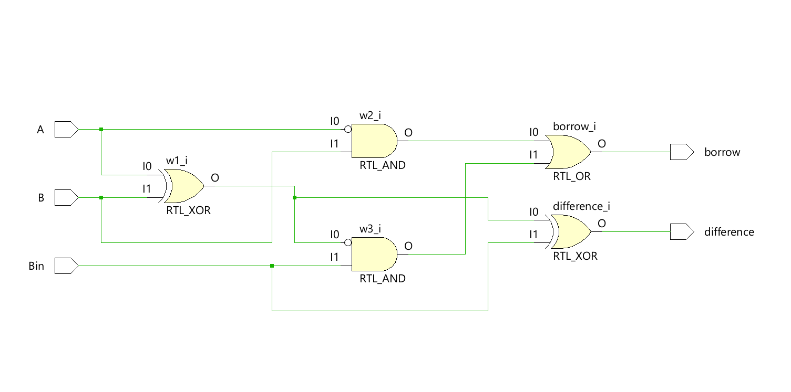
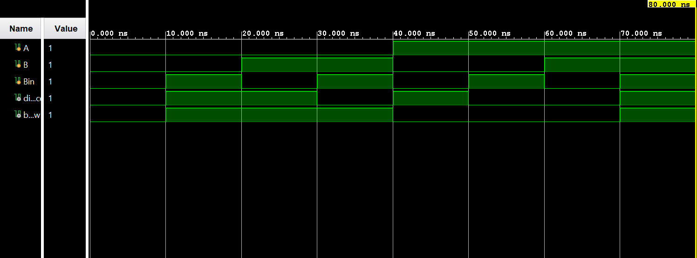

# ◈ **Verilog RTL code** 

```verilog

module full_subtractor_using_two_half_subtractor(

    input A,
    input B,
    input Bin,
    output difference,
    output borrow

);

wire w1, w2, w3;

assign w1 = A ^ B;
assign difference = w1 ^ Bin;

assign w2 = ~A & B;
assign w3 = ~w1 & Bin;
assign borrow = w2 | w3;

endmodule

```

# 📊 **Truth table**

| **Inputs** | **Inputs** | **Inputs** | **Output** | **Output** |
|:---:|:---:|:---:|:---:|:---:|
| **A** | **B** | **Bin** | **Difference** | **Borrow** |
| 0 | 0 | 0 | 0 | 0 |
| 0 | 0 | 1 | 1 | 1 |
| 0 | 1 | 0 | 1 | 1 |
| 0 | 1 | 1 | 0 | 1 |
| 1 | 0 | 0 | 1 | 0 |
| 1 | 0 | 1 | 0 | 0 |
| 1 | 1 | 0 | 0 | 0 |
| 1 | 1 | 1 | 1 | **1** |

# 🧪 **Testbench**

```verilog

module full_subtractor_using_two_half_subtractor_tb;
     reg A;
     reg B;
     reg Bin;

     wire difference;
     wire borrow;

     full_subtractor_using_two_half_subtractor DUT(
        .A(A),
        .B(B),
        .Bin(Bin),
        .difference(difference),
        .borrow(borrow)

     );

     initial begin
        $dumpfile("full_subtractor_using_two_half_subtractor.vcd");
        $dumpvars(0, full_subtractor_using_two_half_subtractor_tb);

        A = 0;
        B = 0;
        Bin = 0;

        #10;

        A = 0;
        B = 0;
        Bin = 1;

        #10;

        A = 0;
        B = 1;
        Bin = 0;

        #10;

        A = 0;
        B = 1;
        Bin = 1;

        #10;

        A = 1;
        B = 0;
        Bin = 0;
         
        #10;

        A = 1;
        B = 0;
        Bin = 1;
         
        #10;

        A = 1;
        B = 1;
        Bin = 0;
         
        #10;

        A = 1;
        B = 1;
        Bin = 1;
         
        #10;

        $finish;

    end

endmodule               

```

# 🔷 **RTL Schematics**



# 📈 **Simulation Result**


# ◈ **Verification Summary**

| **Test Case** | **Expected Output** | **Status** |
|:---|:---:|:---:|
| `A=0, B=0, Bin=0` | `Difference=0, Borrow=0` | **PASS** |
| `A=0, B=0, Bin=1` | `Difference=1, Borrow=1` | **PASS** |
| `A=0, B=1, Bin=0` | `Difference=1, Borrow=1` | **PASS** |
| `A=0, B=1, Bin=1` | `Difference=0, Borrow=1` | **PASS** |
| `A=1, B=0, Bin=0` | `Difference=1, Borrow=0` | **PASS** |
| `A=1, B=0, Bin=1` | `Difference=0, Borrow=0` | **PASS** |
| `A=1, B=1, Bin=0` | `Difference=0, Borrow=0` | **PASS** |
| `A=1, B=1, Bin=1` | `Difference=1, Borrow=1` | **PASS** |

**Verification Result:** `8/8 TEST CASES PASSED`

