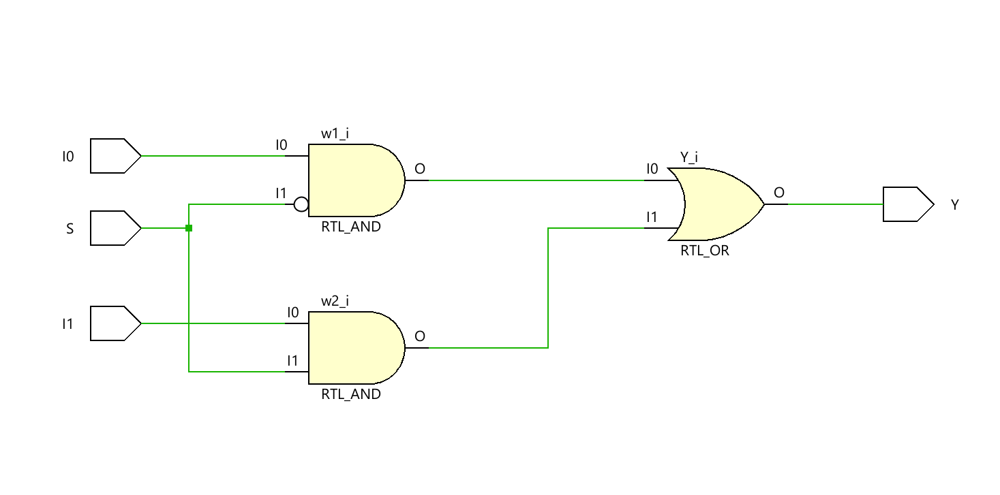
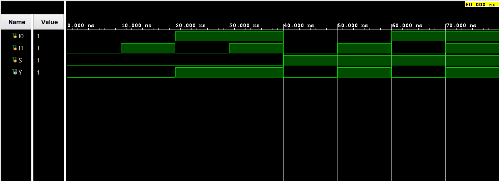

# ◈ **Verilog RTL code** 

```verilog

module mux_2to1(
    
    input I0,
    input I1,
    input S,
    output Y

);

wire w1, w2;

assign w1 = ( I0 & ~S);
assign w2 = ( I1 & S);

assign Y = w1 | w2;

endmodule

```

# 📊 **Truth table**

| **Inputs** | **Inputs** | **Inputs** | **Output** |
|:---:|:---:|:---:|:---:|
| **I0** | **I1** | **S** | **Y** |
| 0 | 0 | 0 | 0 |
| 0 | 1 | 0 | 0 |
| 1 | 0 | 0 | 1 |
| 1 | 1 | 0 | 1 |
| 0 | 0 | 1 | 0 |
| 0 | 1 | 1 | 1 |
| 1 | 0 | 1 | 0 |
| 1 | 1 | 1 | 1 |

# 🧪 **Testbench**

```verilog

module mux_2to1_tb;

    reg I0;
    reg I1;
    reg S;

    wire Y;

    mux_2to1 DUT(
        .I0(I0),
        .I1(I1),
        .S(S),
        .Y(Y)
    );

    initial begin
        $dumpfile("mux_2to1.vcd");
        $dumpvars(0, mux_2to1_tb);

        // taken S =0

        I0 = 0;
        I1 = 0;
        S = 0;

        #10;

        I0 = 0;
        I1 = 1;
        S = 0;

        #10;

        I0 = 1;
        I1 = 0;
        S = 0;

        #10;

        I0 = 1;
        I1 = 1;
        S = 0;

        #10;

       // here S = 1

        I0 = 0;
        I1 = 0;
        S = 1;

        #10;

        I0 = 0;
        I1 = 1;
        S = 1;

        #10;

        I0 = 1;
        I1 = 0;
        S = 1;

        #10;

        I0 = 1;
        I1 = 1;
        S = 1;

        #10;

        $finish;

    end

endmodule        

```

# 🔷 **RTL Schematics**



# 📈 **Simulation Result**


# ◈ **Verification Summary**

| **Test Case** | **Expected Output** | **Status** |
|:---|:---:|:---:|
| `I0=0, I1=0, S=0` | `Y=0` | **PASS** |
| `I0=0, I1=0, S=1` | `Y=0` | **PASS** |
| `I0=0, I1=1, S=0` | `Y=0` | **PASS** |
| `I0=0, I1=1, S=1` | `Y=1` | **PASS** |
| `I0=1, I1=0, S=0` | `Y=1` | **PASS** |
| `I0=1, I1=0, S=1` | `Y=0` | **PASS** |
| `I0=1, I1=1, S=0` | `Y=1` | **PASS** |
| `I0=1, I1=1, S=1` | `Y=1` | **PASS** |

**Verification Result:** `8/8 TEST CASES PASSED`


