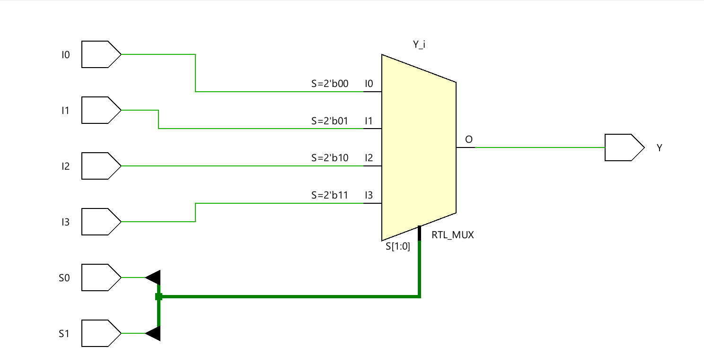
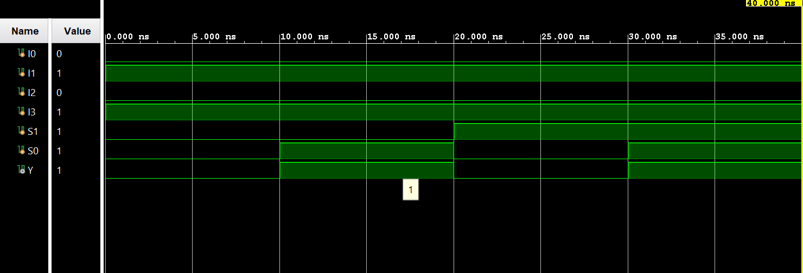

# ◈ **Verilog RTL code** 

```verilog

module mux_4to1(

    input I0,
    input I1,
    input I2,
    input I3,

    input S0,
    input S1,

    output reg Y
);

always @(*) begin
    
    case ({S1, S0})

       2'b00: Y = I0;
       2'b01: Y = I1;
       2'b10: Y = I2;
       2'b11: Y = I3;

    endcase
end
endmodule

```

# 📊 **Truth table**

| **Inputs** | **Inputs** | **Inputs** | **Inputs** | **Inputs** | **Output** |
|:---:|:---:|:---:|:---:|:---:|:---:|
| **I0** | **I1** | **I2** | **I3** | **S1 S0** | **Y** |
| X | X | X | X | 00 | I0 |
| X | X | X | X | 01 | I1 |
| X | X | X | X | 10 | I2 |
| X | X | X | X | 11 | I3 |
# 🧪 **Testbench**

```verilog

module mux_4to1_tb;

    reg I0;
    reg I1;
    reg I2;
    reg I3;

    reg S1;
    reg S0;

    wire Y;

    mux_4to1 DUT(

        .I0(I0),
        .I1(I1),
        .I2(I2),
        .I3(I3),

        .S1(S1),
        .S0(S0),

        .Y(Y)

    );

    initial begin

        $dumpfile("mux_4to1.vcd");
        $dumpvars(0, mux_4to1_tb);

        // Input value

        I0 = 0;
        I1 = 1;
        I2 = 0;
        I3 = 1;

        // S1S0 = 00  select I0

        S1 = 0;
        S0 = 0;

        #10;
        
        // S1S0 = 01  select I1

        S1 = 0;
        S0 = 1;

        #10;

        // S1S0 = 10 select I2

        S1 = 1;
        S0 = 0;

        #10;

        // S1S0 = 11  select I3

        S1 = 1;
        S0 = 1;

        #10;

        $finish;

    end    

endmodule         

```

# 🔷 **RTL Schematics**



# 📈 **Simulation Result**


# ◈ **Verification Summary**

| **Test Case** | **Expected Output** | **Status** |
|:---|:---:|:---:|
| `I0=0, I1=1, I2=0, I3=1, S1=0, S0=0` | `Y=0` | **PASS** |
| `I0=0, I1=1, I2=0, I3=1, S1=0, S0=1` | `Y=1` | **PASS** |
| `I0=0, I1=1, I2=0, I3=1, S1=1, S0=0` | `Y=0` | **PASS** |
| `I0=0, I1=1, I2=0, I3=1, S1=1, S0=1` | `Y=1` | **PASS** |

**Verification Result:** `4/4 TEST CASES PASSED`


