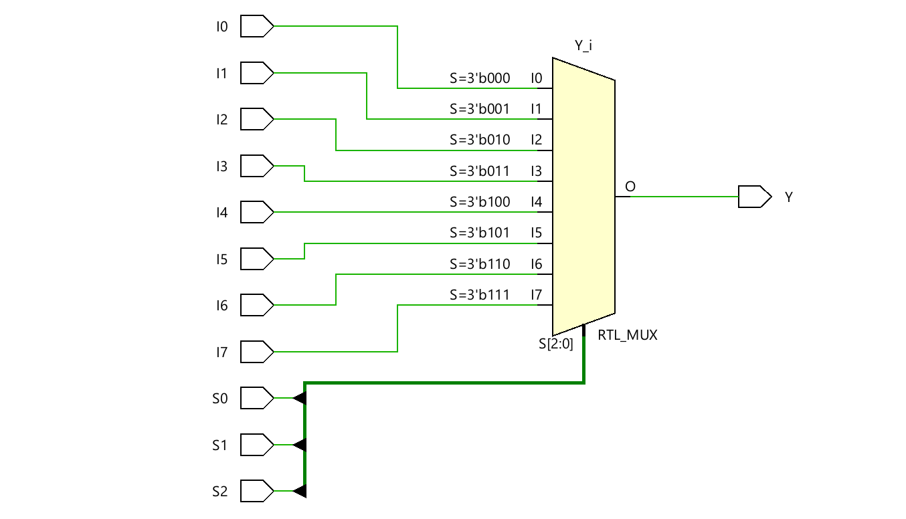
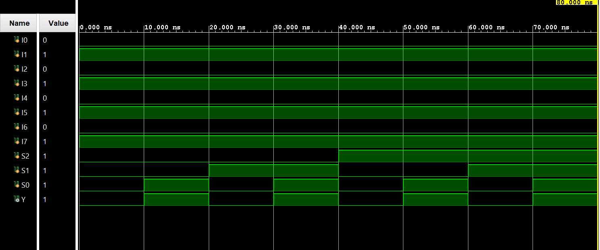

# ◈ **Verilog RTL code** 

```verilog

module mux_8to1(

    input I0, I1, I2, I3, I4, I5, I6, I7,

    input S2, S1, S0,

    output reg Y

);

always @(*) begin
    
    case ({S2, S1, S0})

       3'b000: Y = I0; 
       3'b001: Y = I1;
       3'b010: Y = I2;
       3'b011: Y = I3;
       3'b100: Y = I4;
       3'b101: Y = I5;
       3'b110: Y = I6;
       3'b111: Y = I7;
       
    endcase   
end
endmodule    

```
# 📊 **Truth table**

| **Inputs** | **Inputs** | **Inputs** | **Inputs** | **Inputs** | **Inputs** | **Inputs** | **Inputs** | **Inputs** | **Inputs** | **Inputs** | **Output** |
|:---:|:---:|:---:|:---:|:---:|:---:|:---:|:---:|:---:|:---:|:---:|:---:|
| **I0** | **I1** | **I2** | **I3** | **I4** | **I5** | **I6** | **I7** | **S2** | **S1** | **S0** | **Y** |
| X | X | X | X | X | X | X | X | 0 | 0 | 0 | I0 |
| X | X | X | X | X | X | X | X | 0 | 0 | 1 | I1 |
| X | X | X | X | X | X | X | X | 0 | 1 | 0 | I2 |
| X | X | X | X | X | X | X | X | 0 | 1 | 1 | I3 |
| X | X | X | X | X | X | X | X | 1 | 0 | 0 | I4 |
| X | X | X | X | X | X | X | X | 1 | 0 | 1 | I5 |
| X | X | X | X | X | X | X | X | 1 | 1 | 0 | I6 |
| X | X | X | X | X | X | X | X | 1 | 1 | 1 | **I7** |

# 🧪 **Testbench**

```verilog

module mux_8to1_tb;
   
   reg I0, I1, I2,I3, I4, I5, I6, I7;
   
   reg S2, S1, S0;

   wire Y;

   mux_8to1 DUT(
    .I0(I0),
    .I1(I1),
    .I2(I2),
    .I3(I3),    
    .I4(I4),
    .I5(I5),
    .I6(I6),
    .I7(I7),
    .S1(S1),
    .S2(S2),
    .S3(S3),
    .Y(Y)
   
   );

   initial begin
      $dumpfile("mux_8to1.vcd");
      $dumpvars(0, mux_8to1_tb);

      //Input value

      I0 = 0;
      I1 = 1;
      I2 = 0;
      I3 = 1;
      I4 = 0;
      I5 = 1;
      I6 = 0;
      I7 = 1;

      // S2S1S0 = 000 → select I0

      S2 = 0;
      S1 = 0;
      S0 = 0;

      #10;

      // S2S1S0 = 001 → select I1

      S2 = 0;
      S1 = 0;
      S0 = 1;

      #10;

      // S2S1S0 = 010 → select I2

      S2 = 0;
      S1 = 1;
      S0 = 0;

      #10;

      // S2S1S0 = 011 → select I3

      S2 = 0;
      S1 = 1;
      S0 = 1;

      #10;

      // S2S1S0 = 100 → select I4

      S2 = 1;
      S1 = 0;
      S0 = 0;

      #10;

      // S2S1S0 = 101 → select I5

      S2 = 1;
      S1 = 0;
      S0 = 1;

      #10;

      // S2S1S0 = 110 → select I6

      S2 = 1;
      S1 = 1;
      S0 = 0;

      #10;

      // S2S1S0 = 111 → select I7

      S2 = 1;
      S1 = 1;
      S0 = 1;

      #10;

      $finish;

    end

endmodule         

```

# 🔷 **RTL Schematics**



# 📈 **Simulation Result**


# ◈ **Verification Summary**

| **Test Case** | **Expected Output** | **Status** |
|:---|:---:|:---:|
| `I0=0, I1=1, I2=0, I3=1, I4=0, I5=1, I6=0, I7=1, S2=0, S1=0, S0=0` | `Y=0` | **PASS** |
| `I0=0, I1=1, I2=0, I3=1, I4=0, I5=1, I6=0, I7=1, S2=0, S1=0, S0=1` | `Y=1` | **PASS** |
| `I0=0, I1=1, I2=0, I3=1, I4=0, I5=1, I6=0, I7=1, S2=0, S1=1, S0=0` | `Y=0` | **PASS** |
| `I0=0, I1=1, I2=0, I3=1, I4=0, I5=1, I6=0, I7=1, S2=0, S1=1, S0=1` | `Y=1` | **PASS** |
| `I0=0, I1=1, I2=0, I3=1, I4=0, I5=1, I6=0, I7=1, S2=1, S1=0, S0=0` | `Y=0` | **PASS** |
| `I0=0, I1=1, I2=0, I3=1, I4=0, I5=1, I6=0, I7=1, S2=1, S1=0, S0=1` | `Y=1` | **PASS** |
| `I0=0, I1=1, I2=0, I3=1, I4=0, I5=1, I6=0, I7=1, S2=1, S1=1, S0=0` | `Y=0` | **PASS** |
| `I0=0, I1=1, I2=0, I3=1, I4=0, I5=1, I6=0, I7=1, S2=1, S1=1, S0=1` | `Y=1` | **PASS** |

**Verification Result:** `8/8 TEST CASES PASSED`


