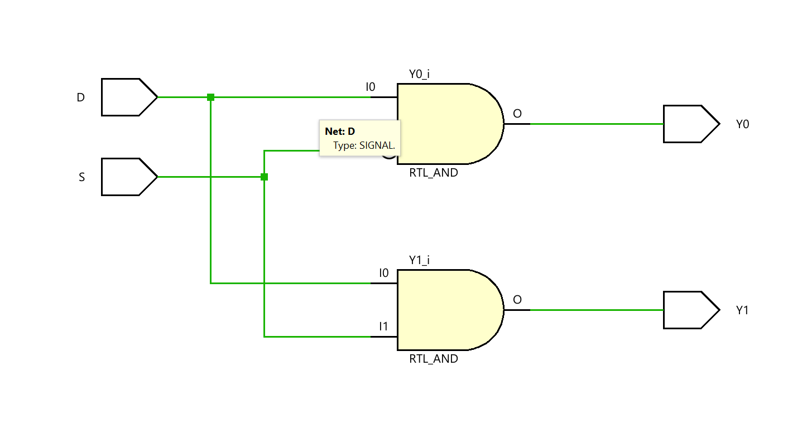
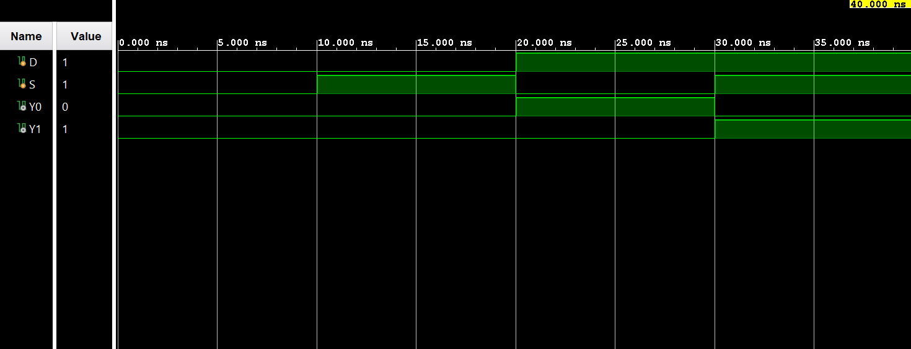

# ◈ **Verilog RTL code** 

```verilog

module demux_1to2(

    input D,
    input S,

    output Y0,
    output Y1

);

assign Y0 = D & ~S;
assign Y1 = D & S;

endmodule

```

# 📊 **Truth table**

| **Inputs** | **Inputs** | **Output** | **Output** |
|:---:|:---:|:---:|:---:|
| **D** | **S** | **Y0** | **Y1** |
| 0 | 0 | 0 | 0 |
| 0 | 1 | 0 | 0 |
| 1 | 0 | **1** | 0 |
| 1 | 1 | 0 | **1** |

# 🧪 **Testbench**

```verilog

module demux_1to2_tb;

    reg D;
    reg S;

    wire Y0;
    wire Y1;

    demux_1to2 DUT(
        .D(D),
        .S(S),
        .Y0(Y0),
        .Y1(Y1)
    );

    initial begin

        $dumpfile("demux_1to2.vcd");
        $dumpvars(0, demux_1to2_tb);

        // D = 0, S = 0 → Y0 = 0, Y1 = 0

        D = 0;
        S = 0;

        #10;

        // D = 0, S = 1 → Y0 = 0, Y1 = 0

        D = 0;
        S = 1;

        #10;

        // D = 1, S = 0 → D goes to Y0

        D = 1;
        S = 0;

        #10;

        // D = 1, S = 1 → D goes to Y1

        D = 1;
        S = 1;

        #10;

        $finish;

    end

endmodule        

```

# 🔷 **RTL Schematics**



# 📈 **Simulation Result**


# ◈ **Verification Summary**

| **Test Case** | **Expected Output** | **Status** |
|:---|:---:|:---:|
| `D=0, S=0` | `Y0=0, Y1=0` | **PASS** |
| `D=0, S=1` | `Y0=0, Y1=0` | **PASS** |
| `D=1, S=0` | `Y0=1, Y1=0` | **PASS** |
| `D=1, S=1` | `Y0=0, Y1=1` | **PASS** |

**Verification Result:** `4/4 TEST CASES PASSED`


