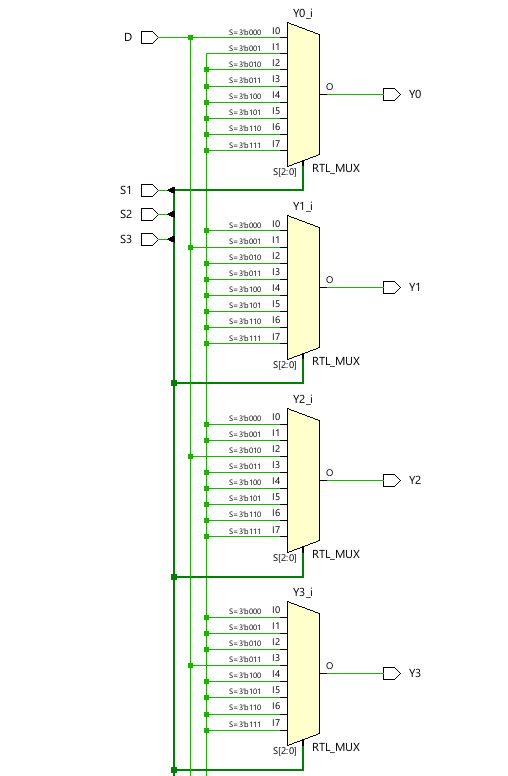
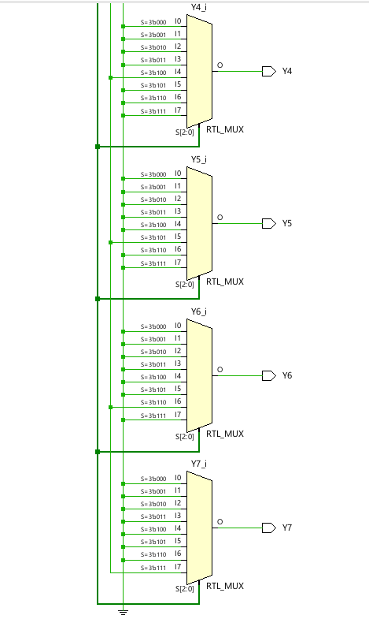
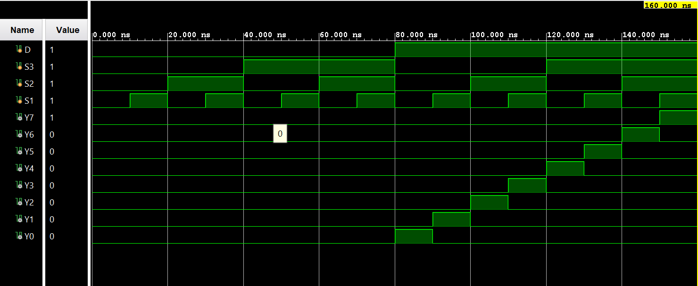

# ◈ **Verilog RTL code** 

```verilog

module demux_1to8(
    input D,
    input S3, S2, S1,

    output reg Y7, Y6, Y5, Y4, Y3, Y2, Y1, Y0

);

always @(*) begin

    case ({S3, S2, S1})

    3'b000: begin
        Y0 = D;
        Y1 = 0;
        Y2 = 0;
        Y3 = 0;
        Y4 = 0;
        Y5 = 0;
        Y6 = 0;
        Y7 = 0;
    end    

     3'b001: begin
        Y0 = 0;
        Y1 = D;
        Y2 = 0;
        Y3 = 0;
        Y4 = 0;
        Y5 = 0;
        Y6 = 0;
        Y7 = 0;
    end    

     3'b010: begin
        Y0 = 0;
        Y1 = 0;
        Y2 = D;
        Y3 = 0;
        Y4 = 0;
        Y5 = 0;
        Y6 = 0;
        Y7 = 0;
    end    

     3'b011: begin
        Y0 = 0;
        Y1 = 0;
        Y2 = 0;
        Y3 = D;
        Y4 = 0;
        Y5 = 0;
        Y6 = 0;
        Y7 = 0;
    end    

     3'b100: begin
        Y0 = 0;
        Y1 = 0;
        Y2 = 0;
        Y3 = 0;
        Y4 = D;
        Y5 = 0;
        Y6 = 0;
        Y7 = 0;
    end    

     3'b101: begin
        Y0 = 0;
        Y1 = 0;
        Y2 = 0;
        Y3 = 0;
        Y4 = 0;
        Y5 = D;
        Y6 = 0;
        Y7 = 0;
    end    

     3'b110: begin
        Y0 = 0;
        Y1 = 0;
        Y2 = 0;
        Y3 = 0;
        Y4 = 0;
        Y5 = 0;
        Y6 = D;
        Y7 = 0;
    end    

     3'b111: begin
        Y0 = 0;
        Y1 = 0;
        Y2 = 0;
        Y3 = 0;
        Y4 = 0;
        Y5 = 0;
        Y6 = 0;
        Y7 = D;
    end    
    
    endcase
end
endmodule        

```
# 📊 **Truth table**

| **Inputs** | **Inputs** | **Inputs** | **Inputs** | **Output** | **Output** | **Output** | **Output** | **Output** | **Output** | **Output** |
|:---:|:---:|:---:|:---:|:---:|:---:|:---:|:---:|:---:|:---:|:---:|
| **D** | **S2** | **S1** | **S0** | **Y0** | **Y1** | **Y2** | **Y3** | **Y4** | **Y5** | **Y6** | **Y7** |
| 0 | 0 | 0 | 0 | 0 | 0 | 0 | 0 | 0 | 0 | 0 | 0 |
| 0 | 0 | 0 | 1 | 0 | 0 | 0 | 0 | 0 | 0 | 0 | 0 |
| 0 | 0 | 1 | 0 | 0 | 0 | 0 | 0 | 0 | 0 | 0 | 0 |
| 0 | 0 | 1 | 1 | 0 | 0 | 0 | 0 | 0 | 0 | 0 | 0 |
| 0 | 1 | 0 | 0 | 0 | 0 | 0 | 0 | 0 | 0 | 0 | 0 |
| 0 | 1 | 0 | 1 | 0 | 0 | 0 | 0 | 0 | 0 | 0 | 0 |
| 0 | 1 | 1 | 0 | 0 | 0 | 0 | 0 | 0 | 0 | 0 | 0 |
| 0 | 1 | 1 | 1 | 0 | 0 | 0 | 0 | 0 | 0 | 0 | 0 |
| 1 | 0 | 0 | 0 | **1** | 0 | 0 | 0 | 0 | 0 | 0 | 0 |
| 1 | 0 | 0 | 1 | 0 | **1** | 0 | 0 | 0 | 0 | 0 | 0 |
| 1 | 0 | 1 | 0 | 0 | 0 | **1** | 0 | 0 | 0 | 0 | 0 |
| 1 | 0 | 1 | 1 | 0 | 0 | 0 | **1** | 0 | 0 | 0 | 0 |
| 1 | 1 | 0 | 0 | 0 | 0 | 0 | 0 | **1** | 0 | 0 | 0 |
| 1 | 1 | 0 | 1 | 0 | 0 | 0 | 0 | 0 | **1** | 0 | 0 |
| 1 | 1 | 1 | 0 | 0 | 0 | 0 | 0 | 0 | 0 | **1** | 0 |
| 1 | 1 | 1 | 1 | 0 | 0 | 0 | 0 | 0 | 0 | 0 | **1** |

# 🧪 **Testbench**

```verilog

module demux_1to8_tb;

    reg D;
    reg S3, S2, S1;

    wire Y7, Y6, Y5, Y4, Y3, Y2, Y1, Y0;

    demux_1to8 DUT(
        .D(D),
        .S3(S3),
        .S2(S2),
        .S1(S1),

        .Y0(Y0),
        .Y1(Y1),
        .Y2(Y2),
        .Y3(Y3),
        .Y4(Y4),
        .Y5(Y5),
        .Y6(Y6),
        .Y7(Y7)
    );

    initial begin

        $dumpfile("demux_1to8.vcd");
        $dumpvars(0, demux_1to8_tb);

        // D = 0, S3S2S1 = 000 → All outputs = 0

        D = 0;
        S3 = 0;
        S2 = 0;
        S1 = 0;

        #10;

        // D = 0, S3S2S1 = 001 → All outputs = 0

        D = 0;
        S3 = 0;
        S2 = 0;
        S1 = 1;

        #10;

        // D = 0, S3S2S1 = 010 → All outputs = 0

        D = 0;
        S3 = 0;
        S2 = 1;
        S1 = 0;

        #10;

        // D = 0, S3S2S1 = 011 → All outputs = 0

        D = 0;
        S3 = 0;
        S2 = 1;
        S1 = 1;

        #10;

        // D = 0, S3S2S1 = 100 → All outputs = 0

        D = 0;
        S3 = 1;
        S2 = 0;
        S1 = 0;

        #10;

        // D = 0, S3S2S1 = 101 → All outputs = 0

        D = 0;
        S3 = 1;
        S2 = 0;
        S1 = 1;

        #10;

        // D = 0, S3S2S1 = 110 → All outputs = 0

        D = 0;
        S3 = 1;
        S2 = 1;
        S1 = 0;

        #10;

        // D = 0, S3S2S1 = 111 → All outputs = 0

        D = 0;
        S3 = 1;
        S2 = 1;
        S1 = 1;

        #10;

        // D = 1, S3S2S1 = 000 → D goes to Y0

        D = 1;
        S3 = 0;
        S2 = 0;
        S1 = 0;

        #10;

        // D = 1, S3S2S1 = 001 → D goes to Y1

        D = 1;
        S3 = 0;
        S2 = 0;
        S1 = 1;

        #10;

        // D = 1, S3S2S1 = 010 → D goes to Y2

        D = 1;
        S3 = 0;
        S2 = 1;
        S1 = 0;

        #10;

        // D = 1, S3S2S1 = 011 → D goes to Y3

        D = 1;
        S3 = 0;
        S2 = 1;
        S1 = 1;

        #10;

        // D = 1, S3S2S1 = 100 → D goes to Y4

        D = 1;
        S3 = 1;
        S2 = 0;
        S1 = 0;

        #10;

        // D = 1, S3S2S1 = 101 → D goes to Y5

        D = 1;
        S3 = 1;
        S2 = 0;
        S1 = 1;

        #10;

        // D = 1, S3S2S1 = 110 → D goes to Y6

        D = 1;
        S3 = 1;
        S2 = 1;
        S1 = 0;

        #10;

        // D = 1, S3S2S1 = 111 → D goes to Y7

        D = 1;
        S3 = 1;
        S2 = 1;
        S1 = 1;

        #10;

        $finish;

    end

endmodule         

```

# 🔷 **RTL Schematics**



# 📈 **Simulation Result**


# ◈ **Verification Summary**

| **Test Case** | **Expected Output** | **Status** |
|:---|:---:|:---:|
| `D=0, S2=0, S1=0, S0=0` | `Y0=0, Y1=0, Y2=0, Y3=0, Y4=0, Y5=0, Y6=0, Y7=0` | **PASS** |
| `D=0, S2=0, S1=0, S0=1` | `Y0=0, Y1=0, Y2=0, Y3=0, Y4=0, Y5=0, Y6=0, Y7=0` | **PASS** |
| `D=0, S2=0, S1=1, S0=0` | `Y0=0, Y1=0, Y2=0, Y3=0, Y4=0, Y5=0, Y6=0, Y7=0` | **PASS** |
| `D=0, S2=0, S1=1, S0=1` | `Y0=0, Y1=0, Y2=0, Y3=0, Y4=0, Y5=0, Y6=0, Y7=0` | **PASS** |
| `D=0, S2=1, S1=0, S0=0` | `Y0=0, Y1=0, Y2=0, Y3=0, Y4=0, Y5=0, Y6=0, Y7=0` | **PASS** |
| `D=0, S2=1, S1=0, S0=1` | `Y0=0, Y1=0, Y2=0, Y3=0, Y4=0, Y5=0, Y6=0, Y7=0` | **PASS** |
| `D=0, S2=1, S1=1, S0=0` | `Y0=0, Y1=0, Y2=0, Y3=0, Y4=0, Y5=0, Y6=0, Y7=0` | **PASS** |
| `D=0, S2=1, S1=1, S0=1` | `Y0=0, Y1=0, Y2=0, Y3=0, Y4=0, Y5=0, Y6=0, Y7=0` | **PASS** |
| `D=1, S2=0, S1=0, S0=0` | `Y0=1, Y1=0, Y2=0, Y3=0, Y4=0, Y5=0, Y6=0, Y7=0` | **PASS** |
| `D=1, S2=0, S1=0, S0=1` | `Y0=0, Y1=1, Y2=0, Y3=0, Y4=0, Y5=0, Y6=0, Y7=0` | **PASS** |
| `D=1, S2=0, S1=1, S0=0` | `Y0=0, Y1=0, Y2=1, Y3=0, Y4=0, Y5=0, Y6=0, Y7=0` | **PASS** |
| `D=1, S2=0, S1=1, S0=1` | `Y0=0, Y1=0, Y2=0, Y3=1, Y4=0, Y5=0, Y6=0, Y7=0` | **PASS** |
| `D=1, S2=1, S1=0, S0=0` | `Y0=0, Y1=0, Y2=0, Y3=0, Y4=1, Y5=0, Y6=0, Y7=0` | **PASS** |
| `D=1, S2=1, S1=0, S0=1` | `Y0=0, Y1=0, Y2=0, Y3=0, Y4=0, Y5=1, Y6=0, Y7=0` | **PASS** |
| `D=1, S2=1, S1=1, S0=0` | `Y0=0, Y1=0, Y2=0, Y3=0, Y4=0, Y5=0, Y6=1, Y7=0` | **PASS** |
| `D=1, S2=1, S1=1, S0=1` | `Y0=0, Y1=0, Y2=0, Y3=0, Y4=0, Y5=0, Y6=0, Y7=1` | **PASS** |

**Verification Result:** `16/16 TEST CASES PASSED`


