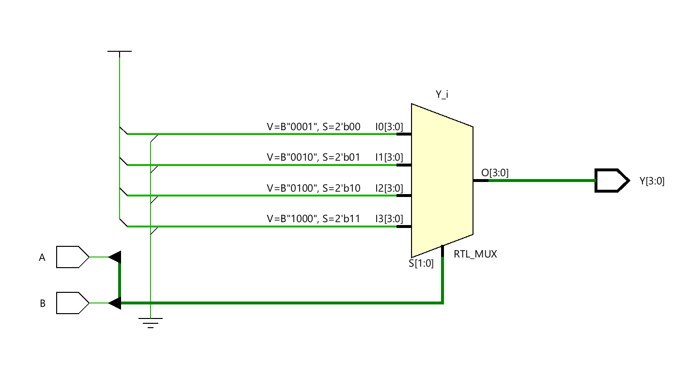
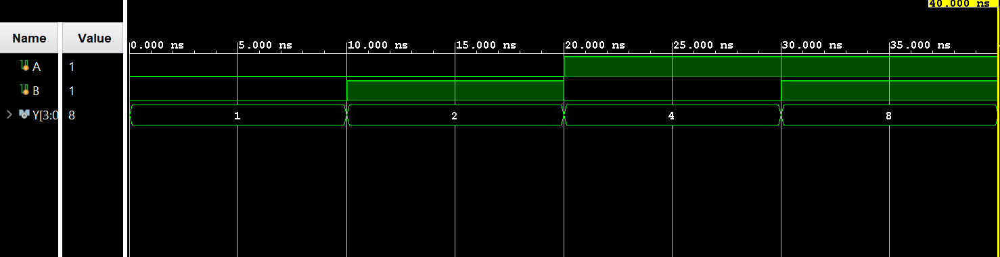

# ◈ **Verilog RTL code** 

```verilog

module decoder_2to4(

    input A,B,

    output reg [3:0] Y

);

always @(*) begin

    case ({A, B})

       2'b00: Y = 4'b0001;
       2'b01: Y = 4'b0010;
       2'b10: Y = 4'b0100;
       2'b11: Y = 4'b1000;
    endcase
end

endmodule       

```

# 📊 **Truth table**

| **Inputs** | **Inputs** | **Output** | **Output** |
|:---:|:---:|:---:|:---:|
| **A** | **B** | **Y0** | **Y1** | **Y2** | **Y3** |
| 0 | 0 | **1** | 0 | 0 | 0 |
| 0 | 1 | 0 | **1** | 0 | 0 |
| 1 | 0 | 0 | 0 | **1** | 0 |
| 1 | 1 | 0 | 0 | 0 | **1** |

# 🧪 **Testbench**

```verilog

module decoder_2to4_tb;

    reg A, B;
    
    wire[3:0]  Y;


    decoder_2to4 DUT(
        .A(A),
        .B(B),
        .Y(Y)

    );

    initial begin 
      $dumpfile("decoder_2to4.vcd");
      $dumpvars(0, decoder_2to4_tb);
      
      // A B = 00 → Y = 0001

      A = 0;
      B = 0;

      #10;

      // A B = 01 → Y = 0010

      A = 0;
      B = 1;

      // A B = 10 → Y = 0100

      #10;

      A = 1;
      B = 0;

      #10;

      // A B = 11 → Y = 1000

      A = 1;
      B = 1;

      #10;

      $finish;

    end

endmodule              

```

# 🔷 **RTL Schematics**



# 📈 **Simulation Result**


# ◈ **Verification Summary**

| **Test Case** | **Expected Output** | **Status** |
|:---|:---:|:---:|
| `A=0, B=0` | `Y0=1, Y1=0, Y2=0, Y3=0` | **PASS** |
| `A=0, B=1` | `Y0=0, Y1=1, Y2=0, Y3=0` | **PASS** |
| `A=1, B=0` | `Y0=0, Y1=0, Y2=1, Y3=0` | **PASS** |
| `A=1, B=1` | `Y0=0, Y1=0, Y2=0, Y3=1` | **PASS** |

**Verification Result:** `4/4 TEST CASES PASSED`


