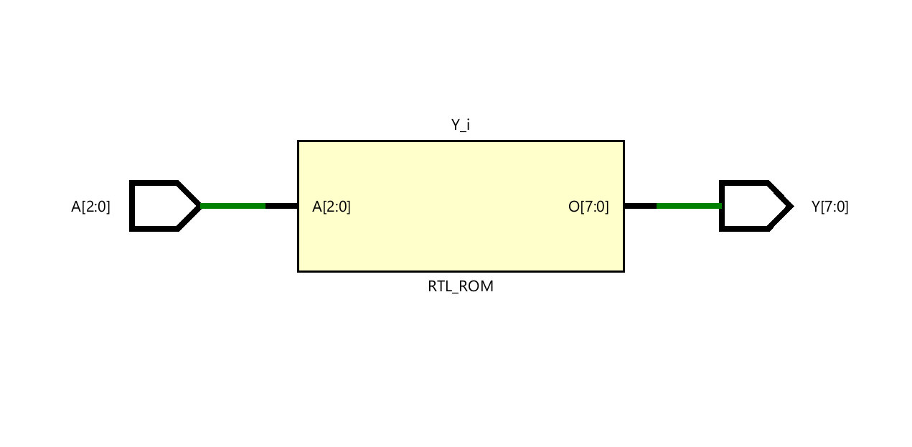
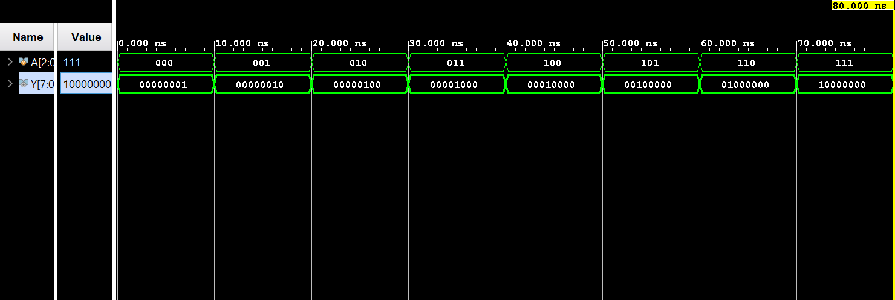

# ◈ 3-to-8 Decoder

### Combinational Circuit • Decoder • Dataflow Modeling

---

## 📌 Module Description

The **3-to-8 Decoder** is a combinational circuit that converts **3 input lines** into **8 output lines**, where exactly one output goes **HIGH (`1`)** for each valid input combination. Implemented using continuous assignment (`assign`) in dataflow abstraction.

---

# ◈ **Verilog RTL code** 

```verilog

module decoder_3to8(

    input [2:0] A,

    output reg [7:0] Y

);

always @(*) begin

    case (A)
       
       3'b000: Y = 8'b00000001;
       3'b001: Y = 8'b00000010;
       3'b010: Y = 8'b00000100;
       3'b011: Y = 8'b00001000;
       3'b100: Y = 8'b00010000;
       3'b101: Y = 8'b00100000;
       3'b110: Y = 8'b01000000;
       3'b111: Y = 8'b10000000;

    endcase

end       
endmodule             

```

# 📊 **Truth table**

| **Inputs** | **Inputs** | **Inputs** | **Output** | **Output** | **Output** | **Output** | **Output** | **Output** | **Output** | **Output** |
|:---:|:---:|:---:|:---:|:---:|:---:|:---:|:---:|:---:|:---:|:---:|
| **A0** | **A1** | **A2** | **Y0** | **Y1** | **Y2** | **Y3** | **Y4** | **Y5** | **Y6** | **Y7** |
| 0 | 0 | 0 | **1** | 0 | 0 | 0 | 0 | 0 | 0 | 0 |
| 0 | 0 | 1 | 0 | **1** | 0 | 0 | 0 | 0 | 0 | 0 |
| 0 | 1 | 0 | 0 | 0 | **1** | 0 | 0 | 0 | 0 | 0 |
| 0 | 1 | 1 | 0 | 0 | 0 | **1** | 0 | 0 | 0 | 0 |
| 1 | 0 | 0 | 0 | 0 | 0 | 0 | **1** | 0 | 0 | 0 |
| 1 | 0 | 1 | 0 | 0 | 0 | 0 | 0 | **1** | 0 | 0 |
| 1 | 1 | 0 | 0 | 0 | 0 | 0 | 0 | 0 | **1** | 0 |
| 1 | 1 | 1 | 0 | 0 | 0 | 0 | 0 | 0 | 0 | **1** |

# 🧪 **Testbench**

```verilog

module decoder_3to8_tb;
    reg [2:0] A;

    wire [7:0] Y;

    decoder_3to8 DUT(
        .A(A),
        .Y(Y)
    );

  initial begin
     $dumpfile("decoder_3to8.vcd");
     $dumpvars(0, decoder_3to8_tb);

     A = 3'b000;

     #10;

     A = 3'b001;

     #10;

     A = 3'b010;

     #10;

     A = 3'b011;

     #10;

     A = 3'b100;

     #10;

     A = 3'b101;

     #10;

     A = 3'b110;

     #10;

     A = 3'b111;

     #10;

     $finish;
  
    end
endmodule    
              

```

# 🔷 **RTL Schematics**



# 📈 **Simulation Result**


# ◈ **Verification Summary**

| **Test Case** | **Expected Output** | **Status** |
|:---|:---:|:---:|
| `A0=0, A1=0, A2=0` | `Y0=1, Y1=0, Y2=0, Y3=0, Y4=0, Y5=0, Y6=0, Y7=0` | **PASS** |
| `A0=0, A1=0, A2=1` | `Y0=0, Y1=1, Y2=0, Y3=0, Y4=0, Y5=0, Y6=0, Y7=0` | **PASS** |
| `A0=0, A1=1, A2=0` | `Y0=0, Y1=0, Y2=1, Y3=0, Y4=0, Y5=0, Y6=0, Y7=0` | **PASS** |
| `A0=0, A1=1, A2=1` | `Y0=0, Y1=0, Y2=0, Y3=1, Y4=0, Y5=0, Y6=0, Y7=0` | **PASS** |
| `A0=1, A1=0, A2=0` | `Y0=0, Y1=0, Y2=0, Y3=0, Y4=1, Y5=0, Y6=0, Y7=0` | **PASS** |
| `A0=1, A1=0, A2=1` | `Y0=0, Y1=0, Y2=0, Y3=0, Y4=0, Y5=1, Y6=0, Y7=0` | **PASS** |
| `A0=1, A1=1, A2=0` | `Y0=0, Y1=0, Y2=0, Y3=0, Y4=0, Y5=0, Y6=1, Y7=0` | **PASS** |
| `A0=1, A1=1, A2=1` | `Y0=0, Y1=0, Y2=0, Y3=0, Y4=0, Y5=0, Y6=0, Y7=1` | **PASS** |

**Verification Result:** `4/4 TEST CASES PASSED`


