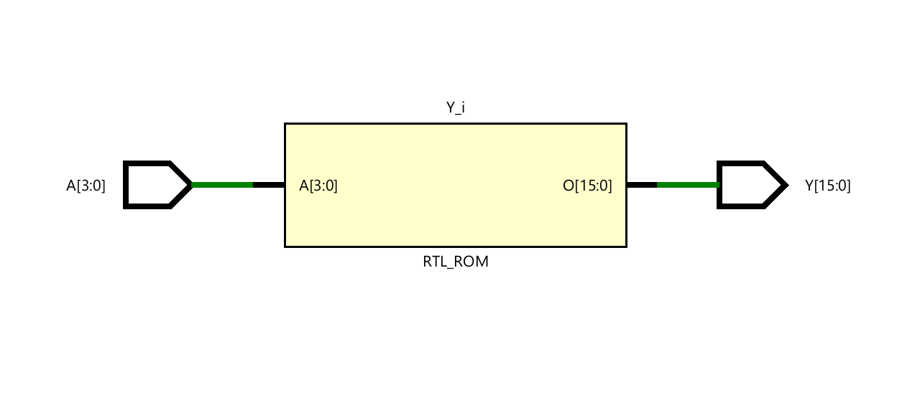
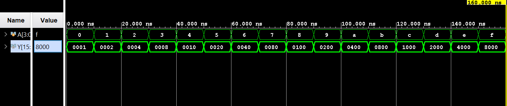

# ◈ 4-to-16 Decoder 

### Combinational Circuit • Decoder • Dataflow Modeling

---

## 📌 Module Description

The **4-to-16 Decoder** is a combinational circuit that converts **4 input lines** into **16 output lines**, where exactly one output goes **HIGH (`1`)** for each valid input combination. Implemented using continuous assignment (`assign`) in dataflow abstraction.

---

# ◈ **Verilog RTL code** 

```verilog

module decoder_4to16(

    input [3:0] A,
    output reg [15:0] Y

);

always @(*) begin 
    case (A)
    
     4'b0000: Y = 16'b0000000000000001;
     4'b0001: Y = 16'b0000000000000010;
     4'b0010: Y = 16'b0000000000000100;
     4'b0011: Y = 16'b0000000000001000;
     4'b0100: Y = 16'b0000000000010000;
     4'b0101: Y = 16'b0000000000100000;
     4'b0110: Y = 16'b0000000001000000;
     4'b0111: Y = 16'b0000000010000000;
     4'b1000: Y = 16'b0000000100000000;
     4'b1001: Y = 16'b0000001000000000;
     4'b1010: Y = 16'b0000010000000000;
     4'b1011: Y = 16'b0000100000000000;
     4'b1100: Y = 16'b0001000000000000;
     4'b1101: Y = 16'b0010000000000000;
     4'b1110: Y = 16'b0100000000000000;
     4'b1111: Y = 16'b1000000000000000;
     endcase

end
endmodule                  

```

# 📊 **Truth table**

| **Inputs** | **Inputs** | **Inputs** | **Inputs** | **Output** | **Output** | **Output** | **Output** | **Output** | **Output** | **Output** | **Output** | **Output** | **Output** | **Output** | **Output** | **Output** | **Output** | **Output** | **Output** |
|:---:|:---:|:---:|:---:|:---:|:---:|:---:|:---:|:---:|:---:|:---:|:---:|:---:|:---:|:---:|:---:|:---:|:---:|:---:|:---:|
| **A0** | **A1** | **A2** | **A3** | **Y0** | **Y1** | **Y2** | **Y3** | **Y4** | **Y5** | **Y6** | **Y7** | **Y8** | **Y9** | **Y10** | **Y11** | **Y12** | **Y13** | **Y14** | **Y15** |
| 0 | 0 | 0 | 0 | **1** | 0 | 0 | 0 | 0 | 0 | 0 | 0 | 0 | 0 | 0 | 0 | 0 | 0 | 0 | 0 |
| 0 | 0 | 0 | 1 | 0 | **1** | 0 | 0 | 0 | 0 | 0 | 0 | 0 | 0 | 0 | 0 | 0 | 0 | 0 | 0 |
| 0 | 0 | 1 | 0 | 0 | 0 | **1** | 0 | 0 | 0 | 0 | 0 | 0 | 0 | 0 | 0 | 0 | 0 | 0 | 0 |
| 0 | 0 | 1 | 1 | 0 | 0 | 0 | **1** | 0 | 0 | 0 | 0 | 0 | 0 | 0 | 0 | 0 | 0 | 0 | 0 |
| 0 | 1 | 0 | 0 | 0 | 0 | 0 | 0 | **1** | 0 | 0 | 0 | 0 | 0 | 0 | 0 | 0 | 0 | 0 | 0 |
| 0 | 1 | 0 | 1 | 0 | 0 | 0 | 0 | 0 | **1** | 0 | 0 | 0 | 0 | 0 | 0 | 0 | 0 | 0 | 0 |
| 0 | 1 | 1 | 0 | 0 | 0 | 0 | 0 | 0 | 0 | **1** | 0 | 0 | 0 | 0 | 0 | 0 | 0 | 0 | 0 |
| 0 | 1 | 1 | 1 | 0 | 0 | 0 | 0 | 0 | 0 | 0 | **1** | 0 | 0 | 0 | 0 | 0 | 0 | 0 | 0 |
| 1 | 0 | 0 | 0 | 0 | 0 | 0 | 0 | 0 | 0 | 0 | 0 | **1** | 0 | 0 | 0 | 0 | 0 | 0 | 0 |
| 1 | 0 | 0 | 1 | 0 | 0 | 0 | 0 | 0 | 0 | 0 | 0 | 0 | **1** | 0 | 0 | 0 | 0 | 0 | 0 |
| 1 | 0 | 1 | 0 | 0 | 0 | 0 | 0 | 0 | 0 | 0 | 0 | 0 | 0 | **1** | 0 | 0 | 0 | 0 | 0 |
| 1 | 0 | 1 | 1 | 0 | 0 | 0 | 0 | 0 | 0 | 0 | 0 | 0 | 0 | 0 | **1** | 0 | 0 | 0 | 0 |
| 1 | 1 | 0 | 0 | 0 | 0 | 0 | 0 | 0 | 0 | 0 | 0 | 0 | 0 | 0 | 0 | **1** | 0 | 0 | 0 |
| 1 | 1 | 0 | 1 | 0 | 0 | 0 | 0 | 0 | 0 | 0 | 0 | 0 | 0 | 0 | 0 | 0 | **1** | 0 | 0 |
| 1 | 1 | 1 | 0 | 0 | 0 | 0 | 0 | 0 | 0 | 0 | 0 | 0 | 0 | 0 | 0 | 0 | 0 | **1** | 0 |
| 1 | 1 | 1 | 1 | 0 | 0 | 0 | 0 | 0 | 0 | 0 | 0 | 0 | 0 | 0 | 0 | 0 | 0 | 0 | **1** |

# 🧪 **Testbench**

```verilog

module decoder_4to16_tb;

    reg [3:0] A;
    wire [15:0] Y;

    decoder_4to16 DUT(
        .A(A),
        .Y(Y)
    );

    initial begin

        $dumpfile("decoder_4to16.vcd");
        $dumpvars(0, decoder_4to16_tb);

        // A = 0000 → Y = 0000000000000001
        A = 4'b0000;

        #10;

        // A = 0001 → Y = 0000000000000010
        A = 4'b0001;

        #10;

        // A = 0010 → Y = 0000000000000100
        A = 4'b0010;

        #10;

        // A = 0011 → Y = 0000000000001000
        A = 4'b0011;

        #10;

        // A = 0100 → Y = 0000000000010000
        A = 4'b0100;

        #10;

        // A = 0101 → Y = 0000000000100000
        A = 4'b0101;

        #10;

        // A = 0110 → Y = 0000000001000000
        A = 4'b0110;

        #10;

        // A = 0111 → Y = 0000000010000000
        A = 4'b0111;

        #10;

        // A = 1000 → Y = 0000000100000000
        A = 4'b1000;

        #10;

        // A = 1001 → Y = 0000001000000000
        A = 4'b1001;

        #10;

        // A = 1010 → Y = 0000010000000000
        A = 4'b1010;

        #10;

        // A = 1011 → Y = 0000100000000000
        A = 4'b1011;

        #10;

        // A = 1100 → Y = 0001000000000000
        A = 4'b1100;

        #10;

        // A = 1101 → Y = 0010000000000000
        A = 4'b1101;

        #10;

        // A = 1110 → Y = 0100000000000000
        A = 4'b1110;

        #10;

        // A = 1111 → Y = 1000000000000000
        A = 4'b1111;

        #10;

        $finish;

    end

endmodule    
              
```

# 🔷 **RTL Schematics**



# 📈 **Simulation Result**


# ◈ **Verification Summary**

| **Test Case** | **Expected Output** | **Status** |
|:---|:---:|:---:|
| `A0=0, A1=0, A2=0, A3=0` | `Y0=1, Y1=0, Y2=0, Y3=0, Y4=0, Y5=0, Y6=0, Y7=0, Y8=0, Y9=0, Y10=0, Y11=0, Y12=0, Y13=0, Y14=0, Y15=0` | **PASS** |
| `A0=0, A1=0, A2=0, A3=1` | `Y0=0, Y1=1, Y2=0, Y3=0, Y4=0, Y5=0, Y6=0, Y7=0, Y8=0, Y9=0, Y10=0, Y11=0, Y12=0, Y13=0, Y14=0, Y15=0` | **PASS** |
| `A0=0, A1=0, A2=1, A3=0` | `Y0=0, Y1=0, Y2=1, Y3=0, Y4=0, Y5=0, Y6=0, Y7=0, Y8=0, Y9=0, Y10=0, Y11=0, Y12=0, Y13=0, Y14=0, Y15=0` | **PASS** |
| `A0=0, A1=0, A2=1, A3=1` | `Y0=0, Y1=0, Y2=0, Y3=1, Y4=0, Y5=0, Y6=0, Y7=0, Y8=0, Y9=0, Y10=0, Y11=0, Y12=0, Y13=0, Y14=0, Y15=0` | **PASS** |
| `A0=0, A1=1, A2=0, A3=0` | `Y0=0, Y1=0, Y2=0, Y3=0, Y4=1, Y5=0, Y6=0, Y7=0, Y8=0, Y9=0, Y10=0, Y11=0, Y12=0, Y13=0, Y14=0, Y15=0` | **PASS** |
| `A0=0, A1=1, A2=0, A3=1` | `Y0=0, Y1=0, Y2=0, Y3=0, Y4=0, Y5=1, Y6=0, Y7=0, Y8=0, Y9=0, Y10=0, Y11=0, Y12=0, Y13=0, Y14=0, Y15=0` | **PASS** |
| `A0=0, A1=1, A2=1, A3=0` | `Y0=0, Y1=0, Y2=0, Y3=0, Y4=0, Y5=0, Y6=1, Y7=0, Y8=0, Y9=0, Y10=0, Y11=0, Y12=0, Y13=0, Y14=0, Y15=0` | **PASS** |
| `A0=0, A1=1, A2=1, A3=1` | `Y0=0, Y1=0, Y2=0, Y3=0, Y4=0, Y5=0, Y6=0, Y7=1, Y8=0, Y9=0, Y10=0, Y11=0, Y12=0, Y13=0, Y14=0, Y15=0` | **PASS** |
| `A0=1, A1=0, A2=0, A3=0` | `Y0=0, Y1=0, Y2=0, Y3=0, Y4=0, Y5=0, Y6=0, Y7=0, Y8=1, Y9=0, Y10=0, Y11=0, Y12=0, Y13=0, Y14=0, Y15=0` | **PASS** |
| `A0=1, A1=0, A2=0, A3=1` | `Y0=0, Y1=0, Y2=0, Y3=0, Y4=0, Y5=0, Y6=0, Y7=0, Y8=0, Y9=1, Y10=0, Y11=0, Y12=0, Y13=0, Y14=0, Y15=0` | **PASS** |
| `A0=1, A1=0, A2=1, A3=0` | `Y0=0, Y1=0, Y2=0, Y3=0, Y4=0, Y5=0, Y6=0, Y7=0, Y8=0, Y9=0, Y10=1, Y11=0, Y12=0, Y13=0, Y14=0, Y15=0` | **PASS** |
| `A0=1, A1=0, A2=1, A3=1` | `Y0=0, Y1=0, Y2=0, Y3=0, Y4=0, Y5=0, Y6=0, Y7=0, Y8=0, Y9=0, Y10=0, Y11=1, Y12=0, Y13=0, Y14=0, Y15=0` | **PASS** |
| `A0=1, A1=1, A2=0, A3=0` | `Y0=0, Y1=0, Y2=0, Y3=0, Y4=0, Y5=0, Y6=0, Y7=0, Y8=0, Y9=0, Y10=0, Y11=0, Y12=1, Y13=0, Y14=0, Y15=0` | **PASS** |
| `A0=1, A1=1, A2=0, A3=1` | `Y0=0, Y1=0, Y2=0, Y3=0, Y4=0, Y5=0, Y6=0, Y7=0, Y8=0, Y9=0, Y10=0, Y11=0, Y12=0, Y13=1, Y14=0, Y15=0` | **PASS** |
| `A0=1, A1=1, A2=1, A3=0` | `Y0=0, Y1=0, Y2=0, Y3=0, Y4=0, Y5=0, Y6=0, Y7=0, Y8=0, Y9=0, Y10=0, Y11=0, Y12=0, Y13=0, Y14=1, Y15=0` | **PASS** |
| `A0=1, A1=1, A2=1, A3=1` | `Y0=0, Y1=0, Y2=0, Y3=0, Y4=0, Y5=0, Y6=0, Y7=0, Y8=0, Y9=0, Y10=0, Y11=0, Y12=0, Y13=0, Y14=0, Y15=1` | **PASS** |

**Verification Result:** `16/16 TEST CASES PASSED`


