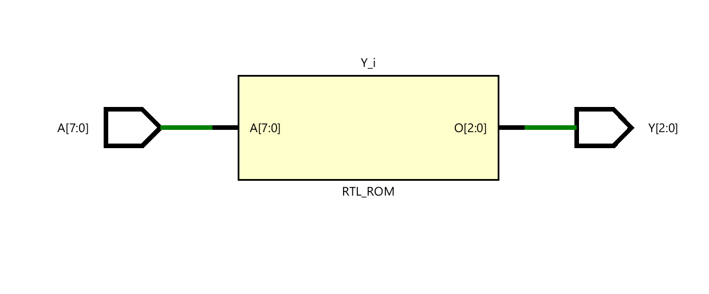
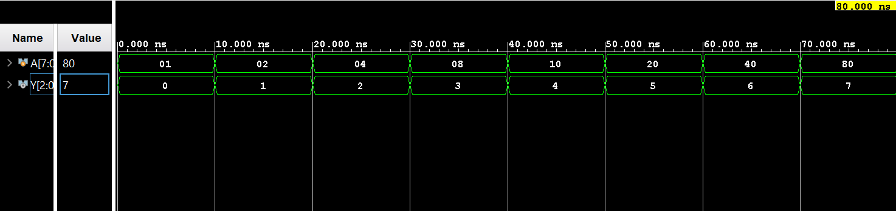

# ◈ 8-to-3 Encoder 

### Combinational Circuit • Encoder • Dataflow Modeling

---

## 📌 Module Description

The **8-to-3 Encoder** is a combinational circuit that converts **8 input lines** into **3 output lines**, where the binary output represents the position of the active input. Implemented using continuous assignment (`assign`) in dataflow abstraction.
---

# ◈ **Verilog RTL code** 

```verilog

module encoder_8to3(
    input [7:0] A,
    output reg [2:0] Y
);

always @(*) begin
     case (A)
       
        8'b00000001: Y = 3'b000;
        8'b00000010: Y = 3'b001;
        8'b00000100: Y = 3'b010;
        8'b00001000: Y = 3'b011;
        8'b00010000: Y = 3'b100;
        8'b00100000: Y = 3'b101;
        8'b01000000: Y = 3'b110;
        8'b10000000: Y = 3'b111;

        default: Y = 3'b000;
        
    endcase

end
endmodule               

```

# 📊 **Truth table**

| **Inputs** | **Inputs** | **Inputs** | **Inputs** | **Inputs** | **Inputs** | **Inputs** | **Inputs** | **Output** | **Output** | **Output** |
|:---:|:---:|:---:|:---:|:---:|:---:|:---:|:---:|:---:|:---:|:---:|
| **A0** | **A1** | **A2** | **A3** | **A4** | **A5** | **A6** | **A7** | **Y2** | **Y1** | **Y0** |
| 1 | 0 | 0 | 0 | 0 | 0 | 0 | 0 | 0 | 0 | 0 |
| 0 | 1 | 0 | 0 | 0 | 0 | 0 | 0 | 0 | 0 | 1 |
| 0 | 0 | 1 | 0 | 0 | 0 | 0 | 0 | 0 | 1 | 0 |
| 0 | 0 | 0 | 1 | 0 | 0 | 0 | 0 | 0 | 1 | 1 |
| 0 | 0 | 0 | 0 | 1 | 0 | 0 | 0 | 1 | 0 | 0 |
| 0 | 0 | 0 | 0 | 0 | 1 | 0 | 0 | 1 | 0 | 1 |
| 0 | 0 | 0 | 0 | 0 | 0 | 1 | 0 | 1 | 1 | 0 |
| 0 | 0 | 0 | 0 | 0 | 0 | 0 | 1 | **1** | **1** | **1** |

# 🧪 **Testbench**

```verilog

module encoder_4to2_tb;

    reg [3:0] A;
    wire [1:0] Y;

    encoder_4to2 DUT(
        .A(A),
        .Y(Y)
    );

    initial begin

        $dumpfile("encoder_4to2.vcd");
        $dumpvars(0, encoder_4to2_tb);

        A = 4'b0001;
        #10;

        A = 4'b0010;
        #10;

        A = 4'b0100;
        #10;

        A = 4'b1000;
        #10;

        $finish;

    end

endmodule              

```

# 🔷 **RTL Schematics**



# 📈 **Simulation Result**


# ◈ **Verification Summary**

| **Test Case** | **Expected Output** | **Status** |
|:---|:---:|:---:|
| `A0=1, A1=0, A2=0, A3=0, A4=0, A5=0, A6=0, A7=0` | `Y2=0, Y1=0, Y0=0` | **PASS** |
| `A0=0, A1=1, A2=0, A3=0, A4=0, A5=0, A6=0, A7=0` | `Y2=0, Y1=0, Y0=1` | **PASS** |
| `A0=0, A1=0, A2=1, A3=0, A4=0, A5=0, A6=0, A7=0` | `Y2=0, Y1=1, Y0=0` | **PASS** |
| `A0=0, A1=0, A2=0, A3=1, A4=0, A5=0, A6=0, A7=0` | `Y2=0, Y1=1, Y0=1` | **PASS** |
| `A0=0, A1=0, A2=0, A3=0, A4=1, A5=0, A6=0, A7=0` | `Y2=1, Y1=0, Y0=0` | **PASS** |
| `A0=0, A1=0, A2=0, A3=0, A4=0, A5=1, A6=0, A7=0` | `Y2=1, Y1=0, Y0=1` | **PASS** |
| `A0=0, A1=0, A2=0, A3=0, A4=0, A5=0, A6=1, A7=0` | `Y2=1, Y1=1, Y0=0` | **PASS** |
| `A0=0, A1=0, A2=0, A3=0, A4=0, A5=0, A6=0, A7=1` | `Y2=1, Y1=1, Y0=1` | **PASS** |

**Verification Result:** `8/8 TEST CASES PASSED`


