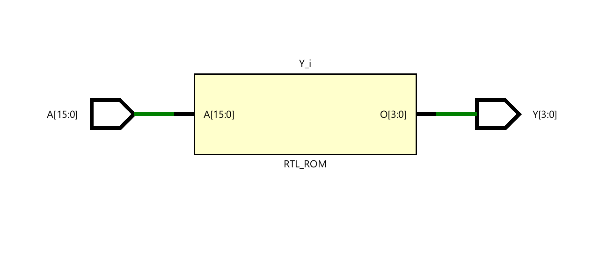
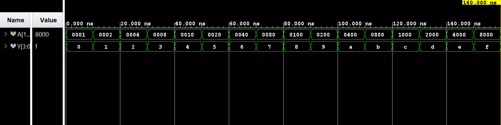

# ◈ 16-to-4 Encoder

### Combinational Circuit • Encoder • Dataflow Modeling

---

## 📌 Module Description

The **16-to-4 Encoder** is a combinational circuit that converts **16 input lines** into **4 output lines**, where the binary output represents the position of the active input. Implemented using continuous assignment (`assign`) in dataflow abstraction.

---

# ◈ **Verilog RTL code** 

```verilog

module encoder_16to4(

    input [15:0] A,
    output reg [3:0] Y

);

always @(*) begin

    case (A)

        16'b0000000000000001: Y = 4'b0000;
        16'b0000000000000010: Y = 4'b0001;
        16'b0000000000000100: Y = 4'b0010;
        16'b0000000000001000: Y = 4'b0011;

        16'b0000000000010000: Y = 4'b0100;
        16'b0000000000100000: Y = 4'b0101;
        16'b0000000001000000: Y = 4'b0110;
        16'b0000000010000000: Y = 4'b0111;

        16'b0000000100000000: Y = 4'b1000;
        16'b0000001000000000: Y = 4'b1001;
        16'b0000010000000000: Y = 4'b1010;
        16'b0000100000000000: Y = 4'b1011;

        16'b0001000000000000: Y = 4'b1100;
        16'b0010000000000000: Y = 4'b1101;
        16'b0100000000000000: Y = 4'b1110;
        16'b1000000000000000: Y = 4'b1111;

        default: Y = 4'b0000;

    endcase

end

endmodule               

```

# 📊 **Truth table**

| **Inputs** | **Inputs** | **Inputs** | **Inputs** | **Inputs** | **Inputs** | **Inputs** | **Inputs** | **Inputs** | **Inputs** | **Inputs** | **Inputs** | **Inputs** | **Inputs** | **Inputs** | **Inputs** | **Output** | **Output** | **Output** | **Output** |
|:---:|:---:|:---:|:---:|:---:|:---:|:---:|:---:|:---:|:---:|:---:|:---:|:---:|:---:|:---:|:---:|:---:|:---:|:---:|:---:|
| **A0** | **A1** | **A2** | **A3** | **A4** | **A5** | **A6** | **A7** | **A8** | **A9** | **A10** | **A11** | **A12** | **A13** | **A14** | **A15** | **Y3** | **Y2** | **Y1** | **Y0** |
| 1 | 0 | 0 | 0 | 0 | 0 | 0 | 0 | 0 | 0 | 0 | 0 | 0 | 0 | 0 | 0 | 0 | 0 | 0 | 0 |
| 0 | 1 | 0 | 0 | 0 | 0 | 0 | 0 | 0 | 0 | 0 | 0 | 0 | 0 | 0 | 0 | 0 | 0 | 0 | 1 |
| 0 | 0 | 1 | 0 | 0 | 0 | 0 | 0 | 0 | 0 | 0 | 0 | 0 | 0 | 0 | 0 | 0 | 0 | 1 | 0 |
| 0 | 0 | 0 | 1 | 0 | 0 | 0 | 0 | 0 | 0 | 0 | 0 | 0 | 0 | 0 | 0 | 0 | 0 | 1 | 1 |
| 0 | 0 | 0 | 0 | 1 | 0 | 0 | 0 | 0 | 0 | 0 | 0 | 0 | 0 | 0 | 0 | 0 | 1 | 0 | 0 |
| 0 | 0 | 0 | 0 | 0 | 1 | 0 | 0 | 0 | 0 | 0 | 0 | 0 | 0 | 0 | 0 | 0 | 1 | 0 | 1 |
| 0 | 0 | 0 | 0 | 0 | 0 | 1 | 0 | 0 | 0 | 0 | 0 | 0 | 0 | 0 | 0 | 0 | 1 | 1 | 0 |
| 0 | 0 | 0 | 0 | 0 | 0 | 0 | 1 | 0 | 0 | 0 | 0 | 0 | 0 | 0 | 0 | 0 | 1 | 1 | 1 |
| 0 | 0 | 0 | 0 | 0 | 0 | 0 | 0 | 1 | 0 | 0 | 0 | 0 | 0 | 0 | 0 | 1 | 0 | 0 | 0 |
| 0 | 0 | 0 | 0 | 0 | 0 | 0 | 0 | 0 | 1 | 0 | 0 | 0 | 0 | 0 | 0 | 1 | 0 | 0 | 1 |
| 0 | 0 | 0 | 0 | 0 | 0 | 0 | 0 | 0 | 0 | 1 | 0 | 0 | 0 | 0 | 0 | 1 | 0 | 1 | 0 |
| 0 | 0 | 0 | 0 | 0 | 0 | 0 | 0 | 0 | 0 | 0 | 1 | 0 | 0 | 0 | 0 | 1 | 0 | 1 | 1 |
| 0 | 0 | 0 | 0 | 0 | 0 | 0 | 0 | 0 | 0 | 0 | 0 | 1 | 0 | 0 | 0 | 1 | 1 | 0 | 0 |
| 0 | 0 | 0 | 0 | 0 | 0 | 0 | 0 | 0 | 0 | 0 | 0 | 0 | 1 | 0 | 0 | 1 | 1 | 0 | 1 |
| 0 | 0 | 0 | 0 | 0 | 0 | 0 | 0 | 0 | 0 | 0 | 0 | 0 | 0 | 1 | 0 | 1 | 1 | 1 | 0 |
| 0 | 0 | 0 | 0 | 0 | 0 | 0 | 0 | 0 | 0 | 0 | 0 | 0 | 0 | 0 | 1 | **1** | **1** | **1** | **1** |

# 🧪 **Testbench**

```verilog

module encoder_16to4_tb;

    reg [15:0] A;

    wire [3:0] Y;

    encoder_16to4 DUT(
        .A(A),
        .Y(Y)
    );

    initial begin

        $dumpfile("encoder_16to4.vcd");
        $dumpvars(0, encoder_16to4_tb);

        // A = 0000000000000001 → Y = 0000
        A = 16'b0000000000000001;

        #10;

        // A = 0000000000000010 → Y = 0001
        A = 16'b0000000000000010;

        #10;

        // A = 0000000000000100 → Y = 0010
        A = 16'b0000000000000100;

        #10;

        // A = 0000000000001000 → Y = 0011
        A = 16'b0000000000001000;

        #10;

        // A = 0000000000010000 → Y = 0100
        A = 16'b0000000000010000;

        #10;

        // A = 0000000000100000 → Y = 0101
        A = 16'b0000000000100000;

        #10;

        // A = 0000000001000000 → Y = 0110
        A = 16'b0000000001000000;

        #10;

        // A = 0000000010000000 → Y = 0111
        A = 16'b0000000010000000;

        #10;

        // A = 0000000100000000 → Y = 1000
        A = 16'b0000000100000000;

        #10;

        // A = 0000001000000000 → Y = 1001
        A = 16'b0000001000000000;

        #10;

        // A = 0000010000000000 → Y = 1010
        A = 16'b0000010000000000;

        #10;

        // A = 0000100000000000 → Y = 1011
        A = 16'b0000100000000000;

        #10;

        // A = 0001000000000000 → Y = 1100
        A = 16'b0001000000000000;

        #10;

        // A = 0010000000000000 → Y = 1101
        A = 16'b0010000000000000;

        #10;

        // A = 0100000000000000 → Y = 1110
        A = 16'b0100000000000000;

        #10;

        // A = 1000000000000000 → Y = 1111
        A = 16'b1000000000000000;

        #10;

        $finish;

    end

endmodule
              

```

# 🔷 **RTL Schematics**



# 📈 **Simulation Result**


# ◈ **Verification Summary**

| **Test Case** | **Expected Output** | **Status** |
|:---|:---:|:---:|
| `A0=1, A1=0, A2=0, A3=0, A4=0, A5=0, A6=0, A7=0, A8=0, A9=0, A10=0, A11=0, A12=0, A13=0, A14=0, A15=0` | `Y3=0, Y2=0, Y1=0, Y0=0` | **PASS** |
| `A0=0, A1=1, A2=0, A3=0, A4=0, A5=0, A6=0, A7=0, A8=0, A9=0, A10=0, A11=0, A12=0, A13=0, A14=0, A15=0` | `Y3=0, Y2=0, Y1=0, Y0=1` | **PASS** |
| `A0=0, A1=0, A2=1, A3=0, A4=0, A5=0, A6=0, A7=0, A8=0, A9=0, A10=0, A11=0, A12=0, A13=0, A14=0, A15=0` | `Y3=0, Y2=0, Y1=1, Y0=0` | **PASS** |
| `A0=0, A1=0, A2=0, A3=1, A4=0, A5=0, A6=0, A7=0, A8=0, A9=0, A10=0, A11=0, A12=0, A13=0, A14=0, A15=0` | `Y3=0, Y2=0, Y1=1, Y0=1` | **PASS** |
| `A0=0, A1=0, A2=0, A3=0, A4=1, A5=0, A6=0, A7=0, A8=0, A9=0, A10=0, A11=0, A12=0, A13=0, A14=0, A15=0` | `Y3=0, Y2=1, Y1=0, Y0=0` | **PASS** |
| `A0=0, A1=0, A2=0, A3=0, A4=0, A5=1, A6=0, A7=0, A8=0, A9=0, A10=0, A11=0, A12=0, A13=0, A14=0, A15=0` | `Y3=0, Y2=1, Y1=0, Y0=1` | **PASS** |
| `A0=0, A1=0, A2=0, A3=0, A4=0, A5=0, A6=1, A7=0, A8=0, A9=0, A10=0, A11=0, A12=0, A13=0, A14=0, A15=0` | `Y3=0, Y2=1, Y1=1, Y0=0` | **PASS** |
| `A0=0, A1=0, A2=0, A3=0, A4=0, A5=0, A6=0, A7=1, A8=0, A9=0, A10=0, A11=0, A12=0, A13=0, A14=0, A15=0` | `Y3=0, Y2=1, Y1=1, Y0=1` | **PASS** |
| `A0=0, A1=0, A2=0, A3=0, A4=0, A5=0, A6=0, A7=0, A8=1, A9=0, A10=0, A11=0, A12=0, A13=0, A14=0, A15=0` | `Y3=1, Y2=0, Y1=0, Y0=0` | **PASS** |
| `A0=0, A1=0, A2=0, A3=0, A4=0, A5=0, A6=0, A7=0, A8=0, A9=1, A10=0, A11=0, A12=0, A13=0, A14=0, A15=0` | `Y3=1, Y2=0, Y1=0, Y0=1` | **PASS** |
| `A0=0, A1=0, A2=0, A3=0, A4=0, A5=0, A6=0, A7=0, A8=0, A9=0, A10=1, A11=0, A12=0, A13=0, A14=0, A15=0` | `Y3=1, Y2=0, Y1=1, Y0=0` | **PASS** |
| `A0=0, A1=0, A2=0, A3=0, A4=0, A5=0, A6=0, A7=0, A8=0, A9=0, A10=0, A11=1, A12=0, A13=0, A14=0, A15=0` | `Y3=1, Y2=0, Y1=1, Y0=1` | **PASS** |
| `A0=0, A1=0, A2=0, A3=0, A4=0, A5=0, A6=0, A7=0, A8=0, A9=0, A10=0, A11=0, A12=1, A13=0, A14=0, A15=0` | `Y3=1, Y2=1, Y1=0, Y0=0` | **PASS** |
| `A0=0, A1=0, A2=0, A3=0, A4=0, A5=0, A6=0, A7=0, A8=0, A9=0, A10=0, A11=0, A12=0, A13=1, A14=0, A15=0` | `Y3=1, Y2=1, Y1=0, Y0=1` | **PASS** |
| `A0=0, A1=0, A2=0, A3=0, A4=0, A5=0, A6=0, A7=0, A8=0, A9=0, A10=0, A11=0, A12=0, A13=0, A14=1, A15=0` | `Y3=1, Y2=1, Y1=1, Y0=0` | **PASS** |
| `A0=0, A1=0, A2=0, A3=0, A4=0, A5=0, A6=0, A7=0, A8=0, A9=0, A10=0, A11=0, A12=0, A13=0, A14=0, A15=1` | `Y3=1, Y2=1, Y1=1, Y0=1` | **PASS** |

**Verification Result:** `16/16 TEST CASES PASSED`


