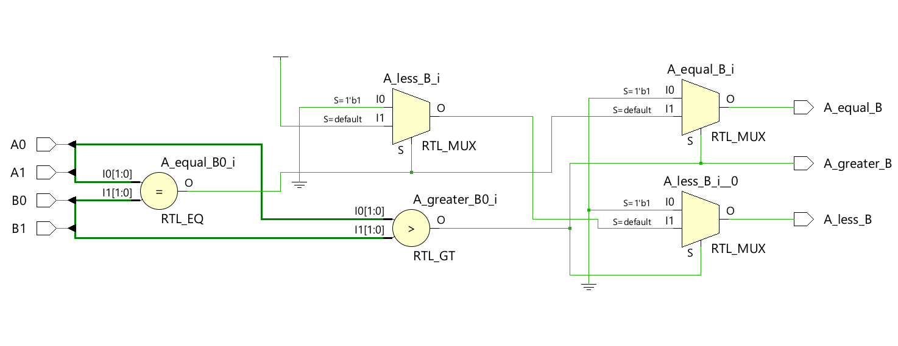
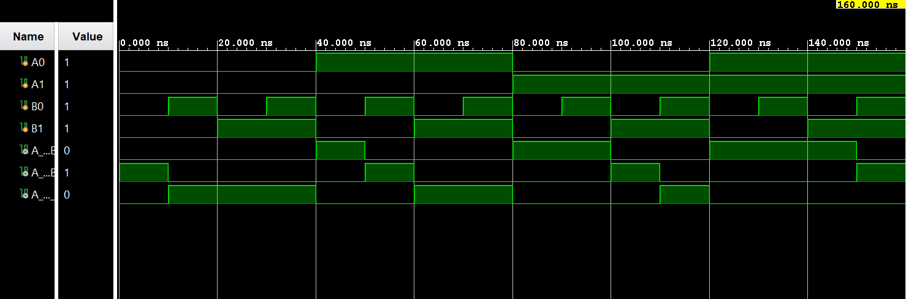

# ◈ 2-Bit Comparator (`2_bit_comparator`)

### Combinational Circuit • Comparator • Dataflow Modeling

---

## 📌 Module Description

The **2-Bit Comparator** is a combinational circuit that compares two 2-bit inputs and determines whether input `A` is **greater than**, **equal to**, or **less than** input `B`. Implemented using continuous assignment (`assign`) in dataflow abstraction.

---

# ◈ **Verilog RTL code** 

```verilog

module two_bit_comparator(
    input A0, A1, B0, B1,
    output reg A_greater_B,
    output reg A_equal_B,
    output reg A_less_B 
);

always @(*) begin
      
    if ({A1, A0} > {B1, B0}) begin

         A_greater_B = 1;
         A_equal_B = 0;
         A_less_B = 0;

    end

    else if ({A1, A0} == {B1, B0}) begin

         A_greater_B = 0;
         A_equal_B = 1;
         A_less_B = 0;

    end

    else begin 

         A_greater_B = 0;
         A_equal_B = 0;
         A_less_B = 1;

    end

end 
endmodule                

```

# 📊 **Truth table**

| **Inputs** | **Inputs** | **Inputs** | **Inputs** | **Output** | **Output** | **Output** |
|:---:|:---:|:---:|:---:|:---:|:---:|:---:|
| **A0** | **A1** | **B0** | **B1** | **A > B** | **A == B** | **A < B** |
| 0 | 0 | 0 | 0 | 0 | **1** | 0 |
| 0 | 0 | 0 | 1 | 0 | 0 | **1** |
| 0 | 0 | 1 | 0 | 0 | 0 | **1** |
| 0 | 0 | 1 | 1 | 0 | 0 | **1** |
| 0 | 1 | 0 | 0 | **1** | 0 | 0 |
| 0 | 1 | 0 | 1 | 0 | **1** | 0 |
| 0 | 1 | 1 | 0 | **1** | 0 | 0 |
| 0 | 1 | 1 | 1 | 0 | 0 | **1** |
| 1 | 0 | 0 | 0 | **1** | 0 | 0 |
| 1 | 0 | 0 | 1 | **1** | 0 | 0 |
| 1 | 0 | 1 | 0 | 0 | **1** | 0 |
| 1 | 0 | 1 | 1 | 0 | 0 | **1** |
| 1 | 1 | 0 | 0 | **1** | 0 | 0 |
| 1 | 1 | 0 | 1 | **1** | 0 | 0 |
| 1 | 1 | 1 | 0 | **1** | 0 | 0 |
| 1 | 1 | 1 | 1 | 0 | **1** | 0 |

# 🧪 **Testbench**

```verilog

module two_bit_comparator_tb;
   reg A0, A1, B0, B1;

   wire A_greater_B;
   wire A_equal_B;
   wire A_less_B;

   two_bit_comparator DUT(
    .A0(A0),
    .A1(A1),
    .B0(B0),
    .B1(B1),
    .A_greater_B(A_greater_B),
    .A_equal_B(A_equal_B),
    .A_less_B(A_less_B)
   );

   initial begin 
   $dumpfile("two_bit_comparator");
   $dumpvars(0, two_bit_comparator_tb);

   // A = 00, B = 00  A = B
        A1 = 0;
        A0 = 0;
        B1 = 0;
        B0 = 0;

        #10;

        // A = 00, B = 01  A < B
        A1 = 0;
        A0 = 0;
        B1 = 0;
        B0 = 1;

        #10;

        // A = 00, B = 10  A < B
        A1 = 0;
        A0 = 0;
        B1 = 1;
        B0 = 0;

        #10;

        // A = 00, B = 11  A < B
        A1 = 0;
        A0 = 0;
        B1 = 1;
        B0 = 1;

        #10;

        // A = 01, B = 00  A > B
        A1 = 0;
        A0 = 1;
        B1 = 0;
        B0 = 0;

        #10;

        // A = 01, B = 01  A = B
        A1 = 0;
        A0 = 1;
        B1 = 0;
        B0 = 1;

        #10;

        // A = 01, B = 10  A < B
        A1 = 0;
        A0 = 1;
        B1 = 1;
        B0 = 0;

        #10;

        // A = 01, B = 11  A < B
        A1 = 0;
        A0 = 1;
        B1 = 1;
        B0 = 1;

        #10;

        // A = 10, B = 00  A > B
        A1 = 1;
        A0 = 0;
        B1 = 0;
        B0 = 0;

        #10;

        // A = 10, B = 01  A > B
        A1 = 1;
        A0 = 0;
        B1 = 0;
        B0 = 1;

        #10;

        // A = 10, B = 10  A = B
        A1 = 1;
        A0 = 0;
        B1 = 1;
        B0 = 0;

        #10;

        // A = 10, B = 11  A < B
        A1 = 1;
        A0 = 0;
        B1 = 1;
        B0 = 1;

        #10;

        // A = 11, B = 00  A > B
        A1 = 1;
        A0 = 1;
        B1 = 0;
        B0 = 0;

        #10;

        // A = 11, B = 01  A > B
        A1 = 1;
        A0 = 1;
        B1 = 0;
        B0 = 1;

        #10;

        // A = 11, B = 10  A > B
        A1 = 1;
        A0 = 1;
        B1 = 1;
        B0 = 0;

        #10;

        // A = 11, B = 11  A = B
        A1 = 1;
        A0 = 1;
        B1 = 1;
        B0 = 1;

        #10;

        $finish;

    end

endmodule               

```

# 🔷 **RTL Schematics**



# 📈 **Simulation Result**


# ◈ **Verification Summary**

| **Test Case** | **Expected Output** | **Status** |
|:---|:---:|:---:|
| `A0=0, A1=0, B0=0, B1=0` | `A>B=0, A==B=1, A<B=0` | **PASS** |
| `A0=0, A1=0, B0=0, B1=1` | `A>B=0, A==B=0, A<B=1` | **PASS** |
| `A0=0, A1=0, B0=1, B1=0` | `A>B=0, A==B=0, A<B=1` | **PASS** |
| `A0=0, A1=0, B0=1, B1=1` | `A>B=0, A==B=0, A<B=1` | **PASS** |
| `A0=0, A1=1, B0=0, B1=0` | `A>B=1, A==B=0, A<B=0` | **PASS** |
| `A0=0, A1=1, B0=0, B1=1` | `A>B=0, A==B=1, A<B=0` | **PASS** |
| `A0=0, A1=1, B0=1, B1=0` | `A>B=0, A==B=1, A<B=0` | **PASS** |
| `A0=0, A1=1, B0=1, B1=1` | `A>B=0, A==B=0, A<B=1` | **PASS** |
| `A0=1, A1=0, B0=0, B1=0` | `A>B=1, A==B=0, A<B=0` | **PASS** |
| `A0=1, A1=0, B0=0, B1=1` | `A>B=0, A==B=0, A<B=1` | **PASS** |
| `A0=1, A1=0, B0=1, B1=0` | `A>B=1, A==B=0, A<B=0` | **PASS** |
| `A0=1, A1=0, B0=1, B1=1` | `A>B=0, A==B=0, A<B=1` | **PASS** |
| `A0=1, A1=1, B0=0, B1=0` | `A>B=1, A==B=0, A<B=0` | **PASS** |
| `A0=1, A1=1, B0=0, B1=1` | `A>B=1, A==B=0, A<B=0` | **PASS** |
| `A0=1, A1=1, B0=1, B1=0` | `A>B=0, A==B=1, A<B=0` | **PASS** |
| `A0=1, A1=1, B0=1, B1=1` | `A>B=0, A==B=1, A<B=0` | **PASS** |

**Verification Result:** `16/16 TEST CASES PASSED`


