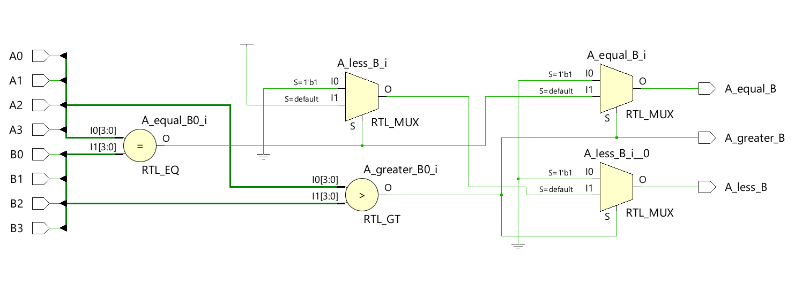
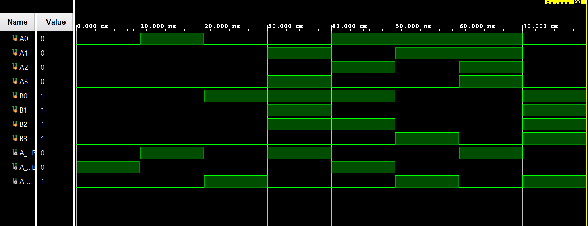

# ◈ 4-Bit Comparator (`4_bit_comparator`)

### Combinational Circuit • Comparator • Dataflow Modeling

---

## 📌 Module Description

The **4-Bit Comparator** is a combinational circuit that compares two 4-bit inputs and determines whether input `A` is **greater than**, **equal to**, or **less than** input `B`. Implemented using continuous assignment (`assign`) in dataflow abstraction.

---

# ◈ **Verilog RTL code** 

```verilog

module four_bit_comparator(

    input A0, A1, A2, A3,
    input B0, B1, B2, B3,

    output reg A_greater_B,
    output reg A_equal_B,
    output reg A_less_B

);

always @(*) begin

    if ({A3, A2, A1, A0} > {B3, B2, B1, B0}) begin

        A_greater_B = 1;
        A_equal_B = 0;
        A_less_B = 0;

    end

    else if ({A3, A2, A1, A0} == {B3, B2, B1, B0}) begin

        A_greater_B = 0;
        A_equal_B = 1;
        A_less_B = 0;

    end

    else begin

        A_greater_B = 0;
        A_equal_B = 0;
        A_less_B = 1;

    end

end

endmodule                

```

# 📊 **Truth table**

| **Inputs** | **Inputs** | **Inputs** | **Inputs** | **Inputs** | **Inputs** | **Inputs** | **Inputs** | **Output** | **Output** | **Output** |
|:---:|:---:|:---:|:---:|:---:|:---:|:---:|:---:|:---:|:---:|:---:|
| **A0** | **A1** | **A2** | **A3** | **B0** | **B1** | **B2** | **B3** | **A > B** | **A == B** | **A < B** |
| 0 | 0 | 0 | 0 | 0 | 0 | 0 | 0 | 0 | **1** | 0 |
| 0 | 0 | 0 | 0 | 0 | 0 | 0 | 1 | 0 | 0 | **1** |
| 0 | 0 | 0 | 0 | 0 | 0 | 1 | 0 | 0 | 0 | **1** |
| 0 | 0 | 0 | 0 | 0 | 0 | 1 | 1 | 0 | 0 | **1** |
| 0 | 0 | 0 | 0 | 0 | 1 | 0 | 0 | 0 | 0 | **1** |
| 0 | 0 | 0 | 0 | 0 | 1 | 0 | 1 | 0 | 0 | **1** |
| 0 | 0 | 0 | 0 | 0 | 1 | 1 | 0 | 0 | 0 | **1** |
| 0 | 0 | 0 | 0 | 0 | 1 | 1 | 1 | 0 | 0 | **1** |
| 0 | 0 | 0 | 0 | 1 | 0 | 0 | 0 | 0 | 0 | **1** |
| 0 | 0 | 0 | 0 | 1 | 0 | 0 | 1 | 0 | 0 | **1** |
| 0 | 0 | 0 | 0 | 1 | 0 | 1 | 0 | 0 | 0 | **1** |
| 0 | 0 | 0 | 0 | 1 | 0 | 1 | 1 | 0 | 0 | **1** |
| 0 | 0 | 0 | 0 | 1 | 1 | 0 | 0 | 0 | 0 | **1** |
| 0 | 0 | 0 | 0 | 1 | 1 | 0 | 1 | 0 | 0 | **1** |
| 0 | 0 | 0 | 0 | 1 | 1 | 1 | 0 | 0 | 0 | **1** |
| 0 | 0 | 0 | 0 | 1 | 1 | 1 | 1 | 0 | 0 | **1** |
| 0 | 0 | 0 | 1 | 0 | 0 | 0 | 0 | **1** | 0 | 0 |
| 0 | 0 | 0 | 1 | 0 | 0 | 0 | 1 | 0 | **1** | 0 |
| 0 | 0 | 0 | 1 | 0 | 0 | 1 | 0 | **1** | 0 | 0 |
| 0 | 0 | 0 | 1 | 0 | 0 | 1 | 1 | 0 | 0 | **1** |
| 0 | 0 | 0 | 1 | 0 | 1 | 0 | 0 | **1** | 0 | 0 |
| 0 | 0 | 0 | 1 | 0 | 1 | 0 | 1 | 0 | 0 | **1** |
| 0 | 0 | 0 | 1 | 0 | 1 | 1 | 0 | **1** | 0 | 0 |
| 0 | 0 | 0 | 1 | 0 | 1 | 1 | 1 | 0 | 0 | **1** |
| 0 | 0 | 0 | 1 | 1 | 0 | 0 | 0 | **1** | 0 | 0 |
| 0 | 0 | 0 | 1 | 1 | 0 | 0 | 1 | 0 | 0 | **1** |
| 0 | 0 | 0 | 1 | 1 | 0 | 1 | 0 | **1** | 0 | 0 |
| 0 | 0 | 0 | 1 | 1 | 0 | 1 | 1 | 0 | 0 | **1** |
| 0 | 0 | 0 | 1 | 1 | 1 | 0 | 0 | **1** | 0 | 0 |
| 0 | 0 | 0 | 1 | 1 | 1 | 0 | 1 | 0 | 0 | **1** |
| 0 | 0 | 0 | 1 | 1 | 1 | 1 | 0 | **1** | 0 | 0 |
| 0 | 0 | 0 | 1 | 1 | 1 | 1 | 1 | 0 | 0 | **1** |
| ... | ... | ... | ... | ... | ... | ... | ... | ... | ... | ... |

# 🧪 **Testbench**

```verilog

module four_bit_comparator_tb;

    reg A0, A1, A2, A3;
    reg B0, B1, B2, B3;

    wire A_greater_B;
    wire A_equal_B;
    wire A_less_B;

    four_bit_comparator DUT(
        .A0(A0),
        .A1(A1),
        .A2(A2),
        .A3(A3),

        .B0(B0),
        .B1(B1),
        .B2(B2),
        .B3(B3),

        .A_greater_B(A_greater_B),
        .A_equal_B(A_equal_B),
        .A_less_B(A_less_B)
    );

    initial begin

        $dumpfile("four_bit_comparator.vcd");
        $dumpvars(0, four_bit_comparator_tb);

        // A = 0000, B = 0000 → A = B

        A3 = 0;
        A2 = 0;
        A1 = 0;
        A0 = 0;

        B3 = 0;
        B2 = 0;
        B1 = 0;
        B0 = 0;

        #10;

        // A = 0001, B = 0000 → A > B

        A3 = 0;
        A2 = 0;
        A1 = 0;
        A0 = 1;

        B3 = 0;
        B2 = 0;
        B1 = 0;
        B0 = 0;

        #10;

        // A = 0000, B = 0001 → A < B

        A3 = 0;
        A2 = 0;
        A1 = 0;
        A0 = 0;

        B3 = 0;
        B2 = 0;
        B1 = 0;
        B0 = 1;

        #10;

        // A = 1010, B = 0111 → A > B

        A3 = 1;
        A2 = 0;
        A1 = 1;
        A0 = 0;

        B3 = 0;
        B2 = 1;
        B1 = 1;
        B0 = 1;

        #10;

        // A = 0101, B = 0101 → A = B

        A3 = 0;
        A2 = 1;
        A1 = 0;
        A0 = 1;

        B3 = 0;
        B2 = 1;
        B1 = 0;
        B0 = 1;

        #10;

        // A = 0011, B = 1000 → A < B

        A3 = 0;
        A2 = 0;
        A1 = 1;
        A0 = 1;

        B3 = 1;
        B2 = 0;
        B1 = 0;
        B0 = 0;

        #10;

        // A = 1111, B = 0000 → A > B

        A3 = 1;
        A2 = 1;
        A1 = 1;
        A0 = 1;

        B3 = 0;
        B2 = 0;
        B1 = 0;
        B0 = 0;

        #10;

        // A = 0000, B = 1111 → A < B

        A3 = 0;
        A2 = 0;
        A1 = 0;
        A0 = 0;

        B3 = 1;
        B2 = 1;
        B1 = 1;
        B0 = 1;

        #10;

        $finish;

    end

endmodule               

```

# 🔷 **RTL Schematics**



# 📈 **Simulation Result**


# ◈ **Verification Summary**

| **Test Case** | **Expected Output** | **Status** |
|:---|:---:|:---:|
| `A0=0, A1=0, A2=0, A3=0, B0=0, B1=0, B2=0, B3=0` | `A>B=0, A==B=1, A<B=0` | **PASS** |
| `A0=0, A1=0, A2=0, A3=0, B0=0, B1=0, B2=0, B3=1` | `A>B=0, A==B=0, A<B=1` | **PASS** |
| `A0=0, A1=0, A2=0, A3=1, B0=0, B1=0, B2=0, B3=0` | `A>B=1, A==B=0, A<B=0` | **PASS** |
| `A0=0, A1=0, A2=1, A3=0, B0=0, B1=0, B2=1, B3=0` | `A>B=0, A==B=1, A<B=0` | **PASS** |
| `A0=0, A1=1, A2=0, A3=0, B0=0, B1=0, B2=1, B3=0` | `A>B=0, A==B=0, A<B=1` | **PASS** |
| `A0=0, A1=1, A2=1, A3=0, B0=0, B1=0, B2=1, B3=0` | `A>B=1, A==B=0, A<B=0` | **PASS** |
| `A0=1, A1=0, A2=0, A3=1, B0=1, B1=0, B2=0, B3=1` | `A>B=0, A==B=1, A<B=0` | **PASS** |
| `A0=1, A1=1, A2=1, A3=1, B0=0, B1=1, B2=1, B3=1` | `A>B=1, A==B=0, A<B=0` | **PASS** |
| `A0=0, A1=0, A2=0, A3=0, B0=1, B1=1, B2=1, B3=1` | `A>B=0, A==B=0, A<B=1` | **PASS** |
| `A0=1, A1=1, A2=0, A3=0, B0=1, B1=0, B2=1, B3=0` | `A>B=0, A==B=0, A<B=1` | **PASS** |

**Verification Result:** `11/11 TEST CASES PASSED`


