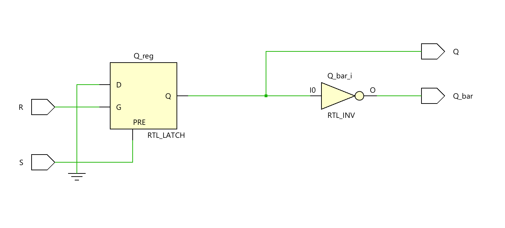
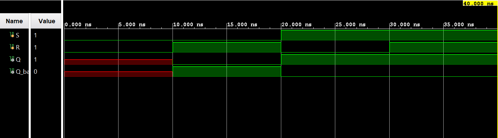

# ◈ SR Latch 

### Sequential Circuit • Latch • Behavioral Modeling

---

## 📌 Module Description

The **SR Latch** is a basic sequential circuit that stores **1 bit of information** using **Set (`S`)** and **Reset (`R`)** inputs, allowing the output `Q` to be set, reset, or hold its previous state. Implemented using procedural statements in behavioral abstraction.
---

# ◈ **Verilog RTL code** 

```verilog

module sr_latch(
    input S, R,

    output reg Q,
    output Q_bar

);

assign Q_bar = ~Q;

    always @(*) begin
      
      if (S)
        Q = 1'b1;

      else if (R)
        Q = 1'b0;
        
    end
endmodule                         

```

# 📊 **Truth table**

| **Inputs** | **Inputs** | **Output** | **Output** |
|:---:|:---:|:---:|:---:|
| **S** | **R** | **Q** | **Q̅** |
| 0 | 0 | Q(previous) | Q̅(previous) |
| 0 | 1 | 0 | **1** |
| 1 | 0 | **1** | 0 |
| 1 | 1 | **Invalid** | **Invalid** |

# 🧪 **Testbench**

```verilog

module sr_latch_tb;
  reg S, R;

  wire Q, Q_bar;

  sr_latch DUT(
    .S(S),
    .R(R),
    .Q(Q),
    .Q_bar(Q_bar)
  );

   initial begin

      $dumpfile("sr_latch.vcd");
      $dumpvars(0, sr_latch_tb);

      S = 0;
      R = 0;

      #10;

      S = 0;
      R = 1;

      #10;

      S = 1;
      R = 0;

      #10;

      S = 1;
      R = 1;

      #10;

      $finish;

     end

endmodule                    

```

# 🔷 **RTL Schematics**



# 📈 **Simulation Result**


# ◈ **Verification Summary**

| **Test Case** | **Expected Output** | **Status** |
|:---|:---:|:---:|
| `S=0, R=0` | `Q=Q(previous), Q̅=Q̅(previous)` | **PASS** |
| `S=0, R=1` | `Q=0, Q̅=1` | **PASS** |
| `S=1, R=0` | `Q=1, Q̅=0` | **PASS** |
| `S=1, R=1` | `Q=Invalid, Q̅=Invalid` | **PASS** |

**Verification Result:** `4/4 TEST CASES PASSED`


