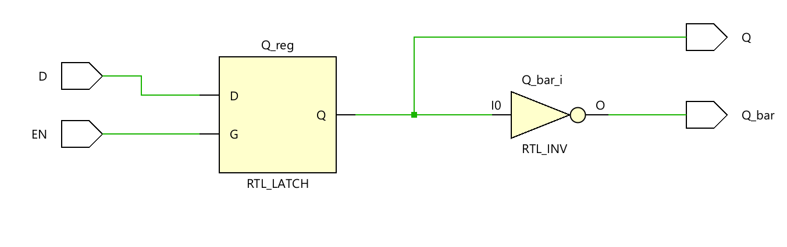
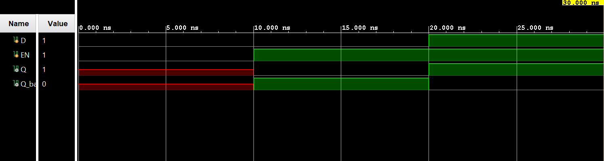

# ◈ D Latch (`d_latch`)

### Sequential Circuit • Latch • Behavioral Modeling

---

## 📌 Module Description

The **D Latch** is a basic sequential circuit that stores **1 bit of information** using a **Data (`D`)** input and an **Enable (`EN`)** signal, allowing the output `Q` to follow `D` when enabled and hold its previous state when disabled. Implemented using procedural statements in behavioral abstraction.

---

# ◈ **Verilog RTL code** 

```verilog

module d_latch(
    input D, EN,

    output reg Q,
    output Q_bar

);

assign Q_bar = ~Q;

always @(*) begin
  
  if (EN)
     Q = D;

end
endmodule                              

```

# 📊 **Truth table**

| **Inputs** | **Inputs** | **Output** | **Output** |
|:---:|:---:|:---:|:---:|
| **D** | **EN** | **Q** | **Q̅** |
| 0 | 0 | Q(previous) | Q̅(previous) |
| 0 | 1 | 0 | **1** |
| 1 | 0 | Q(previous) | Q̅(previous) |
| 1 | 1 | **1** | 0 |

# 🧪 **Testbench**

```verilog

module d_latch_tb;
  reg D, EN;

  wire Q;
  wire Q_bar;

  d_latch DUT(
    .D(D),
    .EN(EN),
    .Q(Q),
    .Q_bar(Q_bar)    
  );

  initial begin
    $dumpfile("d_latch");
    $dumpvars(0, d_latch_tb);

    EN = 0;
    D = 0;

    #10;

    EN = 1;
    D = 0;

    #10;

    EN = 1;
    D = 1;

    #10;

    $finish;
  end
endmodule    
                    

```

# 🔷 **RTL Schematics**



# 📈 **Simulation Result**


# ◈ **Verification Summary**

| **Test Case** | **Expected Output** | **Status** |
|:---|:---:|:---:|
| `D=0, EN=0` | `Q=Q(previous), Q̅=Q̅(previous)` | **PASS** |
| `D=0, EN=1` | `Q=0, Q̅=1` | **PASS** |
| `D=1, EN=0` | `Q=Q(previous), Q̅=Q̅(previous)` | **PASS** |
| `D=1, EN=1` | `Q=1, Q̅=0` | **PASS** |

**Verification Result:** `4/4 TEST CASES PASSED`


