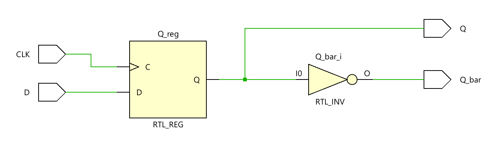
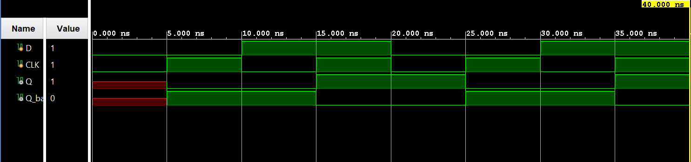

# ◈ D Flip-Flop 

### Sequential Circuit • Flip-Flop • Behavioral Modeling

---

## 📌 Module Description

The **D Flip-Flop** is a basic sequential circuit that stores **1 bit of information** and captures the value of the **Data (`D`)** input on the active edge of the **Clock (`CLK`)** signal. Implemented using procedural statements in behavioral abstraction.

---

# ◈ **Verilog RTL code** 

```verilog

module d_flip_flop(

    input D, CLK,
    output reg Q,
    output Q_bar

);

assign Q_bar = ~Q;

  always @(posedge CLK) begin
    Q <= D;

  end
endmodule    
                         

```

# 📊 **Truth table**

| **Inputs** | **Inputs** | **Output** | **Output** |
|:---:|:---:|:---:|:---:|
| **D** | **CLK** | **Q** | **Q̅** |
| 0 | ↑ | 0 | **1** |
| 1 | ↑ | **1** | 0 |
| 0 | No Edge | Q(previous) | Q̅(previous) |
| 1 | No Edge | Q(previous) | Q̅(previous) |

# 🧪 **Testbench**

```verilog

module d_flip_flop_tb;
   reg D, CLK;

   wire Q;
   wire Q_bar;

   d_flip_flop DUT(
    .D(D),
    .CLK(CLK),
    .Q(Q),
    .Q_bar(Q_bar)

   );

    // Clock Generation
    initial begin 
      CLK = 0;
        forever #5 CLK = ~CLK;
    end

    initial begin
      $dumpfile("d_flip_flop.vcd");
      $dumpvars(0, d_flip_flop_tb);

      D = 0;

      #10;

      D = 1;

      #10;

      D = 0;

      #10;

      D = 1;

      #10;

      $finish;
    end
endmodule                          

```

# 🔷 **RTL Schematics**



# 📈 **Simulation Result**


# ◈ **Verification Summary**

| **Test Case** | **Expected Output** | **Status** |
|:---|:---:|:---:|
| `D=0, CLK=↑` | `Q=0, Q̅=1` | **PASS** |
| `D=1, CLK=↑` | `Q=1, Q̅=0` | **PASS** |
| `D=0, CLK=No Edge` | `Q=Q(previous), Q̅=Q̅(previous)` | **PASS** |
| `D=1, CLK=No Edge` | `Q=Q(previous), Q̅=Q̅(previous)` | **PASS** |

**Verification Result:** `4/4 TEST CASES PASSED`


