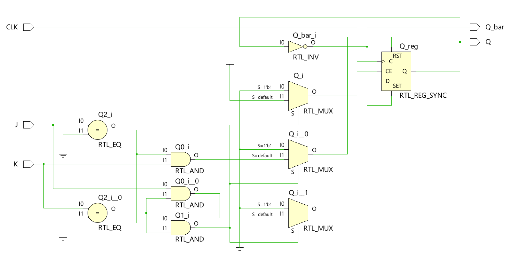
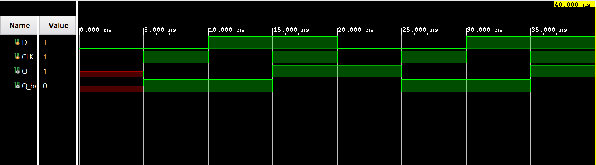

# ◈ JK Flip-Flop (`jk_flip_flop`)

### Sequential Circuit • Flip-Flop • Behavioral Modeling

---

## 📌 Module Description

The **JK Flip-Flop** is a sequential circuit that stores **1 bit of information** using **J** and **K** inputs, allowing the output `Q` to set, reset, hold, or toggle its state based on the input combination at the active clock edge. Implemented using procedural statements in behavioral abstraction.

---

# ◈ **Verilog RTL code** 

```verilog

module jk_flip_flop(

    input J, K, CLK,
    output reg Q,
    output Q_bar

);

assign Q_bar = ~Q;

always @(posedge CLK) begin

    if (J == 0 && K == 0)
         Q <= Q;

    else if (J == 0 && K == 1)
         Q <= 0;

    else if (J == 1 && K == 0)
         Q <= 1;

    else 
         Q <= ~Q;

end 
endmodule                            
                         
```

# 📊 **Truth table**

| **Inputs** | **Inputs** | **Inputs** | **Output** | **Output** |
|:---:|:---:|:---:|:---:|:---:|
| **J** | **K** | **CLK** | **Q** | **Q̅** |
| 0 | 0 | ↑ | Q(previous) | Q̅(previous) |
| 0 | 1 | ↑ | 0 | **1** |
| 1 | 0 | ↑ | **1** | 0 |
| 1 | 1 | ↑ | Q̅(previous) | Q(previous) |

# 🧪 **Testbench**

```verilog

module jk_flip_flop_tb;
   reg J, K, CLK;

   wire Q, Q_bar;

   jk_flip_flop DUT(
    .J(J),
    .K(K),
    .CLK(CLK),
    .Q(Q),
    .Q_bar(Q_bar)

   );

   //clock generation

   initial begin
   CLK = 0;
     forever #5 CLK = ~CLK;
    end 

    initial begin
      $dumpfile("jk_flip_flop.vcd");
      $dumpvars(0, jk_flip_flop_tb);

        J = 1;
        K = 0;

        #10;

        // 00 - HOLD
        J = 0;
        K = 0;

        #10;

        // 01 - RESET
        J = 0;
        K = 1;

        #10;

        // 10 - SET
        J = 1;
        K = 0;

        #10;

        // 11 - TOGGLE
        J = 1;
        K = 1;

        #10;

        // 11 - TOGGLE again
        J = 1;
        K = 1;

        #10;

        $finish;

    end

endmodule                          

```

# 🔷 **RTL Schematics**



# 📈 **Simulation Result**


# ◈ **Verification Summary**

| **Test Case** | **Expected Output** | **Status** |
|:---|:---:|:---:|
| `J=0, K=0, CLK=↑` | `Q=Q(previous), Q̅=Q̅(previous)` | **PASS** |
| `J=0, K=1, CLK=↑` | `Q=0, Q̅=1` | **PASS** |
| `J=1, K=0, CLK=↑` | `Q=1, Q̅=0` | **PASS** |
| `J=1, K=1, CLK=↑` | `Q=Q̅(previous), Q̅=Q(previous)` | **PASS** |

**Verification Result:** `4/4 TEST CASES PASSED`


