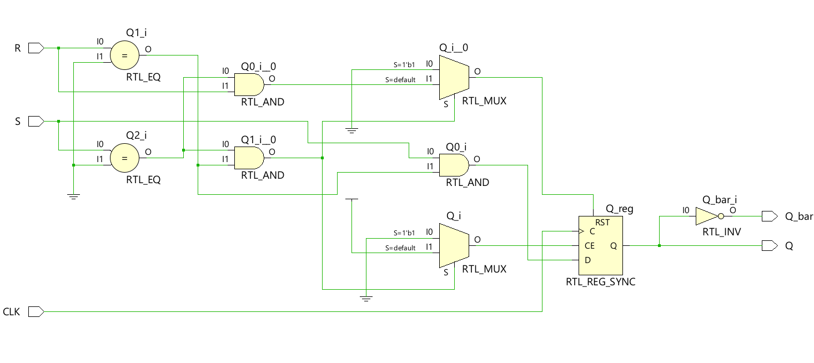
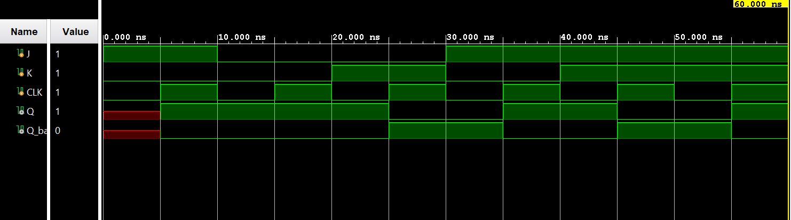

# ◈ SR Flip-Flop 

### Sequential Circuit • Flip-Flop • Behavioral Modeling

---

## 📌 Module Description

The **SR Flip-Flop** is a sequential circuit that stores **1 bit of information** using **Set (`S`)** and **Reset (`R`)** inputs, allowing the output `Q` to set, reset, or hold its state based on the input combination at the active clock edge. Implemented using procedural statements in behavioral abstraction.

---

# ◈ **Verilog RTL code** 

```verilog

module sr_flip_flop(

    input S, R, CLK,

    output reg Q,
    output Q_bar

);

assign Q_bar = ~Q;

always @(posedge CLK) begin

    if (S == 0 && R == 0)
        Q <= Q;

    else if (S == 0 && R == 1)
        Q <= 0;

    else if (S == 1 && R == 0)
        Q <= 1;

    else
        Q <= 1'bx;

end

endmodule                            
                         
```

| **Inputs** | **Inputs** | **Inputs** | **Output** | **Output** |
|:---:|:---:|:---:|:---:|:---:|
| **S** | **R** | **CLK** | **Q** | **Q̅** |
| 0 | 0 | ↑ | Q(previous) | Q̅(previous) |
| 0 | 1 | ↑ | 0 | **1** |
| 1 | 0 | ↑ | **1** | 0 |
| 1 | 1 | ↑ | **Invalid** | **Invalid** |
# 🧪 **Testbench**

```verilog

module sr_flip_flop_tb;

    reg S, R, CLK;

    wire Q;
    wire Q_bar;

    sr_flip_flop DUT(
        .S(S),
        .R(R),
        .CLK(CLK),
        .Q(Q),
        .Q_bar(Q_bar)
    );

    // Clock generation

    initial begin

        CLK = 0;

        forever #5 CLK = ~CLK;

    end


    initial begin

        $dumpfile("sr_flip_flop.vcd");
        $dumpvars(0, sr_flip_flop_tb);


        // 10 → SET
        S = 1;
        R = 0;

        #10;


        // 00 → HOLD
        S = 0;
        R = 0;

        #10;


        // 01 → RESET
        S = 0;
        R = 1;

        #10;


        // 00 → HOLD
        S = 0;
        R = 0;

        #10;


        // 10 → SET again
        S = 1;
        R = 0;

        #10;


        $finish;

    end

endmodule                       

```

# 🔷 **RTL Schematics**



# 📈 **Simulation Result**


# ◈ **Verification Summary**

| **Test Case** | **Expected Output** | **Status** |
|:---|:---:|:---:|
| `S=0, R=0, CLK=↑` | `Q=Q(previous), Q̅=Q̅(previous)` | **PASS** |
| `S=0, R=1, CLK=↑` | `Q=0, Q̅=1` | **PASS** |
| `S=1, R=0, CLK=↑` | `Q=1, Q̅=0` | **PASS** |
| `S=1, R=1, CLK=↑` | `Q=Invalid, Q̅=Invalid` | **PASS** |

**Verification Result:** `4/4 TEST CASES PASSED`


