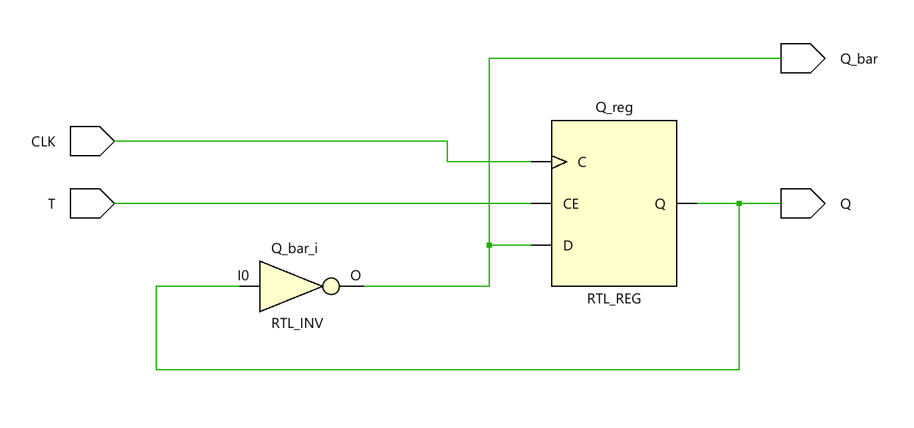
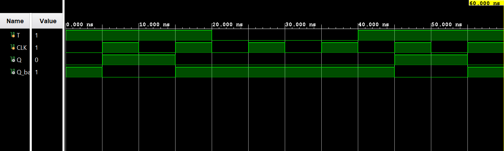

# ◈ T Flip-Flop 

### Sequential Circuit • Flip-Flop • Behavioral Modeling

---

## 📌 Module Description

The **T Flip-Flop** is a sequential circuit that stores **1 bit of information** using a **Toggle (`T`)** input, allowing the output `Q` to hold its state when `T` is LOW (`0`) or toggle its state when `T` is HIGH (`1`) at the active clock edge. Implemented using procedural statements in behavioral abstraction.

---

# ◈ **Verilog RTL code** 

```verilog

module t_flip_flop(

    input T,
    input CLK,

    output reg Q,
    output Q_bar

);

assign Q_bar = ~Q;

initial
    Q = 0;

always @(posedge CLK) begin

    if (T == 0)
        Q <= Q;

    else
        Q <= ~Q;

end

endmodule                            
                         
```
# 📊 **Truth table**

| **Inputs** | **Inputs** | **Output** | **Output** |
|:---:|:---:|:---:|:---:|
| **T** | **CLK** | **Q** | **Q̅** |
| 0 | ↑ | Q(previous) | Q̅(previous) |
| 1 | ↑ | Q̅(previous) | Q(previous) |

# 🧪 **Testbench**

```verilog

module t_flip_flop_tb;

    reg T, CLK;

    wire Q;
    wire Q_bar;

    t_flip_flop DUT(
        .T(T),
        .CLK(CLK),
        .Q(Q),
        .Q_bar(Q_bar)
    );

    // Clock generation

    initial begin

        CLK = 0;

        forever #5 CLK = ~CLK;

    end

    initial begin

        $dumpfile("t_flip_flop.vcd");
        $dumpvars(0, t_flip_flop_tb);

        // T = 1 → TOGGLE
        T = 1;

        #20;

        // T = 0 → HOLD
        T = 0;

        #20;

        // T = 1 → TOGGLE
        T = 1;

        #20;

        $finish;

    end

endmodule                       

```

# 🔷 **RTL Schematics**



# 📈 **Simulation Result**


# ◈ **Verification Summary**

| **Test Case** | **Expected Output** | **Status** |
|:---|:---:|:---:|
| `T=0, CLK=↑` | `Q=Q(previous), Q̅=Q̅(previous)` | **PASS** |
| `T=1, CLK=↑` | `Q=Q̅(previous), Q̅=Q(previous)` | **PASS** |

**Verification Result:** `2/2 TEST CASES PASSED`


