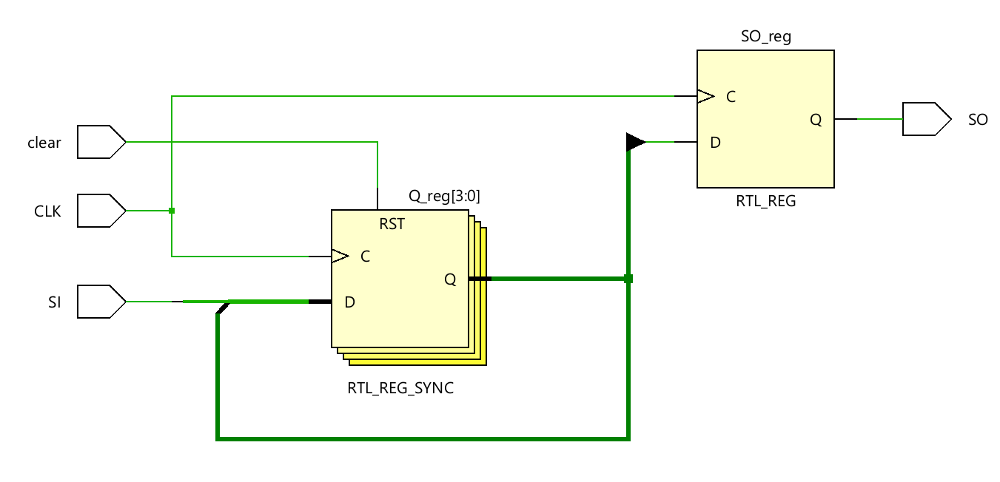
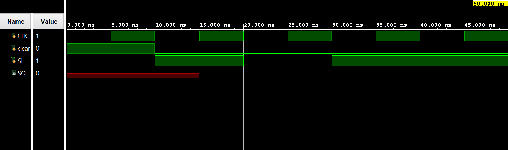

# ◈ Serial-In Serial-Out 

### Sequential Circuit • Shift Register • Behavioral Modeling

---

## 📌 Module Description

The **Serial-In Serial-Out (SISO) Shift Register** is a sequential circuit that accepts data **serially** through a single input and shifts it through a series of flip-flops on each active clock edge, producing the data **serially** at the output. Implemented using procedural statements in behavioral abstraction.

---

# ◈ **Verilog RTL code** 

```verilog

module siso(
    input CLK,
    input clear,
    input SI,
    output reg SO
);
    reg [3:0] Q;

    always @(posedge CLK) begin
        if (clear == 1) begin
          Q   <= 4'b0000;
        end

        else begin
          Q <= {SI, Q[3:1]};
        end   

    end
    
    always @(posedge CLK) begin
        SO <= Q;
    end

endmodule     
                         
```

# 📊 **Truth table**

| **Inputs** | **Inputs** | **Output** |
|:---:|:---:|:---:|
| **Data In** | **CLK** | **Data Out** |
| 0 | ↑ | 0 |
| 1 | ↑ | 1 |

# 🧪 **Testbench**

```verilog

module siso_tb;

reg CLK;
reg clear;
reg SI;

wire SO;

siso DUT(
    .CLK(CLK),
    .clear(clear),
    .SI(SI),
    .SO(SO)
);

initial begin

    $dumpfile("siso.vcd");
    $dumpvars(0, siso_tb);

    // Reset
    CLK = 0;
    clear = 1;
    SI = 0;

    #10;

    clear = 0;

    // Send 1
    SI = 1;
    #10;

    // Send 0
    SI = 0;
    #10;

    // Send 1
    SI = 1;
    #10;

    // Send 1
    SI = 1;
    #10;

    $finish;

end

always #5 CLK = ~CLK;

endmodule                          

```

# 🔷 **RTL Schematics**



# 📈 **Simulation Result**


# ◈ **Verification Summary**

| **Test Case** | **Expected Output** | **Status** |
|:---|:---:|:---:|
| `Data In=0, CLK=↑` | `Data Out=0` | **PASS** |
| `Data In=1, CLK=↑` | `Data Out=1` | **PASS** |

**Verification Result:** `2/2 TEST CASES PASSED`


