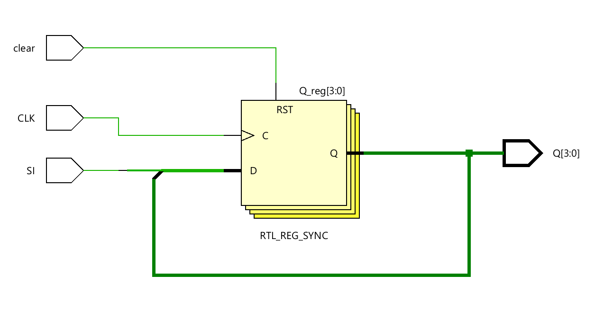
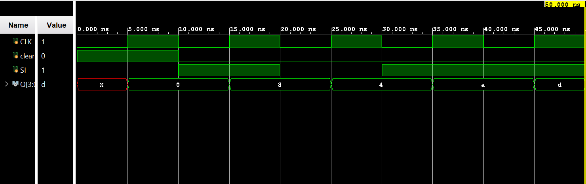

# ◈ Serial-In Parallel-Out (`sipo_shift_register`)

### Sequential Circuit • Shift Register • Behavioral Modeling

---

## 📌 Module Description

The **Serial-In Parallel-Out (SIPO) Shift Register** is a sequential circuit that accepts data **serially** through a single input and shifts it through a series of flip-flops on each active clock edge, providing the stored data **simultaneously** through multiple parallel outputs. Implemented using procedural statements in behavioral abstraction.

---

# ◈ **Verilog RTL code** 

```verilog

module sipo(
    input CLK,
    input clear,
    input SI,
    output reg [3:0] Q
);

    
   
    always @(posedge CLK) begin
        if (clear == 1) begin
          Q <= 4'b0000;
        end

        else begin
          Q <= {SI, Q[3:1]};
        end   

    end

endmodule         
                         
```

# 📊 **Truth table**

| **Inputs** | **Inputs** | **Output** | **Output** | **Output** | **Output** |
|:---:|:---:|:---:|:---:|:---:|:---:|
| **Data In** | **CLK** | **Q0** | **Q1** | **Q2** | **Q3** |
| 0 | ↑ | 0 | Q0(previous) | Q1(previous) | Q2(previous) |
| 1 | ↑ | 1 | Q0(previous) | Q1(previous) | Q2(previous) |

# 🧪 **Testbench**

```verilog

module sipo_tb;

reg CLK;
reg clear;
reg SI;

wire [3:0] Q;

sipo DUT(
    .CLK(CLK),
    .clear(clear),
    .SI(SI),
    .Q(Q)
);

initial begin

    $dumpfile("sipo.vcd");
    $dumpvars(0, sipo_tb);

    // Initial values
    CLK = 0;
    clear = 1;
    SI = 0;

    #10;

    // Release clear
    clear = 0;

    // Send 1
    SI = 1;
    #10;

    // Send 0
    SI = 0;
    #10;

    // Send 1
    SI = 1;
    #10;

    // Send 1
    SI = 1;
    #10;

    $finish;

end

// Clock generation
always #5 CLK = ~CLK;

endmodule                          

```

# 🔷 **RTL Schematics**



# 📈 **Simulation Result**


# ◈ **Verification Summary**

| **Test Case** | **Expected Output** | **Status** |
|:---|:---:|:---:|
| `Data In=0, CLK=↑` | `Q0=0, Q1=Q0(previous), Q2=Q1(previous), Q3=Q2(previous)` | **PASS** |
| `Data In=1, CLK=↑` | `Q0=1, Q1=Q0(previous), Q2=Q1(previous), Q3=Q2(previous)` | **PASS** |

**Verification Result:** `2/2 TEST CASES PASSED`


