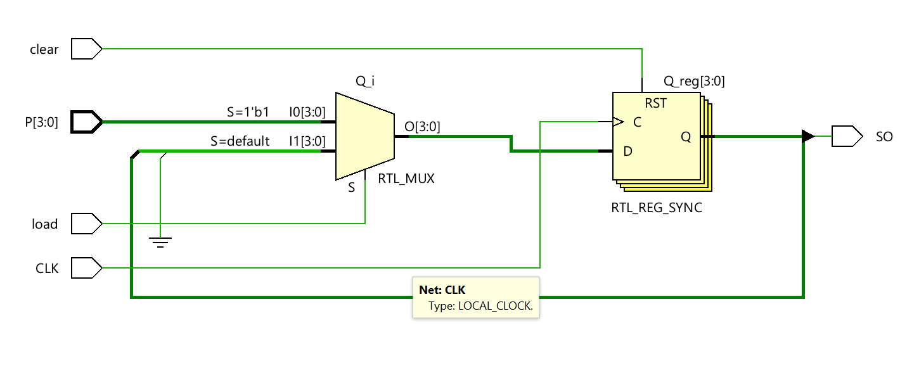
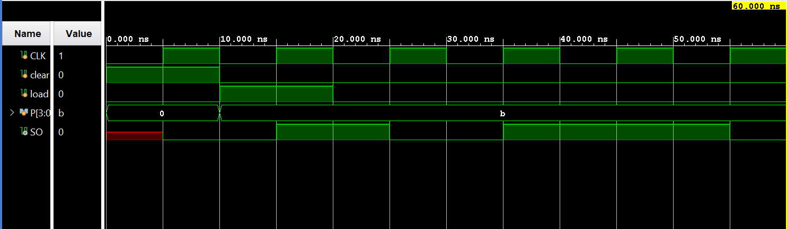

# ◈ Parallel-In Serial-Out 

### Sequential Circuit • Shift Register • Behavioral Modeling

---

## 📌 Module Description

The **Parallel-In Serial-Out (PISO) Shift Register** is a sequential circuit that loads multiple data bits **in parallel** and shifts them out **serially** through a single output on each active clock edge. Implemented using procedural statements in behavioral abstraction.

---

# ◈ **Verilog RTL code** 

```verilog

module piso(
    input CLK,
    input clear,
    input load,
    input [3:0] P,
    output SO
);

reg [3:0] Q;

always @(posedge CLK) begin

    if (clear == 1)
        Q <= 4'b0000;

    else if (load == 1)
        Q <= P;

    else
        Q <= {Q[2:0], 1'b0};

end

assign SO = Q[3];

endmodule
                         
```

# 📊 **Truth table**

| **Inputs** | **Inputs** | **Inputs** | **Inputs** | **Inputs** | **Output** |
|:---:|:---:|:---:|:---:|:---:|:---:|
| **P0** | **P1** | **P2** | **P3** | **CLK** | **Data Out** |
| 0 | 0 | 0 | 0 | ↑ | P0 |
| 0 | 0 | 0 | 1 | ↑ | P3 |
| 0 | 0 | 1 | 0 | ↑ | P2 |
| 0 | 0 | 1 | 1 | ↑ | P3 |
| 0 | 1 | 0 | 0 | ↑ | P1 |
| 0 | 1 | 0 | 1 | ↑ | P3 |
| 0 | 1 | 1 | 0 | ↑ | P2 |
| 0 | 1 | 1 | 1 | ↑ | P3 |
| 1 | 0 | 0 | 0 | ↑ | P0 |
| 1 | 0 | 0 | 1 | ↑ | P3 |
| 1 | 0 | 1 | 0 | ↑ | P2 |
| 1 | 0 | 1 | 1 | ↑ | P3 |
| 1 | 1 | 0 | 0 | ↑ | P1 |
| 1 | 1 | 0 | 1 | ↑ | P3 |
| 1 | 1 | 1 | 0 | ↑ | P2 |
| 1 | 1 | 1 | 1 | ↑ | P3 |

# 🧪 **Testbench**

```verilog

module piso_tb;

reg CLK;
reg clear;
reg load;
reg [3:0] P;

wire SO;

piso DUT(
    .CLK(CLK),
    .clear(clear),
    .load(load),
    .P(P),
    .SO(SO)
);

initial begin

    $dumpfile("piso.vcd");
    $dumpvars(0, piso_tb);

    // Initial values
    CLK = 0;
    clear = 1;
    load = 0;
    P = 4'b0000;

    #10;

    // Release clear
    clear = 0;

    // Parallel load
    P = 4'b1011;
    load = 1;

    #10;

    // Start shifting
    load = 0;

    #10;
    #10;
    #10;
    #10;

    $finish;

end

// Clock generation
always #5 CLK = ~CLK;

endmodule                         

```

# 🔷 **RTL Schematics**



# 📈 **Simulation Result**


# ◈ **Verification Summary**

| **Test Case** | **Expected Output** | **Status** |
|:---|:---:|:---:|
| `P3P2P1P0=0000, Shift 4 CLK` | `Data Out=0000` | **PASS** |
| `P3P2P1P0=0001, Shift 4 CLK` | `Data Out=0001` | **PASS** |
| `P3P2P1P0=0010, Shift 4 CLK` | `Data Out=0010` | **PASS** |
| `P3P2P1P0=0011, Shift 4 CLK` | `Data Out=0011` | **PASS** |
| `P3P2P1P0=0100, Shift 4 CLK` | `Data Out=0100` | **PASS** |
| `P3P2P1P0=0101, Shift 4 CLK` | `Data Out=0101` | **PASS** |
| `P3P2P1P0=0110, Shift 4 CLK` | `Data Out=0110` | **PASS** |
| `P3P2P1P0=0111, Shift 4 CLK` | `Data Out=0111` | **PASS** |
| `P3P2P1P0=1000, Shift 4 CLK` | `Data Out=1000` | **PASS** |
| `P3P2P1P0=1001, Shift 4 CLK` | `Data Out=1001` | **PASS** |
| `P3P2P1P0=1010, Shift 4 CLK` | `Data Out=1010` | **PASS** |
| `P3P2P1P0=1011, Shift 4 CLK` | `Data Out=1011` | **PASS** |
| `P3P2P1P0=1100, Shift 4 CLK` | `Data Out=1100` | **PASS** |
| `P3P2P1P0=1101, Shift 4 CLK` | `Data Out=1101` | **PASS** |
| `P3P2P1P0=1110, Shift 4 CLK` | `Data Out=1110` | **PASS** |
| `P3P2P1P0=1111, Shift 4 CLK` | `Data Out=1111` | **PASS** |

**Verification Result:** `2/2 TEST CASES PASSED`


