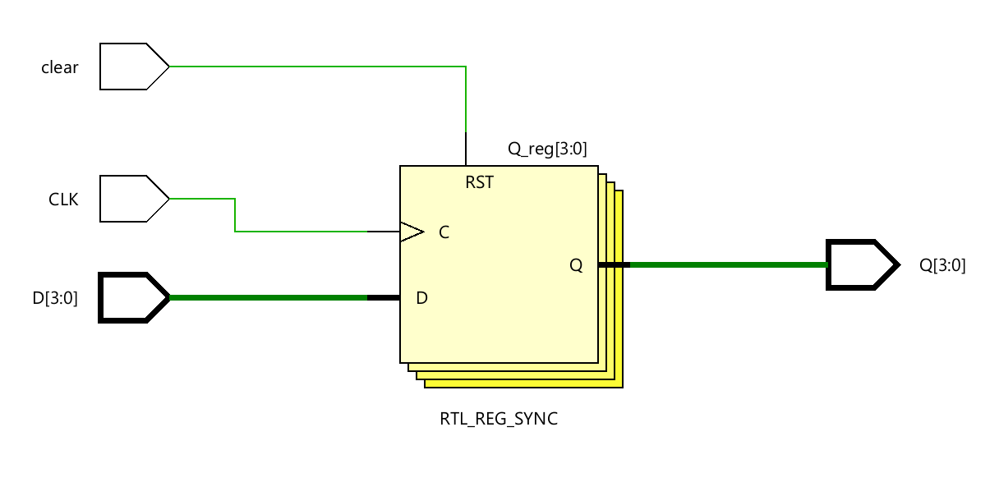
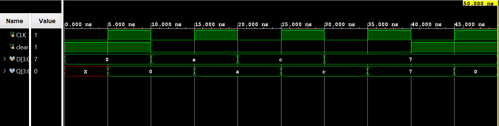

# ◈ Parallel-In Serial-Out 

### Sequential Circuit • Shift Register • Behavioral Modeling

---

## 📌 Module Description

The **Parallel-In Serial-Out (PISO) Shift Register** is a sequential circuit that loads multiple data bits **in parallel** and shifts them out **serially** through a single output on each active clock edge. Implemented using procedural statements in behavioral abstraction.

---

# ◈ **Verilog RTL code** 

```verilog

module pipo(
    input CLK,
    input clear,
    input [3:0] D,
    output reg [3:0] Q
);

always @(posedge CLK) begin

    if (clear == 1)
        Q <= 4'b0000;

    else
        Q <= D;

end

endmodule
                         
```

# 📊 **Truth table**

| **Inputs** | **Inputs** | **Inputs** | **Inputs** | **Inputs** | **Output** | **Output** | **Output** | **Output** |
|:---:|:---:|:---:|:---:|:---:|:---:|:---:|:---:|:---:|
| **D0** | **D1** | **D2** | **D3** | **CLK** | **Q0** | **Q1** | **Q2** | **Q3** |
| 0 | 0 | 0 | 0 | ↑ | 0 | 0 | 0 | 0 |
| 0 | 0 | 0 | 1 | ↑ | 0 | 0 | 0 | **1** |
| 0 | 0 | 1 | 0 | ↑ | 0 | 0 | **1** | 0 |
| 0 | 0 | 1 | 1 | ↑ | 0 | 0 | **1** | **1** |
| 0 | 1 | 0 | 0 | ↑ | 0 | **1** | 0 | 0 |
| 0 | 1 | 0 | 1 | ↑ | 0 | **1** | 0 | **1** |
| 0 | 1 | 1 | 0 | ↑ | 0 | **1** | **1** | 0 |
| 0 | 1 | 1 | 1 | ↑ | 0 | **1** | **1** | **1** |
| 1 | 0 | 0 | 0 | ↑ | **1** | 0 | 0 | 0 |
| 1 | 0 | 0 | 1 | ↑ | **1** | 0 | 0 | **1** |
| 1 | 0 | 1 | 0 | ↑ | **1** | 0 | **1** | 0 |
| 1 | 0 | 1 | 1 | ↑ | **1** | 0 | **1** | **1** |
| 1 | 1 | 0 | 0 | ↑ | **1** | **1** | 0 | 0 |
| 1 | 1 | 0 | 1 | ↑ | **1** | **1** | 0 | **1** |
| 1 | 1 | 1 | 0 | ↑ | **1** | **1** | **1** | 0 |
| 1 | 1 | 1 | 1 | ↑ | **1** | **1** | **1** | **1** |

# 🧪 **Testbench**

```verilog

module pipo_tb;

reg CLK;
reg clear;
reg [3:0] D;

wire [3:0] Q;

pipo DUT(
    .CLK(CLK),
    .clear(clear),
    .D(D),
    .Q(Q)
);

initial begin

    $dumpfile("pipo.vcd");
    $dumpvars(0, pipo_tb);

    // Initial values
    CLK = 0;
    clear = 1;
    D = 4'b0000;

    #10;

    // Release clear
    clear = 0;

    // Load 1010
    D = 4'b1010;

    #10;

    // Load 1100
    D = 4'b1100;

    #10;

    // Load 0111
    D = 4'b0111;

    #10;

    // Clear
    clear = 1;

    #10;

    $finish;

end

// Clock generation
always #5 CLK = ~CLK;

endmodule                        

```

# 🔷 **RTL Schematics**



# 📈 **Simulation Result**


# ◈ **Verification Summary**

| **Test Case** | **Expected Output** | **Status** |
|:---|:---:|:---:|
| `D0=0, D1=0, D2=0, D3=0, CLK=↑` | `Q0=0, Q1=0, Q2=0, Q3=0` | **PASS** |
| `D0=0, D1=0, D2=0, D3=1, CLK=↑` | `Q0=0, Q1=0, Q2=0, Q3=1` | **PASS** |
| `D0=0, D1=0, D2=1, D3=0, CLK=↑` | `Q0=0, Q1=0, Q2=1, Q3=0` | **PASS** |
| `D0=0, D1=0, D2=1, D3=1, CLK=↑` | `Q0=0, Q1=0, Q2=1, Q3=1` | **PASS** |
| `D0=0, D1=1, D2=0, D3=0, CLK=↑` | `Q0=0, Q1=1, Q2=0, Q3=0` | **PASS** |
| `D0=0, D1=1, D2=0, D3=1, CLK=↑` | `Q0=0, Q1=1, Q2=0, Q3=1` | **PASS** |
| `D0=0, D1=1, D2=1, D3=0, CLK=↑` | `Q0=0, Q1=1, Q2=1, Q3=0` | **PASS** |
| `D0=0, D1=1, D2=1, D3=1, CLK=↑` | `Q0=0, Q1=1, Q2=1, Q3=1` | **PASS** |
| `D0=1, D1=0, D2=0, D3=0, CLK=↑` | `Q0=1, Q1=0, Q2=0, Q3=0` | **PASS** |
| `D0=1, D1=0, D2=0, D3=1, CLK=↑` | `Q0=1, Q1=0, Q2=0, Q3=1` | **PASS** |
| `D0=1, D1=0, D2=1, D3=0, CLK=↑` | `Q0=1, Q1=0, Q2=1, Q3=0` | **PASS** |
| `D0=1, D1=0, D2=1, D3=1, CLK=↑` | `Q0=1, Q1=0, Q2=1, Q3=1` | **PASS** |
| `D0=1, D1=1, D2=0, D3=0, CLK=↑` | `Q0=1, Q1=1, Q2=0, Q3=0` | **PASS** |
| `D0=1, D1=1, D2=0, D3=1, CLK=↑` | `Q0=1, Q1=1, Q2=0, Q3=1` | **PASS** |
| `D0=1, D1=1, D2=1, D3=0, CLK=↑` | `Q0=1, Q1=1, Q2=1, Q3=0` | **PASS** |
| `D0=1, D1=1, D2=1, D3=1, CLK=↑` | `Q0=1, Q1=1, Q2=1, Q3=1` | **PASS** |

**Verification Result:** `16/16 TEST CASES PASSED`


