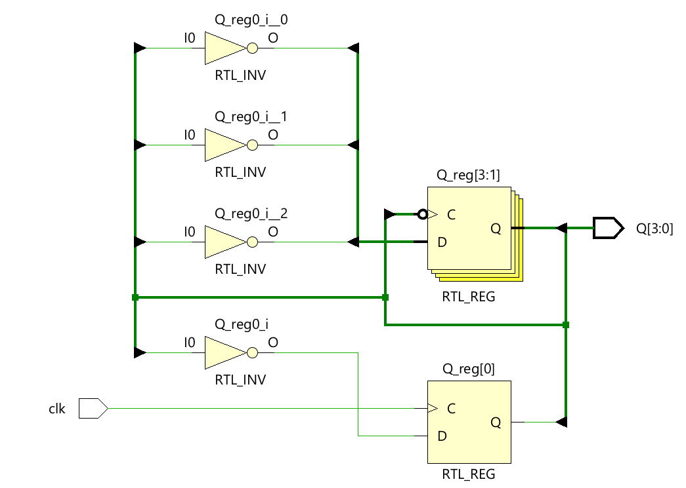
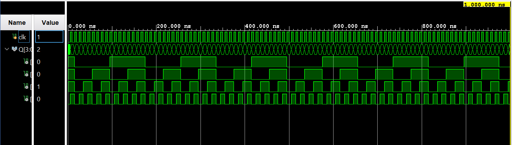

# ◈ 4-Bit Asynchronous Up Counter

### Sequential Circuit • Counter • Behavioral Modeling

---

## 📌 Module Description

The **4-Bit Asynchronous Up Counter** is a sequential circuit that counts upward from **0000 to 1111** using four flip-flops, where each flip-flop is triggered by the output transition of the preceding flip-flop rather than a common clock. Implemented using procedural statements in behavioral abstraction.

---

# ◈ **Verilog RTL code** 

```verilog

module async_4bit_up_counter(
    input clk,
    output reg [3:0] Q
);

initial begin 
   Q = 4'b0000;
end

always @(posedge clk) begin
   Q[0] <= ~Q[0];
end

always @(negedge Q[0]) begin
   Q[1] <= ~Q[1];
end

always @(negedge Q[1]) begin
   Q[2] <= ~Q[2];
end

always @(negedge Q[2]) begin
   Q[3] <= ~Q[3];
end

endmodule
                         
```

# 📊 **Truth table**

| **Inputs** | **Output** | **Output** | **Output** | **Output** |
|:---:|:---:|:---:|:---:|:---:|
| **CLK** | **Q3** | **Q2** | **Q1** | **Q0** |
| ↑ | 0 | 0 | 0 | 0 |
| ↑ | 0 | 0 | 0 | 1 |
| ↑ | 0 | 0 | 1 | 0 |
| ↑ | 0 | 0 | 1 | 1 |
| ↑ | 0 | 1 | 0 | 0 |
| ↑ | 0 | 1 | 0 | 1 |
| ↑ | 0 | 1 | 1 | 0 |
| ↑ | 0 | 1 | 1 | 1 |
| ↑ | 1 | 0 | 0 | 0 |
| ↑ | 1 | 0 | 0 | 1 |
| ↑ | 1 | 0 | 1 | 0 |
| ↑ | 1 | 0 | 1 | 1 |
| ↑ | 1 | 1 | 0 | 0 |
| ↑ | 1 | 1 | 0 | 1 |
| ↑ | 1 | 1 | 1 | 0 |
| ↑ | 1 | 1 | 1 | 1 |
| ↑ | 0 | 0 | 0 | 0 |

# 🧪 **Testbench**

```verilog

module async_4bit_up_counter_tb;
   reg clk;
   wire [3:0] Q;

   async_4bit_up_counter DUT(
    .clk(clk),
    .Q(Q)
   );

// Clock

initial begin
   clk = 0;
   forever #5 clk <= ~clk;
end

initial begin 
  $dumpfile("async_4bit_up_counter.vcd");
  $dumpvars(0, async_4bit_up_counter_tb);

  #1000;

  $finish;
end
endmodule                                  

```

# 🔷 **RTL Schematics**



# 📈 **Simulation Result**


# ◈ **Verification Summary**

| **Test Case** | **Expected Output** | **Status** |
|:---|:---:|:---:|
| `Initial State` | `Q3Q2Q1Q0=0000` | **PASS** |
| `1st Clock Pulse` | `Q3Q2Q1Q0=0001` | **PASS** |
| `2nd Clock Pulse` | `Q3Q2Q1Q0=0010` | **PASS** |
| `3rd Clock Pulse` | `Q3Q2Q1Q0=0011` | **PASS** |
| `4th Clock Pulse` | `Q3Q2Q1Q0=0100` | **PASS** |
| `5th Clock Pulse` | `Q3Q2Q1Q0=0101` | **PASS** |
| `6th Clock Pulse` | `Q3Q2Q1Q0=0110` | **PASS** |
| `7th Clock Pulse` | `Q3Q2Q1Q0=0111` | **PASS** |
| `8th Clock Pulse` | `Q3Q2Q1Q0=1000` | **PASS** |
| `9th Clock Pulse` | `Q3Q2Q1Q0=1001` | **PASS** |
| `10th Clock Pulse` | `Q3Q2Q1Q0=1010` | **PASS** |
| `11th Clock Pulse` | `Q3Q2Q1Q0=1011` | **PASS** |
| `12th Clock Pulse` | `Q3Q2Q1Q0=1100` | **PASS** |
| `13th Clock Pulse` | `Q3Q2Q1Q0=1101` | **PASS** |
| `14th Clock Pulse` | `Q3Q2Q1Q0=1110` | **PASS** |
| `15th Clock Pulse` | `Q3Q2Q1Q0=1111` | **PASS** |
| `16th Clock Pulse` | `Q3Q2Q1Q0=0000` | **PASS** |

**Verification Result:** `16/16 TEST CASES PASSED`

