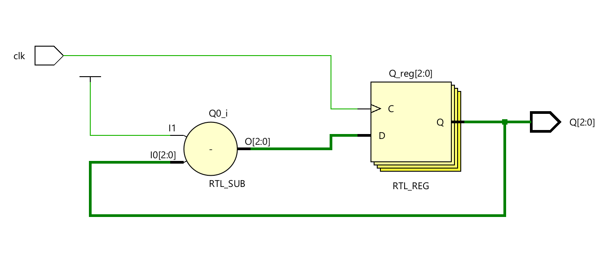
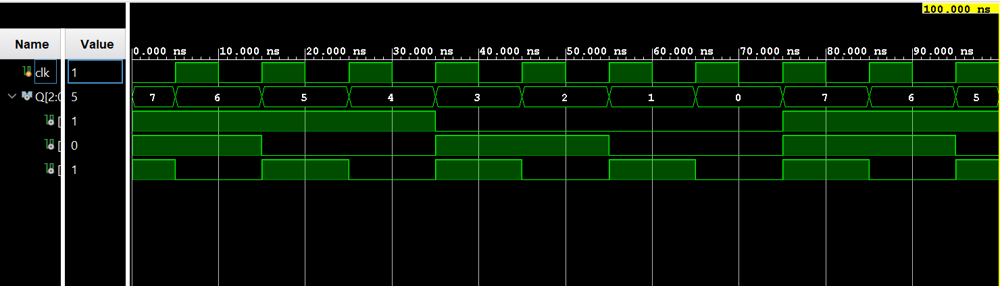

# ◈ 3-Bit Synchronous Down Counter 

### Sequential Circuit • Counter • Behavioral Modeling

---

## 📌 Module Description

The **3-Bit Synchronous Down Counter** is a sequential circuit that counts downward from **111 to 000** using three flip-flops, where all flip-flops are triggered simultaneously by the same clock signal. Implemented using procedural statements in behavioral abstraction.

---

# ◈ **Verilog RTL code** 

```verilog

module sync_3bit_down_counter(
    input clk,
    output reg [2:0] Q
);

initial begin
    Q = 3'b111;
end

always @(posedge clk) begin
    Q <= Q - 1;
end

endmodule
                         
```

# 📊 **Truth table**

| **Inputs** | **Output** | **Output** | **Output** |
|:---:|:---:|:---:|:---:|
| **CLK** | **Q2** | **Q1** | **Q0** |
| ↑ | 1 | 1 | 1 |
| ↑ | 1 | 1 | 0 |
| ↑ | 1 | 0 | 1 |
| ↑ | 1 | 0 | 0 |
| ↑ | 0 | 1 | 1 |
| ↑ | 0 | 1 | 0 |
| ↑ | 0 | 0 | 1 |
| ↑ | 0 | 0 | 0 |
| ↑ | 1 | 1 | 1 |

# 🧪 **Testbench**

```verilog

module sync_3bit_down_counter_tb;

reg clk;
wire [2:0] Q;

sync_3bit_down_counter DUT(
    .clk(clk),
    .Q(Q)
);

initial begin
    clk = 0;
    forever #5 clk <= ~clk;
end

initial begin
    $dumpfile("sync_3bit_down_counter.vcd");
    $dumpvars(0, sync_3bit_down_counter_tb);

    #100;
    $finish;
end

endmodule                         

```

# 🔷 **RTL Schematics**



# 📈 **Simulation Result**


# ◈ **Verification Summary**

| **Test Case** | **Expected Output** | **Status** |
|:---|:---:|:---:|
| `Initial State` | `Q2Q1Q0=111` | **PASS** |
| `1st Clock Pulse` | `Q2Q1Q0=110` | **PASS** |
| `2nd Clock Pulse` | `Q2Q1Q0=101` | **PASS** |
| `3rd Clock Pulse` | `Q2Q1Q0=100` | **PASS** |
| `4th Clock Pulse` | `Q2Q1Q0=011` | **PASS** |
| `5th Clock Pulse` | `Q2Q1Q0=010` | **PASS** |
| `6th Clock Pulse` | `Q2Q1Q0=001` | **PASS** |
| `7th Clock Pulse` | `Q2Q1Q0=000` | **PASS** |
| `8th Clock Pulse` | `Q2Q1Q0=111` | **PASS** |

**Verification Result:** `8/8 TEST CASES PASSED`


