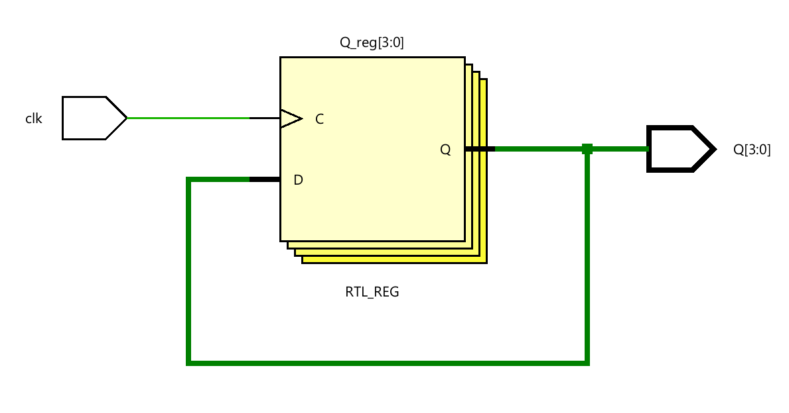
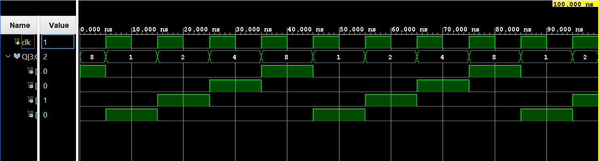

# ◈ Ring Counter

### Sequential Circuit • Counter • Behavioral Modeling

---

## 📌 Module Description

The **Ring Counter** is a sequential circuit that uses a shift register to circulate a single **HIGH (`1`) bit** through a series of flip-flops, producing a repeating sequence of states on each active clock edge. Implemented using procedural statements in behavioral abstraction.

---

# ◈ **Verilog RTL code** 

```verilog

module ring_counter_4bit(
    input clk,
    output reg [3:0] Q
);

initial begin
    Q = 4'b1000;
end

always @(posedge clk) begin
    Q <= {Q[2:0], Q[3]};
end

endmodule
                         
```

# 📊 **Truth table**

| **Inputs** | **Output** | **Output** | **Output** | **Output** |
|:---:|:---:|:---:|:---:|:---:|
| **CLK** | **Q3** | **Q2** | **Q1** | **Q0** |
| ↑ | 1 | 0 | 0 | 0 |
| ↑ | 0 | 1 | 0 | 0 |
| ↑ | 0 | 0 | 1 | 0 |
| ↑ | 0 | 0 | 0 | 1 |
| ↑ | 1 | 0 | 0 | 0 |

# 🧪 **Testbench**

```verilog

module ring_counter_4bit_tb;

reg clk;
wire [3:0] Q;

ring_counter_4bit DUT(
    .clk(clk),
    .Q(Q)
);

// Clock

initial begin
    clk = 0;
    forever #5 clk <= ~clk;
end

initial begin
    $dumpfile("ring_counter_4bit.vcd");
    $dumpvars(0, ring_counter_4bit_tb);

    #100;

    $finish;
end

endmodule                                     

```

# 🔷 **RTL Schematics**



# 📈 **Simulation Result**


# ◈ **Verification Summary**

| **Test Case** | **Expected Output** | **Status** |
|:---|:---:|:---:|
| `Initial State` | `Q3Q2Q1Q0=1000` | **PASS** |
| `1st Clock Pulse` | `Q3Q2Q1Q0=0100` | **PASS** |
| `2nd Clock Pulse` | `Q3Q2Q1Q0=0010` | **PASS** |
| `3rd Clock Pulse` | `Q3Q2Q1Q0=0001` | **PASS** |
| `4th Clock Pulse` | `Q3Q2Q1Q0=1000` | **PASS** |

**Verification Result:** `16/16 TEST CASES PASSED`
