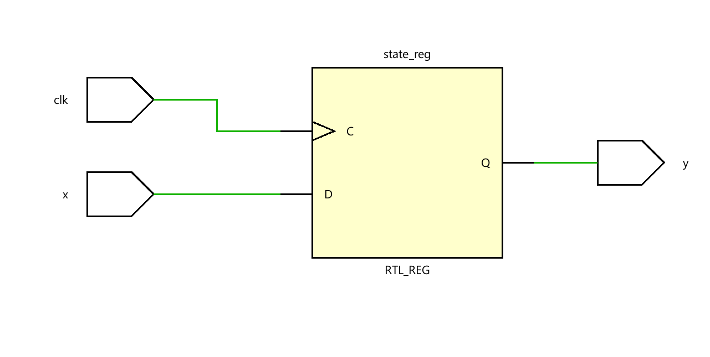
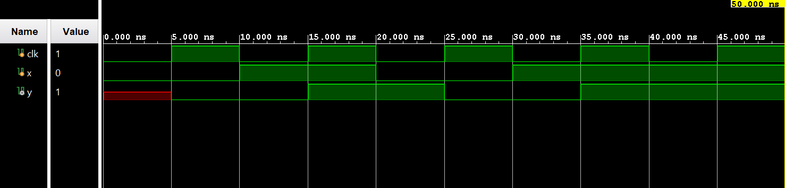

# ◈ Moore FSM

### Sequential Circuit • Finite State Machine • Behavioral Modeling

---

## 📌 Module Description

The **Moore Finite State Machine (FSM)** is a sequential circuit in which the output depends **only on the current state**, while the next state depends on the current state and inputs. Implemented using procedural statements in behavioral abstraction.

---

# ◈ **Verilog RTL code** 

```verilog

module moore_fsm(
    input clk,
    input x,
    output reg y
);

reg state;
reg next_state;

// State 
always @(posedge clk) begin
   state <= next_state;
end

// Next State
always @(*) begin
   if (state == 0) begin 
      if(x == 0)
         next_state = 0;
      else
         next_state = 1; 
    end
    else begin
      if (x == 0)
         next_state = 0;
      else
         next_state = 1;
    end
end

//output
always @(*) begin
   if (state == 0)
       y = 0;
    else   
       y = 1;
end
endmodule 
                         
```

# 📊 **Truth table**

| **Current State** | **Input x** | **Next State** | **Output y** |
|--------------------|-------------|----------------|--------------|
| S0                 | 0           | S0             | 0            |
| S0                 | 1           | S1             | 0            |
| S1                 | 0           | S0             | 1            |
| S1                 | 1           | S1             | 1            |

# 🧪 **Testbench**

```verilog

module moore_fsm_tb;
  reg clk;
  reg x;

  wire y;

   moore_fsm DUT(
    .clk(clk),
    .x(x),
    .y(y)
   );

initial begin
  clk = 0;
  forever #5 clk <= ~clk;
end

initial begin
  $dumpfile("moore_fsm.vcd");
  $dumpvars(0, moore_fsm_tb);

end

initial begin
   #0 x = 0;

   #10 x = 1;

   #10 x = 0;

   #10 x = 1;

   #10 x = 1;

   #10 x = 0;

   $finish;
end
endmodule                                        

```

# 🔷 **RTL Schematics**



# 📈 **Simulation Result**


# ◈ **Verification Summary**

| **Test Case** | **Expected Output** | **Status** |
|:---|:---:|:---:|
| `Initial State` | `Q3Q2Q1Q0=1000` | **PASS** |
| `1st Clock Pulse` | `Q3Q2Q1Q0=0100` | **PASS** |
| `2nd Clock Pulse` | `Q3Q2Q1Q0=0010` | **PASS** |
| `3rd Clock Pulse` | `Q3Q2Q1Q0=0001` | **PASS** |
| `4th Clock Pulse` | `Q3Q2Q1Q0=1000` | **PASS** |

**Verification Result:** `16/16 TEST CASES PASSED`
