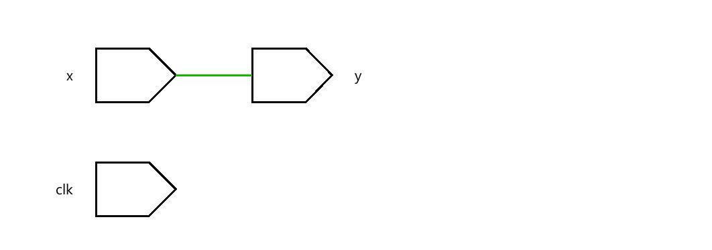
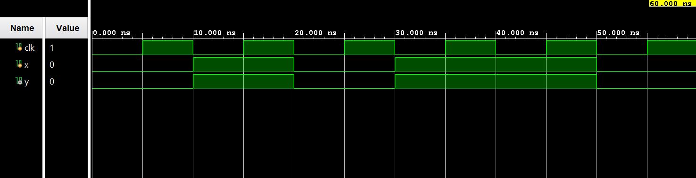

# ◈ Mealy FSM

### Sequential Circuit • Finite State Machine • Behavioral Modeling

---

## 📌 Module Description

The **Mealy Finite State Machine (FSM)** is a sequential circuit in which the output depends on both the **current state** and the **current input**, while the next state depends on the current state and inputs. Implemented using procedural statements in behavioral abstraction.

---

# ◈ **Verilog RTL code** 

```verilog

module mealy_fsm(
    input clk,
    input x,
    output reg y
);

reg state;
reg next_state;

always @(posedge clk) begin
   state <= next_state;
end   

always @(*) begin
   if (state == 0) begin
       if (x == 0)
        next_state = 0;
       else 
        next_state = 1;
    end
    else begin
       if (x == 0) 
         next_state = 0;
       else
         next_state = 1;
    end
end

// output logic

always @(*) begin
    if (state == 0) begin
       if (x == 0)
           y = 0;
       else
           y = 1;
    end

    else begin
        if (x == 0) 
            y = 0;
        else 
            y = 1;
    end           
end 
endmodule
                         
```

# 📊 **Truth table**

| **Current State** | **Input x** | **Next State** | **Output y** |
|:---:|:---:|:---:|:---:|
| S0 | 0 | S0 | 0 |
| S0 | 1 | S1 | 1 |
| S1 | 0 | S0 | 1 |
| S1 | 1 | S1 | 0 |

# 🧪 **Testbench**

```verilog

module mealy_fsm_tb;
  reg clk;
  reg x;

  wire y;

   mealy_fsm DUT(
    .clk(clk),
    .x(x),
    .y(y)
   );

initial begin
  clk = 0;
  forever #5 clk <= ~clk;
end

initial begin
  $dumpfile("mealy_fsm.vcd");
  $dumpvars(0, mealy_fsm_tb);

end

initial begin
    x = 0;

    #10 x = 1;
    #10 x = 0;
    #10 x = 1;
    #10 x = 1;
    #10 x = 0;

    #10;
    $finish;
end

endmodule                                        

```

# 🔷 **RTL Schematics**



# 📈 **Simulation Result**


# ◈ **Verification Summary**

| **Test Case** | **Expected Output** | **Status** |
|:---|:---:|:---:|
| `Current State=S0, x=0` | `Next State=S0, y=0` | **PASS** |
| `Current State=S0, x=1` | `Next State=S1, y=1` | **PASS** |
| `Current State=S1, x=0` | `Next State=S0, y=1` | **PASS** |
| `Current State=S1, x=1` | `Next State=S1, y=0` | **PASS** |

**Verification Result:** `4/4 TEST CASES PASSED`

