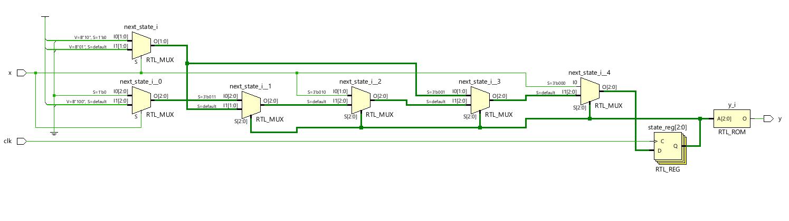
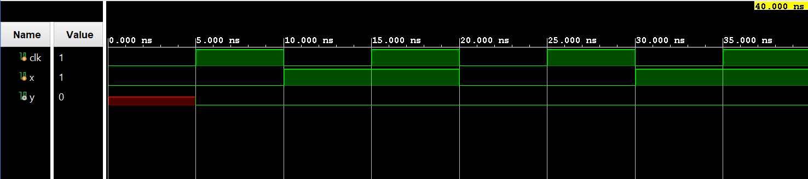

# ◈ Sequence Detector 1011 Overlapping 

### Sequential Circuit • Finite State Machine • Behavioral Modeling

---

## 📌 Module Description

The **1011 Overlapping Sequence Detector** is a sequential circuit that detects the input sequence **`1011`** and generates an output **HIGH (`1`)** whenever the sequence is detected, while allowing overlapping occurrences by retaining the relevant portion of the detected sequence. Implemented using procedural statements in behavioral abstraction.

---

# ◈ **Verilog RTL code** 

```verilog

module sequnece_detector_1011_overlap(
    input clk,
    input x,
    output reg y
);

reg [2:0] state;
reg [2:0] next_state;

always @(posedge clk) begin
    state <= next_state;
end

always @(*) begin
    if (state == 3'b000) begin
        if  (x == 0)
          next_state = 3'b000;
    else
          next_state = 3'b001;
    end

    else if (state == 3'b001) begin
           if (x == 0)
             next_state = 3'b010;
           else 
             next_state = 3'b001;   
    end       

    else if (state == 3'b010) begin
           if (x == 0)
              next_state = 3'b000;
           else 
              next_state = 3'b011;
    end

    else if (state == 3'b011) begin
            if (x == 0)
               next_state = 3'b000;
            else 
               next_state = 3'b100;
    end             

    else begin 
            if (x == 0)
               next_state = 3'b010;
            else     
               next_state =3'b001;
    end             
end 

always @(*) begin 
    if (state == 3'b100)
       y = 1;
    else   
       y = 0;
end 
endmodule   
                         
```

# 📊 **Truth table**

| **Current State** | **Input x** | **Next State** | **Output y** |
|:---:|:---:|:---:|:---:|
| S0 | 0 | S0 | 0 |
| S0 | 1 | S1 | 0 |
| S1 | 0 | S0 | 0 |
| S1 | 1 | S2 | 0 |
| S2 | 0 | S3 | 0 |
| S2 | 1 | S2 | 0 |
| S3 | 0 | S0 | 0 |
| S3 | 1 | S4 | 0 |
| S4 | 0 | S1 | 1 |
| S4 | 1 | S2 | 1 |

# 🧪 **Testbench**

```verilog

module sequnece_detector_1011_overlap_tb;
   reg clk;
   reg x;

   wire y;

   sequnece_detector_1011_overlap DUT(
    .clk(clk),
    .x(x),
    .y(y)
   );

initial begin 
  clk = 0;
  forever #5 clk <= ~clk;    
end 

initial begin
   $dumpfile("sequnece_detector_1011_overlap.vcd");
   $dumpvars(0, sequnece_detector_1011_overlap_tb);
end

initial begin

    x = 0;
  #10 x = 1;
  #10 x = 0;
  #10 x = 1;
  #10 x = 1;

  $finish;
end     

endmodule                                        

```

# 🔷 **RTL Schematics**



# 📈 **Simulation Result**


# ◈ **Verification Summary**

| **Test Case** | **Expected Output** | **Status** |
|:---|:---:|:---:|
| `Current State=S0, x=0` | `Next State=S0, y=0` | **PASS** |
| `Current State=S0, x=1` | `Next State=S1, y=0` | **PASS** |
| `Current State=S1, x=0` | `Next State=S0, y=0` | **PASS** |
| `Current State=S1, x=1` | `Next State=S2, y=0` | **PASS** |
| `Current State=S2, x=0` | `Next State=S3, y=0` | **PASS** |
| `Current State=S2, x=1` | `Next State=S2, y=0` | **PASS** |
| `Current State=S3, x=0` | `Next State=S0, y=0` | **PASS** |
| `Current State=S3, x=1` | `Next State=S4, y=0` | **PASS** |
| `Current State=S4, x=0` | `Next State=S1, y=1` | **PASS** |
| `Current State=S4, x=1` | `Next State=S2, y=1` | **PASS** |

**Verification Result:** `10/10 TEST CASES PASSED`
