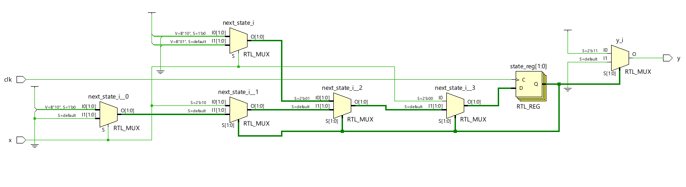
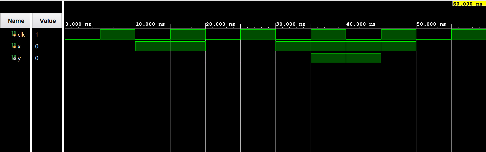

# ◈ Binary Encoding (`binary_encoding`)

### Finite State Machine • State Encoding • Behavioral Modeling

---

## 📌 Module Description

**Binary Encoding** in an FSM is a state encoding technique where each state is assigned a unique **binary code (`0` and `1`)**, allowing the FSM to represent and identify its states using a set of flip-flops. Implemented using binary state encoding in behavioral abstraction.

---

# ◈ **Verilog RTL code** 

```verilog

module binary_encoding(
    input clk,
    input x,
    output reg y
);

reg [1:0] state;
reg [1:0] next_state;

initial begin
    state = 2'b00;
end

always @(posedge clk) begin
    state <= next_state;
end

always @(*) begin
    if (state == 2'b00) begin
        if (x == 0)
            next_state = 2'b00;
        else
            next_state = 2'b01;
    end
    else if (state == 2'b01) begin
        if (x == 0)
            next_state = 2'b10;
        else
            next_state = 2'b01;
    end
    else if (state == 2'b10) begin
        if (x == 0)
            next_state = 2'b00;
        else
            next_state = 2'b11;
    end
    else begin
        if (x == 0)
            next_state = 2'b10;
        else
            next_state = 2'b00;
    end
end

always @(*) begin
    if (state == 2'b11)
        y = 1;
    else
        y = 0;
end

endmodule   
                         
```

# 📊 **Truth table**

| **Current State** | **Input x** | **Next State** | **Output y** | 
| :---------------: | :---------: | :------------: | :----------: | 
|      S0 (00)      |      0      |    S0 (00)     |       0      | 
|      S0 (00)      |      1      |    S1 (01)     |       0      |    
|      S1 (01)      |      0      |    S2 (10)     |       0      |    
|      S1 (01)      |      1      |    S1 (01)     |       0      |    
|      S2 (10)      |      0      |    S0 (00)     |       0      |    
|      S2 (10)      |      1      |    S3 (11)     |       0      |    
|      S3 (11)      |      0      |    S2 (10)     |       1      |    
|      S3 (11)      |      1      |    S0 (00)     |       1      |    

# 🧪 **Testbench**

```verilog

module binary_encoding_tb;

reg clk;
reg x;
wire y;

binary_encoding DUT(
    .clk(clk),
    .x(x),
    .y(y)
);

initial begin
    clk = 0;
    forever #5 clk <= ~clk;
end

initial begin
    $dumpfile("binary_encoding.vcd");
    $dumpvars(0, binary_encoding_tb);
end

initial begin
    x = 0;

    #10 x = 1;
    #10 x = 0;
    #10 x = 1;
    #10 x = 1;
    #10 x = 0;
    #10;

    $finish;
end

endmodule

```

# 🔷 **RTL Schematics**



# 📈 **Simulation Result**


# ◈ **Verification Summary**

| **Test Case** | **Expected Output** | **Status** |
|:---|:---:|:---:|
| `Current State=S0 (00), x=0` | `Next State=S0 (00), y=0` | **PASS** |
| `Current State=S0 (00), x=1` | `Next State=S1 (01), y=0` | **PASS** |
| `Current State=S1 (01), x=0` | `Next State=S2 (10), y=0` | **PASS** |
| `Current State=S1 (01), x=1` | `Next State=S1 (01), y=0` | **PASS** |
| `Current State=S2 (10), x=0` | `Next State=S0 (00), y=0` | **PASS** |
| `Current State=S2 (10), x=1` | `Next State=S3 (11), y=0` | **PASS** |
| `Current State=S3 (11), x=0` | `Next State=S2 (10), y=1` | **PASS** |
| `Current State=S3 (11), x=1` | `Next State=S0 (00), y=1` | **PASS** |

**Verification Result:** `8/8 TEST CASES PASSED`

