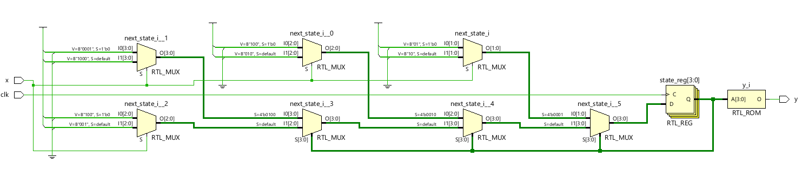
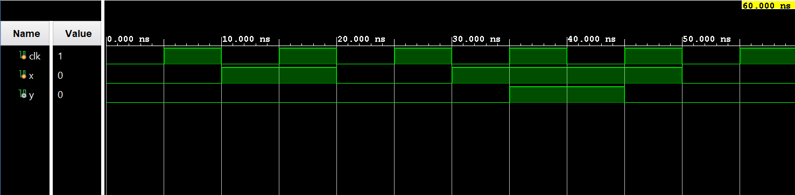

# ◈ One-Hot Encoding

### Finite State Machine • State Encoding • Behavioral Modeling

---

## 📌 Module Description

**One-Hot Encoding** in an FSM is a state encoding technique where each state is assigned a unique **bit position**, with only one bit set to **HIGH (`1`)** at a time while all other state bits remain **LOW (`0`)**. Implemented using one-hot state encoding in behavioral abstraction.

---

# ◈ **Verilog RTL code** 

```verilog

module one_hot_encoding(
    input clk,
    input x,
    output reg y
);

reg [3:0] state;
reg [3:0] next_state;

initial begin
    state = 4'b0001;
end

always @(posedge clk) begin
    state <= next_state;
end

always @(*) begin
    if (state == 4'b0001) begin
        if (x == 0)
            next_state = 4'b0001;
        else
            next_state = 4'b0010;
    end
    else if (state == 4'b0010) begin
        if (x == 0)
            next_state = 4'b0100;
        else
            next_state = 4'b0010;
    end
    else if (state == 4'b0100) begin
        if (x == 0)
            next_state = 4'b0001;
        else
            next_state = 4'b1000;
    end
    else begin
        if (x == 0)
            next_state = 4'b0100;
        else
            next_state = 4'b0001;
    end
end

always @(*) begin
    if (state == 4'b1000)
        y = 1;
    else
        y = 0;
end

endmodule   
                         
```

# 📊 **Truth table**

| **Current State** | **Input x** | **Next State** | **Output y** |    
| :---------------: | :---------: | :------------: | :----------: | 
|      S0 (0001)    |      0      |    S0 (0001)   |       0      |    
|      S0 (0001)    |      1      |    S1 (0010)   |       0      |    
|      S1 (0010)    |      0      |    S2 (0100)   |       0      |    
|      S1 (0010)    |      1      |    S1 (0010)   |       0      |    
|      S2 (0100)    |      0      |    S0 (0001)   |       0      |    
|      S2 (0100)    |      1      |    S3 (1000)   |       0      |    
|      S3 (1000)    |      0      |    S2 (0100)   |       1      |    
|      S3 (1000)    |      1      |    S0 (0001)   |       1      |       

# 🧪 **Testbench**

```verilog

module one_hot_encoding_tb;

reg clk;
reg x;
wire y;

one_hot_encoding DUT(
    .clk(clk),
    .x(x),
    .y(y)
);

initial begin
    clk = 0;
    forever #5 clk <= ~clk;
end

initial begin
    $dumpfile("one_hot_encoding.vcd");
    $dumpvars(0, one_hot_encoding_tb);
end

initial begin
    x = 0;

    #10 x = 1;
    #10 x = 0;
    #10 x = 1;
    #10 x = 1;
    #10 x = 0;
    #10;

    $finish;
end

endmodule

```

# 🔷 **RTL Schematics**



# 📈 **Simulation Result**


# ◈ **Verification Summary**

| **Test Case** | **Expected Output** | **Status** |
|:---|:---:|:---:|
| `Current State=S0 (0001), x=0` | `Next State=S0 (0001), y=0` | **PASS** |
| `Current State=S0 (0001), x=1` | `Next State=S1 (0010), y=0` | **PASS** |
| `Current State=S1 (0010), x=0` | `Next State=S2 (0100), y=0` | **PASS** |
| `Current State=S1 (0010), x=1` | `Next State=S1 (0010), y=0` | **PASS** |
| `Current State=S2 (0100), x=0` | `Next State=S0 (0001), y=0` | **PASS** |
| `Current State=S2 (0100), x=1` | `Next State=S3 (1000), y=0` | **PASS** |
| `Current State=S3 (1000), x=0` | `Next State=S2 (0100), y=1` | **PASS** |
| `Current State=S3 (1000), x=1` | `Next State=S0 (0001), y=1` | **PASS** |

**Verification Result:** `8/8 TEST CASES PASSED`


