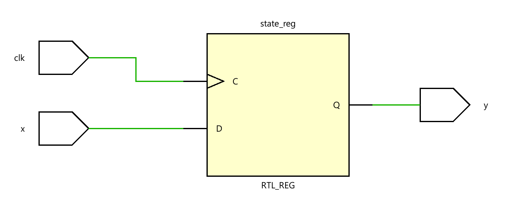
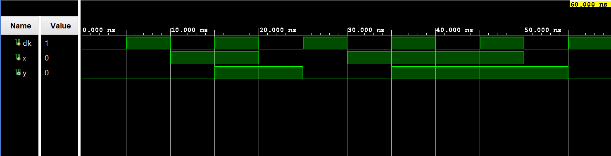

# ◈ Two-Process FSM 

### Finite State Machine • RTL Design • Behavioral Modeling

---

## 📌 Module Description

A **Two-Process FSM** is a common RTL coding style where the FSM is divided into **two separate procedural blocks**: one process for **next-state logic** and another process for **state register/output logic**, providing a clear and structured implementation of sequential and combinational behavior. Implemented using procedural statements in behavioral abstraction.

---

# ◈ **Verilog RTL code** 

```verilog

module two_process_fsm(
    input clk,
    input x,
    output reg y
);

reg state;
reg next_state;

initial begin
    state = 0;
end

// Process 1: State Register
always @(posedge clk) begin
    state <= next_state;
end

// Process 2: Next-State + Output Logic
always @(*) begin

    // Next-State Logic
    if (state == 0) begin
        if (x == 0)
            next_state = 0;
        else
            next_state = 1;
    end
    else begin
        if (x == 0)
            next_state = 0;
        else
            next_state = 1;
    end

    // Output Logic
    if (state == 1)
        y = 1;
    else
        y = 0;

end

endmodule   
                         
```

# 📊 **Truth table**

| **Current State** | **Input x** | **Next State** | **Output y** |    
| :---------------: | :---------: | :------------: | :----------: | 
|         S0        |      0      |       S0       |       0      |   
|         S0        |      1      |       S1       |       0      |    
|         S1        |      0      |       S0       |       0      |    
|         S1        |      1      |       S1       |       1      |           

# 🧪 **Testbench**

```verilog

module two_process_fsm_tb;

reg clk;
reg x;
wire y;

two_process_fsm DUT(
    .clk(clk),
    .x(x),
    .y(y)
);

initial begin
    clk = 0;
    forever #5 clk <= ~clk;
end

initial begin
    $dumpfile("two_process_fsm.vcd");
    $dumpvars(0, two_process_fsm_tb);
end

initial begin
    x = 0;

    #10 x = 1;
    #10 x = 0;
    #10 x = 1;
    #10 x = 1;
    #10 x = 0;
    #10;

    $finish;
end

endmodule


```

# 🔷 **RTL Schematics**



# 📈 **Simulation Result**


# ◈ **Verification Summary**

| **Test Case** | **Expected Output** | **Status** |
|:---|:---:|:---:|
| `Current State=S0, x=0` | `Next State=S0, y=0` | **PASS** |
| `Current State=S0, x=1` | `Next State=S1, y=0` | **PASS** |
| `Current State=S1, x=0` | `Next State=S0, y=0` | **PASS** |
| `Current State=S1, x=1` | `Next State=S1, y=1` | **PASS** |

**Verification Result:** `4/4 TEST CASES PASSED`


