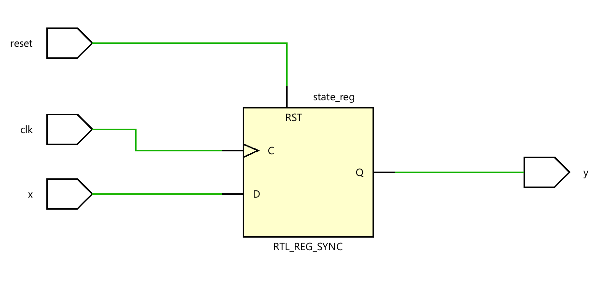
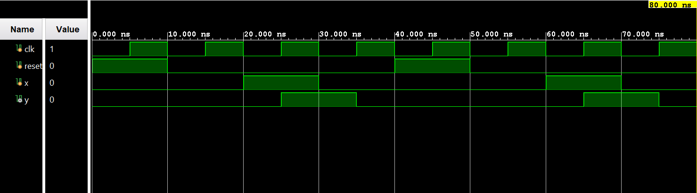

# ◈ Synchronous Reset

### Finite State Machine • Reset Logic • Sequential RTL

---

## 📌 Module Description

**Synchronous Reset** in an FSM is a reset technique where the FSM returns to its **initial state** only when the reset signal is asserted and the **active clock edge** occurs, ensuring that state transitions are synchronized with the clock. Implemented using procedural statements in sequential RTL abstraction.

---

# ◈ **Verilog RTL code** 

```verilog

module synchronous_reset(
    input clk,
    input reset,
    input x,
    output reg y
);

reg state;
reg next_state;

initial begin
    state = 0;
end

// Process 1: State Register
always @(posedge clk) begin
    if (reset)
        state <= 0;
    else
        state <= next_state;
end

// Process 2: Next-State Logic
always @(*) begin
    if (state == 0) begin
        if (x == 0)
            next_state = 0;
        else
            next_state = 1;
    end
    else begin
        if (x == 0)
            next_state = 0;
        else
            next_state = 1;
    end
end

// Process 3: Output Logic
always @(*) begin
    if (state == 1)
        y = 1;
    else
        y = 0;
end

endmodule   
                         
```

# 📊 **Truth table**

| **Current State** | **Reset** | **Input x** | **Next State** | **Output y** |    
| :---------------: | :-------: | :---------: | :------------: | :----------: | 
|         S0        |     1     |      0      |       S0       |       0      |    
|         S0        |     1     |      1      |       S0       |       0      |    
|         S0        |     0     |      0      |       S0       |       0      |    
|         S0        |     0     |      1      |       S1       |       0      |   
|         S1        |     1     |      0      |       S0       |       1      |    
|         S1        |     1     |      1      |       S0       |       1      |    
|         S1        |     0     |      0      |       S0       |       1      |    
|         S1        |     0     |      1      |       S1       |       1      |        

# 🧪 **Testbench**

```verilog

module synchronous_reset_tb;

reg clk;
reg reset;
reg x;
wire y;

synchronous_reset DUT(
    .clk(clk),
    .reset(reset),
    .x(x),
    .y(y)
);

initial begin
    clk = 0;
    forever #5 clk <= ~clk;
end

initial begin
    $dumpfile("synchronous_reset.vcd");
    $dumpvars(0, synchronous_reset_tb);
end

initial begin
    reset = 1;
    x = 0;

    #10 reset = 0;
    #10 x = 1;
    #10 x = 0;

    #10 reset = 1;
    #10 reset = 0;

    #10 x = 1;
    #10 x = 0;
    #10;

    $finish;
end

endmodule

```

# 🔷 **RTL Schematics**



# 📈 **Simulation Result**


# ◈ **Verification Summary**

| **Test Case** | **Expected Output** | **Status** |
|:---|:---:|:---:|
| `Current State=S0, Reset=1, x=0` | `Next State=S0, y=0` | **PASS** |
| `Current State=S0, Reset=1, x=1` | `Next State=S0, y=0` | **PASS** |
| `Current State=S0, Reset=0, x=0` | `Next State=S0, y=0` | **PASS** |
| `Current State=S0, Reset=0, x=1` | `Next State=S1, y=0` | **PASS** |
| `Current State=S1, Reset=1, x=0` | `Next State=S0, y=1` | **PASS** |
| `Current State=S1, Reset=1, x=1` | `Next State=S0, y=1` | **PASS** |
| `Current State=S1, Reset=0, x=0` | `Next State=S0, y=1` | **PASS** |
| `Current State=S1, Reset=0, x=1` | `Next State=S1, y=1` | **PASS** |

**Verification Result:** `8/8 TEST CASES PASSED`


